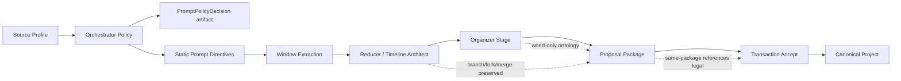

# W1 Import 工业级重构汇报

**日期**: 2026-05-31  
**汇报对象**: 项目负责人 / Product Manager  
**执行人**: Codex Lead + Subagents Volta / Ohm  
**工作区**: `/Volumes/migodam's-external-brain/Development/Narrative_IDE`  
**结论**: 本轮完成零成本架构修复与 UI/数据链路验证，可以进入你手动小规模 `deep` smoke；不代表真实长篇导入已完成产品认证。  

---

## 1. Executive Summary

这轮不是继续补一个按钮，而是把 W1 Import 的几个核心工业化断点接起来：

1. **Prompt / Orchestrator**: 事件密度不再由固定 prompt cap 决定；Orchestrator 会根据 source profile 和质量提示选择 `sparse_turning_points / arc_level / chapter_level / scene_level`，并落盘 `prompt_policy_decision.json` 解释选择。
2. **Timeline**: Timeline Architect 的 branch/fork/merge 信息进入 proposal 和 package accept 链路；前端 dense timeline 加了确定性 label placement，文字不再原地互相盖住。
3. **World Model**: World Model 过滤“人物关系图 / 事件时间线”等模块重复内容，增加中文 taxonomy 和 `categoryPath / parentId` 兼容层级字段。
4. **Inbox Accept**: W1 import proposal 现在按 `importRunId` 打包；Accept package 使用 transaction draft apply，同包内 ID 会先被视为合法引用，避免 character/event/relationship/world 互相依赖导致大面积 blocked。
5. **验证与报告**: 本轮没有 live API、没有 full50；后端、Harness、UI build、Playwright 全部走 zero-cost/mocked/dev fixture。

---

## 2. 分工情况

| 角色 | 负责人 | Owner Paths | 交付内容 | Reviewer / 验收 |
|---|---|---|---|---|
| Lead / Integration | Codex | `sidecar/*`, docs, reports | Prompt policy、World taxonomy、proposal metadata、docs/dev log/PM report、最终测试集成 | 本地集成审查 + 全量 targeted tests |
| Agent A: Prompt / Orchestrator | Lead 执行 | `sidecar/models/state.py`, `sidecar/supervisor/*`, `sidecar/prompts/w1_prompts.py` | Density policy knobs、static directives、`prompt_policy_decision.json`、稀疏事件 converge target | Python tests |
| Agent B: Timeline | Volta | `src/ui-react/components/timeline/*`, `TimelineWorkspace.tsx`, timeline specs | Deterministic label placement、tooltip fallback、sync field classification、dense topology tests | Playwright 17 tests + build |
| Agent C: World Organizer | Lead 执行 | `sidecar/workflows/w1_import.py`, compiler tests | 中文 ontology、模块污染过滤、`categoryPath/parentId`、默认容器清理语义 | Python compiler tests |
| Agent D: Inbox Package Accept | Ohm | `projectService.ts`, `WorkbenchWorkspace.tsx`, package specs | Package-level transaction accept、same-package dependency pre-registration、blocking edge reason | Playwright package/safety tests |
| Agent E: Verification / Reporting | Lead 执行 | `communication/`, `dev_logs/`, Playwright commands | 本 PM 汇报、dev log、测试矩阵、剩余风险 | 本文件 |

---

## 3. 用户问题逐项对照

| 用户提出的问题 / 目标 | 本轮状态 | 证据 | 剩余风险 |
|---|---:|---|---|
| Prompt 密度不应由 Codex 静态决定，应由 Orchestrator 判断 | **Fixed** | `PromptPolicyPatch.event_density_strategy` + `choose_prompt_policy_patch()` + `prompt_policy_decision.json` | 真实导入是否选得“文学上更好”仍需 smoke |
| Event 太细、流水账 | **Partially fixed** | `sparse_turning_points` 会降低 converge target 和 event cap，prompt 指令强调不可逆状态变化 | 需要你手动 deep smoke 看实际模型输出 |
| Timeline 拓扑没有满足 branch/fork/merge | **Fixed in pipeline path** | W1 写入 `timeline_branch` proposal，package accept 同包预注册 branch/event IDs；`projectService` 保留 `parentBranchId/forkEventId/mergeEventId/endAnchor` | 老项目已生成的旧 proposal 可能仍需重新导入或 repair |
| 前端 Synchronize missing schema / timeline field mismatch | **Fixed for known derived/runtime fields** | 新增 `timelineSyncAnalysis.ts`，把派生字段和真实 schema mismatch 分开 | 真实拖拽后的未知 schema warning 仍需手测确认 |
| 大量 event 没吸附 timeline / 瞎放 | **Partially fixed** | 无效 branchId 才 fallback；有效 topology 不再扁平化；package accept 保留 branchId | 模型输出 branchRole/arcId 质量仍需 smoke |
| Timeline 文字重叠 | **Fixed for tested dense fixture** | 30+ event Playwright 验证 visible labels 不重叠；隐藏 label 有 tooltip | 极端字体/更高密度可能需要调参 |
| World Model 混入人物关系图、事件时间线 | **Fixed** | `_is_world_model_module_contamination()` 过滤 graph/timeline module entries | 旧项目已写入的污染项需要迁移/手动清理 |
| World 分类混乱：弟子/门丁/堂等 | **Partially fixed** | 中文 taxonomy：功法与术法、修炼境界与制度、门派组织、地理位置；角色/身份不进功法类 | 上下文判断仍是规则优先，复杂语义需 smoke |
| World Model 需要多级标签/层级 | **Partially fixed** | `categoryPath` / `parentId` 兼容字段已写入，docs 更新 | UI 完整 OneNote-like 树还没做 |
| 增加项目内容整理 Agent | **Partially fixed** | 本轮实现 deterministic + LLM-ready organizer stage 语义：过滤模块重复、taxonomy、hierarchy fields | 还不是独立 live organizer agent |
| Inbox 依赖关系打包 Accept | **Fixed** | `ProposalPackage` UI + transaction draft apply + same-package ID registry | 旧 blocked reason 不再禁用 package retry |
| Parallel Conclusion / 同包互引 | **Fixed in package path** | Accept package 先收集同包 IDs，再按 dependency priority 应用 | 真正循环更新字段如需两阶段 shell/fill，未来可增强 |
| 剩余 blocked 要有准确原因 | **Fixed** | Blocking edge reason: `culprit -> missing type id` | 真实旧 proposal 原因取决于旧数据字段 |
| 详细 PM-style 汇报到 `communication/` | **Fixed** | 本文件 | 后续每轮应继续沿用 |

---

## 4. 具体代码贡献

### 4.1 Prompt / Orchestrator

| 文件 | 修改 |
|---|---|
| `sidecar/models/state.py` | 扩展 `PromptPolicyPatch` knobs，新增 `sparse_turning_points` event density 类型 |
| `sidecar/supervisor/prompt_policy.py` | 新增 deterministic policy chooser、static directive header、policy decision artifact |
| `sidecar/supervisor/planner.py` | 扩展 patch validation，继续拒绝 raw prompt injection |
| `sidecar/supervisor/policy.py` | `_ensure_orchestrator_plan()` 选择/应用 prompt policy；sparse policy 同步 converge target |
| `sidecar/supervisor/tools.py` | `extract_window()` 注入 static directives；event cap 支持 sparse turning points |
| `sidecar/prompts/w1_prompts.py` | Prompt 文案继续强化 state change、timeline-worthy、world-scope 边界 |

### 4.2 Timeline / Sync / Layout

| 文件 | 修改 |
|---|---|
| `timelineLayoutEngine.ts` | Deterministic label candidate placement、CJK-aware width、priority hiding |
| `TimelineCanvas.tsx` / `TimelineEventNode.tsx` | Canvas 接入 label placement；隐藏 label 保留 tooltip |
| `timelineSyncAnalysis.ts` | 把 runtime/derived fields 从真实 schema mismatch 中拆出来 |
| `TimelineWorkspace.tsx` | Synchronize 使用新的 sync analysis report |
| `timeline_topology_import.spec.ts` | 30+ event dense fixture，验证 label 不重叠、branch lane、responsive viewport |

算法参考：
- D3 `forceCollide` 说明 collision force 可避免节点重叠，但本项目选择 deterministic greedy，避免测试不稳定: https://d3js.org/d3-force/collide
- 自动标注布局常见思路是候选位置 + 最小重叠代价: https://en.wikipedia.org/wiki/Automatic_label_placement

### 4.3 World Model Organizer

| 文件 | 修改 |
|---|---|
| `sidecar/workflows/w1_import.py` | 过滤 World Model 模块污染；中文 taxonomy；容器 `categoryPath`；world item `parentId/categoryPath` |
| `tests/test_w1_import_compiler.py` | 增加 world contamination 和 taxonomy examples |
| `dev_docs/W1_IMPORT_COMPILER.md` / `dev_docs/DATA_MODEL.md` | 更新 artifact、PromptPolicyPatch、World hierarchy、package accept 规则 |

### 4.4 Inbox Package Accept

| 文件 | 修改 |
|---|---|
| `src/ui-react/services/projectService.ts` | `getProposalImportPackageKey()`、same-package ID pre-registration、transaction apply、rollback、blocking edge reason |
| `src/ui-react/components/WorkbenchWorkspace.tsx` | Import package card、Accept Package、blocked reason；blocked package 可 retry |
| `tests/e2e/p1/workbench_import_package_accept.spec.ts` | 成功 package accept、失败 rollback、blocking edge readable + retry enabled |

---

## 5. Extraction / 数据结构影响

| 数据层 | 本轮结果 |
|---|---|
| `ImportPlan.prompt_policy` | 记录 normalized patch、directive keys、static directives |
| `system/imports/<run>/prompt_policy_decision.json` | 记录 density/topology/world-scope 选择原因 |
| Timeline branch proposals | 保留 `parentBranchId/forkEventId/mergeEventId/endMode/startAnchor/endAnchor` |
| Timeline event proposals | 继续带 `branchId/orderIndex`；无效 branch 才 fallback |
| World containers/items | 带 `categoryPath/parentId`，过滤 relationship/timeline module pollution |
| Inbox proposals | 按 `importRunId` 成包；包级 Accept transaction |

---

## 6. 测试结果

| 类型 | 命令 | 结果 |
|---|---|---:|
| Python compile | `py_compile state/planner/prompt_policy/tools/policy/w1_import` | PASS |
| Backend targeted | `pytest test_w1_planner_proposal.py test_w1_import_compiler.py test_w1_supervisor_policy.py -q` | 134 passed |
| Backend regression subset | `pytest test_w1_supervisor_tools.py test_w1_quality_rubric.py test_w1_v2_harness.py test_w1_run_events.py -q` | 95 passed |
| Harness | `run_harness.py --no-write` | 5/5 passed |
| UI build | `npm run ui:build` | PASS |
| Playwright new topology/package | `workbench_import_package_accept.spec.ts timeline_topology_import.spec.ts` | 20 passed |
| Playwright observability/safety | `import_activity_status.spec.ts workbench_proposal_safety.spec.ts` | 8 passed |
| Playwright import regression | `import_workflow.spec.ts` | 24 passed |

截图说明：本轮没有生成截图文件；验证主要依赖 Playwright DOM/bounding-box assertions。Timeline dense label overlap 是用实际浏览器 bounding boxes 检查，不是只测纯函数。

---

## 7. 可交给你手动验收的内容

建议你下一轮手动 smoke 用：

| 设置 | 建议 |
|---|---|
| Profile | `deep` |
| 章节数 | 先 6-10 章 |
| Import 内容 | 开启 Timeline / Character / World；Relationship 和 Manuscript 如果 UI toggle 尚未出现，按当前默认 |
| 重点观察 | Event 是否少而关键、branch 是否分叉/合流、World 是否不再放人物关系图、Accept package 是否不再大面积 blocked |

手动验收 checklist：

- [ ] Import 结束后存在 `prompt_policy_decision.json`，且事件密度选择有解释。
- [ ] Timeline 中不是所有 event 都挂到同一 root branch。
- [ ] branch fork/merge 关系在 Accept package 后仍保留。
- [ ] Timeline dense label 不互相盖住；低优先级 label 可以隐藏但 hover 有全文。
- [ ] Workbench Inbox 出现 import package card。
- [ ] 点击 Accept Package 后，同包 character/event/relationship/world 不再因为互相引用被大面积 blocked。
- [ ] World Model 不出现“人物关系图”“事件时间线”这类模块重复项。
- [ ] `记名弟子/内门弟子` 不进入 `功法与术法`。

---

## 8. 仍未完成 / 需要下一轮

| 项目 | 原因 | 下一步 |
|---|---|---|
| 真实 deep smoke 质量认证 | 本轮严格 no live API/no full50 | 由你手动触发小规模 import 后，我再做 artifact + project 数据验收 |
| UI import toggles：Manuscript / Relationship | 本轮重点是 pipeline/package/timeline/world；toggle 还没接 | 下一轮加 UI switch -> sidecar context -> extraction domain filter |
| 完整 OneNote-like World tree UI | 本轮先写 `categoryPath/parentId` 兼容字段 | 下一轮 `WorldWorkspace` 改层级树展示 |
| 独立 live Organizer Agent | 本轮实现 deterministic + LLM-ready organizer stage | 下一轮可把 organizer prompt/tool 纳入 Orchestrator |
| 老项目旧 proposals repair | 本轮修未来导入链路 | 如需修 `import_test11` 旧数据，可单独写一次 zero-cost repair script |

---

## 9. 成本与安全

- Live API/model calls: **NO**
- full50: **NO**
- Provider keys: **未读取**
- 402 risk: **本轮无 live call，不触发**
- Benchmark timestamped outputs: **未提交**
