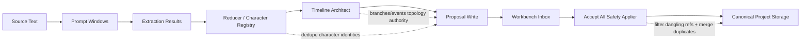

# W1 Import Test11 修复交付汇报

**日期**: 2026-05-31  
**汇报对象**: 项目负责人 / Product Manager  
**执行人**: Codex  
**基准提交**: `54102e4 fix: preserve W1 topology and recover character imports`  
**工作区**: `/Volumes/migodam's-external-brain/Development/Narrative_IDE`  

> 说明：本报告覆盖 `import_test11` 这轮 blocked proposal、拓扑、章节/Manuscript、人物重复与事件质量问题的调查和修复。  
> 当前工作区在该提交之后又出现了未提交修改：`sidecar/prompts/w1_prompts.py`、`sidecar/workflows/w1_import.py`、`tests/test_w1_import_compiler.py`。本报告以已提交的 `54102e4` 为验收基准，不覆盖后续未提交内容。

---

## 1. Executive Summary

本轮首先确认：上一轮修复后，`import_test11` 的 timeline events 已从 0 个成功导入到 36 个，说明 `branch_main` 遗留引用问题已经被部分解除。但继续调查发现，剩余 proposal 的根因已经变了：`system/inbox.json` 中仍有 17 个 pending，全部是 character proposal，且都是因为人物引用了被 Timeline Architect 合并、降级或丢弃的 event id。

本轮修复重点从“强行放行 proposal”调整为“保证导入数据结构正确”：保留复杂时间线拓扑、过滤已丢弃 event 引用、合并重复人物、清理默认空白章节/场景、去重重复 manuscript scene。

---

## 2. 角色与分工

| 角色 | 负责人 | 工作内容 | 产出 |
|---|---|---|---|
| Lead / Investigator | Codex | 读取 `import_test11` 实际项目数据，定位剩余 blocked 根因 | blocked 类型统计、章节/事件/人物/拓扑取证 |
| Backend Fix Owner | Codex | 修复 W1 写入侧：保留 Timeline Architect 分支、写入前人物去重 | `sidecar/workflows/w1_import.py` |
| Frontend/Data Safety Owner | Codex | 修复 Workbench acceptance：过滤 dangling references、合并重复人物、清理 writing artifacts | `src/ui-react/services/projectService.ts` |
| QA Owner | Codex | 增补 Python + Playwright 回归 | `tests/test_w1_import_compiler.py`、`tests/e2e/p1/import_smoke_acceptance.spec.ts` |

本轮没有拆分独立 subagents，因为任务集中在一个确定性链路：W1 artifact -> proposal write -> Workbench accept -> canonical project storage。

---

## 3. 用户问题逐项验收表

| 用户反馈 / 需求点 | 调查结论 | 本轮状态 | 证据 |
|---|---|---:|---|
| 复杂时间线拓扑是否还能保留 | 数据模型和 Canvas 支持 `parentBranchId`、`forkEventId`、`mergeEventId`、`mergeTargetBranchId`、`endMode`。真正问题是 `node_infer_world_settings()` 后置覆盖了 Timeline Architect 的多分支结果。 | 已修复 | `node_infer_world_settings()` 现在检测已有 `state.timeline_branches` 时直接保留，不再覆盖。 |
| 仍有 14/17 个不能 accept | 实际磁盘为 17 个 pending，全部是 character。原因是人物引用了被 demote/merge/discard 的 event id。 | 已修复代码路径 | Workbench accept 前会过滤 import character 的 dangling `linkedEventIds`；同名/别名人物会合并。 |
| 章节顺序仍错 | `chap_1 / Chapter 1` 默认空白章节仍存在，和 `第一章` 同为 `orderIndex=0`，污染排序。 | 已修复代码路径 | project migration 会在存在 imported chapters 时清理 blank starter chapter/scene，并重排 orderIndex。 |
| Timeline Event 过碎、流水账 | 当前 10 章导入 36 个 canonical events，确实偏细，且有“三叔提议/离家/王护法接走/抵达七玄门”等重复语义。 | 未完全解决 | 已记录为下一轮质量策略：降低 canonical event 密度，把 scene beat 放入 manuscript notes。 |
| 重要人物无法识别接受 | 重要人物卡被 blocked，不是不存在；blocked 原因来自 missing/demoted events。另有重复韩立/韩父/韩母/三叔。 | 已修复 acceptance + future write dedupe | import character 会合并同名/别名；W1 proposal write 前也会 dedupe registry characters。 |
| 人物内容不够详细 | 当前 Character Card contract 是 compact draft，不填深层 goals/fears/secrets/arc。 | 部分符合设计，质量待增强 | `W1_IMPORT_COMPILER.md` 明确当前 W1 只创建 compact character-card drafts。 |
| Manuscript 是空的 | `manuscript.json` 实际存在且 10 章有正文；UI/Writing 中空白入口来自 `Scene 1` 和重复 content scenes 污染。 | 已修复代码路径 | migration 清理 blank `Scene 1`，保留 W1 `章节正文` scene，去掉重复 `第N章 — content`。 |
| 导入开关：是否 Manuscript / Relationship | 本轮未做 UI 新功能。 | 未完成 | 建议下一轮增加 import options，传入 sidecar context。 |

---

## 4. 具体代码贡献

### 4.1 W1 写入侧：保留 Timeline Architect 拓扑

**文件**: `sidecar/workflows/w1_import.py`

修改前：`node_infer_world_settings()` 会返回新的 `timeline_branches`，在图执行合并时可能覆盖 Timeline Architect 刚生成的分支。  
修改后：如果 `state["timeline_branches"]` 已经存在，则认为 Timeline Architect 拥有分支拓扑权威，world-settings 只补 world settings / containers，不覆盖 branch topology。

影响：
- 支持 main branch 分叉到 forked branch。
- 支持 forked branch 不合回 root。
- 支持 future `mergeEventId` / `mergeTargetBranchId` 合回主线。
- 防止泛化的“韩立修仙之路”单线覆盖更细的多分支结构。

### 4.2 W1 写入侧：人物去重与关系/event remap

**文件**: `sidecar/workflows/w1_import.py`

新增 `_dedupe_registry_characters_for_write()`：
- 按 canonical name 和 aliases 生成 identity key。
- 合并重复人物的 aliases、summary、notes、open questions、tag ids、confidence、importance。
- 把 event 的 `character_ids` / `participantCharacterIds` remap 到保留的 primary character id。
- 把 relationship 的 source/target remap 到 primary character id。

目标：
- 未来导入不再生成 3 个“韩立”、3 个“韩父”、多个“岳堂主”。
- 提高 relationship 可接受率，因为关系不再指向被重复拆散的人物。

### 4.3 Workbench Accept All：过滤 dangling event refs

**文件**: `src/ui-react/services/projectService.ts`

新增 import proposal normalization：
- 对 imported `character` proposal，在验证前过滤不存在的 `linkedEventIds`、`linkedSceneIds`、`linkedWorldItemIds`、`tagIds`。
- 对 imported `timeline_event` proposal，如果 branchId 不存在，回落到项目 root branch。

这解决 `import_test11` 当前剩余 17 个 character proposal 的主要 block 原因：它们引用的 event 已经被 Timeline Architect 合并/降级/丢弃，不应永久阻塞人物卡导入。

### 4.4 Workbench Accept All：合并重复人物

**文件**: `src/ui-react/services/projectService.ts`

新增同名/别名 character merge：
- `韩立` + alias `二愣子` 会合并到已有韩立。
- `韩父` / `父亲`、`三叔` / `韩三叔` / `韩胖子` 可按 name/alias 合并。
- 合并时保留较丰富 summary/background/role/physicalDescription，并 union linked ids 和 tags。

### 4.5 Writing / Manuscript 清理

**文件**: `src/ui-react/services/projectService.ts`

新增 `cleanupImportedWritingArtifacts()`：
- 如果项目已有 imported chapters，则清理空白 starter `chap_1 / scene_1`。
- 清理同一 chapter 下正文完全相同的重复 scene，优先保留 W1 `章节正文`。
- 重排 chapters 的 `orderIndex`，避免 `Chapter 1` 和 `第一章` 同序导致 UI 错乱。

---

## 5. 项目结构与 Extraction 链路影响



| Layer | 本轮影响 |
|---|---|
| Extraction | 未改 prompt 内容；未跑 live model。 |
| Reducer / Registry | 写入前增加 character identity dedupe。 |
| Timeline Architect | 结果不再被 world-settings branch 覆盖。 |
| Proposal Write | future event/relationship character references 会 remap 到 dedupe 后 primary id。 |
| Workbench Safety | Accept All 更像 batch reconciliation，不再因 demoted event refs 永久 block 人物。 |
| Canonical Storage | migration 会清理 import 后的 blank starter writing artifacts 和 duplicate content scenes。 |

---

## 6. 测试与验证

| 测试 | 结果 | 覆盖内容 |
|---|---:|---|
| `sidecar/.venv/bin/python -m py_compile sidecar/workflows/w1_import.py` | PASS | Python syntax / import safety |
| `sidecar/.venv/bin/python -m pytest tests/test_w1_import_compiler.py -q` | 49 passed | branch preservation、character dedupe、proposal write |
| `npm run ui:build` | PASS | TypeScript + Vite build |
| `npx playwright test --config tests/playwright.config.ts tests/e2e/p1/import_smoke_acceptance.spec.ts tests/e2e/p1/workbench_proposal_safety.spec.ts --reporter=list` | 8 passed | Accept All、same-batch deps、stale refs、Workbench safety regression |

截图说明：本轮以 mocked Playwright 和 filesystem inspection 为主，没有打开可视化浏览器截图。下次涉及 UI 状态/布局/可视验收时，应在 `communication/` 报告中附截图。

---

## 7. 风险与未完成项

| 风险 / 未完成项 | 当前判断 | 建议下一步 |
|---|---|---|
| Event 仍偏流水账 | 当前 canonical event 密度过高，36 events / 10 chapters，且语义重复明显。 | 修改 Timeline Architect density policy 和 prompt policy：只有转折、因果状态变化、拓扑分叉/合流进入 timeline。 |
| Manuscript 是否满足“梳理思路” | 当前 W1 保存原文正文，summary 是正文 excerpt，不是创作思路型梳理。 | 增加 manuscript outline / chapter thinking notes extraction。 |
| Relationship 开关 | 未实现。 | Import UI 增加 `extractRelationships` toggle，传入 sidecar context。 |
| Manuscript 开关 | 未实现。 | Import UI 增加 `extractManuscript` toggle；关闭时不写 manuscript/chapter/scene proposals。 |
| 真实 `import_test11` 数据未被直接修改 | 代码已修，但真实项目要重新打开/保存/Accept All 才会应用。 | 用户手动打开项目验收；若需要，我可以在获得许可后写一次 repair script。 |

---

## 8. 给 PM 的验收建议

1. 重新打开 `import_test11`，确保 app 重新 load project。
2. 进入 Workbench，查看剩余 proposal 数。
3. 点击 “Accept All”。
4. 预期：剩余 character 不再因 missing event refs 被 block；重复人物应合并进已有人物。
5. 进入 Writing，确认空白 `Chapter 1 / Scene 1` 不再作为第一章入口污染排序。
6. 进入 Timeline，确认事件已在合法 branch 上；但 event 粒度仍需下一轮质量优化。

---

## 9. 当前 Git 状态提醒

本报告生成时，仓库在 `54102e4` 之后存在后续未提交改动：

```text
sidecar/prompts/w1_prompts.py
sidecar/workflows/w1_import.py
tests/test_w1_import_compiler.py
```

这些改动不属于本报告验收基准。后续应单独检查、测试、汇报。
