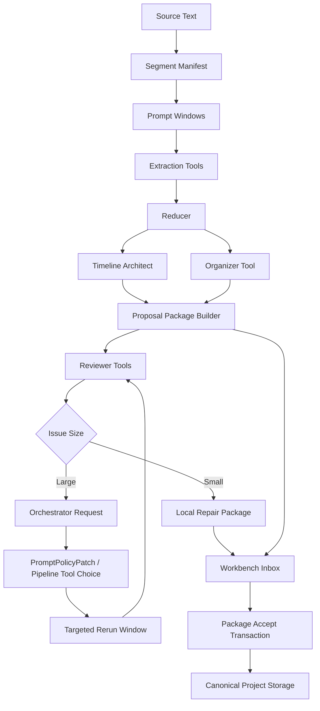
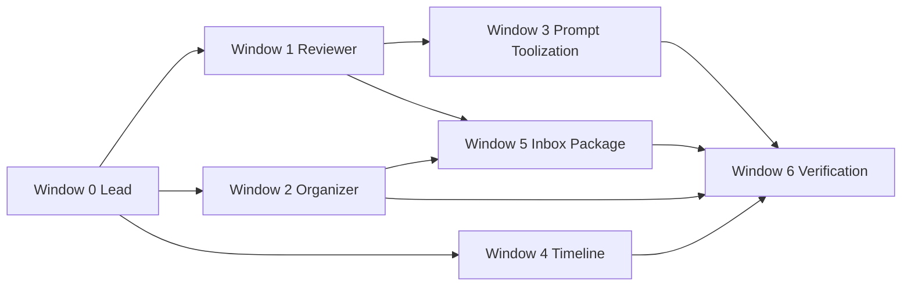

# W1 Import Reviewer / Organizer / Timeline Consistency 多 Claude 分发 Prompt

**日期**: 2026-05-31  
**用途**: 这份文档是给多个 Claude Code 窗口分发任务用的。它不是单窗口 prompt。  
**模式要求**: 所有 Claude 窗口先使用 **plan mode**，先输出计划，不要直接开始改代码。  
**项目路径**: `/Volumes/migodam's-external-brain/Development/Narrative_IDE`  

---

## 快速复制 / 分发流程

你不需要一次把全部内容发给每个 Claude。推荐按下面顺序分发：

1. 先发 **Window 0 Lead**：复制“给所有 Claude 员工的总 Prompt” + “Claude Window 0” 专属 Prompt，让它产出总 task pack。
2. 同时发 **Window 1 Reviewer**、**Window 2 Organizer**、**Window 4 Timeline**：这三块依赖较少，可以并行进入 plan mode。
3. 等 Window 1 的 Reviewer schema 初稿出来后，再发 **Window 3 Prompt / Pipeline Toolization**：这样它能根据 reviewer schema 设计 PromptPolicyPatch 映射。
4. 等 Window 1 / 2 对 `localRepairActions` 和 organizer output 有初稿后，再发 **Window 5 Inbox Package / Repair UX**。
5. **Window 6 Verification** 可以最后发；如果你想省时间，也可以早发，让它先写验收计划，但不要让它改核心业务代码。

Review 规则：
- 不需要把每个 Claude 的 plan 都发回 Codex review。
- 只有三类 plan 建议发回来让我快速看一眼：Window 0 总架构、Window 4 Timeline 前后端一致性、任何会改 `projectService.ts` / `w1_import.py` / prompt 大文件的计划。
- 其他窗口如果 plan 明显遵守 owner paths、测试、no live API，就可以直接让 Claude 自己进入执行。

复制方式：
- 每个窗口复制两段：`总 Prompt` + `该窗口专属 Prompt`。
- 不要把整份 900 行文档全部塞给每个窗口，会浪费 context。
- 文档中外层使用 `~~~~markdown`，内层可以包含 ```ts，不会再因为三反引号嵌套导致格式断掉。

---

## 0. 给所有 Claude 员工的总 Prompt

请复制下面这一整段给每个 Claude 窗口作为 shared context，然后再追加该窗口专属任务包。

> 复制说明：本文所有“要发给 Claude 的 Prompt”都使用 `~~~~markdown` 外层代码块，里面可以安全包含 ```ts / ```text 等内层代码块。你复制时只需要复制 `~~~~markdown` 之间的内容，不要复制外层波浪线本身。

~~~~markdown
你现在是 Narrative IDE 项目的一个 Claude Code 员工。请以 **plan mode** 工作，先规划，不要直接改代码。

项目路径：
`/Volumes/migodam's-external-brain/Development/Narrative_IDE`

你不是唯一工作者。这个任务会被拆给多个 Claude 窗口并行完成，每个窗口可能在不同 branch / worktree 上运行。请把其他 Claude 当成同事，不要覆盖、revert、重写别人的 owner files。你只负责你的任务包。

必须先读：
1. `AGENTS.md`
2. `dev_docs/README.md`
3. `dev_docs/DEV_RULES.md`
4. 与你任务相关的 canonical docs，例如：
   - `dev_docs/W1_IMPORT_COMPILER.md`
   - `dev_docs/DATA_MODEL.md`
   - `dev_docs/FRONTEND_BACKEND_CHECKLIST.md`
   - `dev_docs/WORKFLOW_STATUS.md`
   - `dev_docs/PARALLEL_WORKTREE_PROTOCOL.md`
   - `dev_docs/SHARED_SURFACES.md`

硬约束：
- 不跑 live API。
- 不跑 full50。
- 不读取 provider key。
- 不提交 `.claude/`、`data/*.backup`、benchmark timestamp outputs、Playwright traces、API key/env 文件。
- Prompt modification 只能走 typed / allowlisted knobs，禁止 raw prompt injection。
- Reviewer 默认 token-light，不允许把大量小说正文塞进去。
- Reviewer 不允许 silent mutate canonical project。小修复也必须走 proposal/package 或明确 deterministic repair tool。
- Timeline 前端操作必须能 round-trip 到 canonical project storage。
- 所有变更都要有 zero-cost tests。
- 完成后必须写 Markdown verification report，列出 changed files、tests run、风险、未完成项。

当前产品目标：
把 W1 Import 从“能跑”升级为“可信、可审阅、可修复、前后端一致”的工业级导入系统。重点不是堆更多 agent，而是把 Reviewer、Organizer、Prompt/Pipeline、Timeline Sync 都封装成 Orchestrator 可调用的 tool。

关键产品原则：
1. 小说信息是 soft 的，不能只靠 hard count 验收。
2. Event 不应该流水账，Timeline 只放不可逆状态变化、关键因果转折、branch/fork/merge 有意义的 canonical events。
3. Scene beat / 细节梳理应该进入 Manuscript / Notes，不应该污染 Timeline。
4. World Model 只放世界观实体，不放人物关系图、事件时间线、人物身份关系、单次 scene beat。
5. Import 多次执行时，后续 import 必须和已有项目保持 continuity。
6. Inbox 必须支持 package-level accept，避免同批 proposal 互相依赖导致大面积 blocked。
7. Timeline 前端是 canonical timeline 数据的 renderer，不是孤立玩具。拖拽、吸附、branch/fork/merge 操作必须写回 canonical project storage。

请先输出 plan，必须包含：
1. 你理解的目标和非目标。
2. 你负责的 owner files。
3. 需要先调查的现有代码路径。
4. 设计方案。
5. 具体实施步骤。
6. 测试计划。
7. 与其他 Claude 窗口的接口/依赖。
8. 风险与 deferred items。
~~~~

---

## 1. 我作为 PM / Lead 的设计判断

### 1.1 为什么需要 Reviewer 三分法

W1 Import 的质量问题不是一种问题：

| 问题类型 | 示例 | 应交给谁 |
|---|---|---|
| 提取质量问题 | Event 流水账、World 空类、人物卡太薄 | Quality Reviewer |
| 原文事实不匹配 | 某 event 没发生在对应章节，relationship evidence 不支持关系 | Fact Reviewer |
| 项目连续性问题 | 51-100 章重复创建 1-50 章角色，branch 不延续 | Consistency Reviewer |

这三个 Reviewer 必须是轻量级的，不应每次把全文塞进去。它们应该读 artifacts、summary、evidence refs、source spans，然后只在必要时做 targeted RAG snippet lookup。

### 1.2 Reviewer 的处置策略

Reviewer 不应该都把问题扔回 Orchestrator。应该分两档：

| 问题大小 | 处理方式 |
|---|---|
| 小问题 | Reviewer 产出 `localRepairActions`，进入 repair proposal package，由用户 accept |
| 大问题 | Reviewer 产出 `orchestratorRequests`，让 Orchestrator 开 targeted rerun / re-organize / prompt policy patch |

示例：

```text
World item “记名弟子” 被放进“功法与术法”
=> Quality Reviewer local repair: move category to “修炼境界与制度/身份制度”

Timeline 10 章抽出 80 个 event 且全在 root branch
=> Quality Reviewer escalates: needs_orchestrator_rerun
=> Orchestrator updates PromptPolicyPatch: event_density_strategy=sparse_turning_points, topology_fidelity=high
=> rerun_targeted_window only for affected windows
```

### 1.3 你的 Timeline renderer 设想是正确方向

Timeline 应该是 canonical data renderer：

```text
canonical timeline storage
  timelineBranches[]
  timelineEvents[]
        ↓
normalize / parse / schema migrate
        ↓
TimelineRendererState
        ↓
React/SVG/Canvas render
        ↓
mouse / keyboard operation
        ↓
TimelineOperation
        ↓
validate + apply draft
        ↓
projectService persist
        ↓
reload / round-trip verification
```

核心要求：前端任何可见的 timeline 操作都必须能转成 canonical patch。不能存在“前端看起来变了，但后端/project storage 没变”的状态。

---

## 2. 总体架构 Proposal

### 2.1 W1 Import 新 pipeline



### 2.2 Tool contracts

#### Tool: `quality_review_import`

```ts
type QualityReviewInput = {
  importRunId: string;
  promptPolicyDecision?: PromptPolicyDecision;
  timelineSummary: TimelineReviewSummary;
  characterSummary: CharacterReviewSummary;
  relationshipSummary: RelationshipReviewSummary;
  worldSummary: WorldReviewSummary;
  manuscriptSummary: ManuscriptReviewSummary;
  proposalPackageSummary: ProposalPackageSummary;
  maxTokens?: number;
};

type QualityReviewReport = {
  verdict: "pass" | "warn" | "needs_repair" | "needs_orchestrator_rerun";
  severity: "low" | "medium" | "high";
  findings: ReviewFinding[];
  localRepairActions: RepairAction[];
  orchestratorRequests: OrchestratorRequest[];
  promptPolicySuggestions: Partial<PromptPolicyPatch>;
  tokenCostLedger: ZeroCostLedger;
};
```

#### Tool: `fact_review_import`

```ts
type FactReviewInput = {
  importRunId: string;
  candidateItems: FactReviewCandidate[];
  evidenceIndex: EvidenceIndexRef;
  maxSnippetsPerItem: number;
  maxTotalTokens: number;
};

type FactReviewReport = {
  verdict: "pass" | "warn" | "needs_repair" | "needs_orchestrator_rerun";
  checkedItems: FactCheckItem[];
  mismatches: FactMismatch[];
  confidence: number;
  sourceEvidenceUsed: EvidenceRef[];
  tokenCostLedger: ZeroCostLedger;
};
```

#### Tool: `consistency_review_import`

```ts
type ConsistencyReviewInput = {
  importRunId: string;
  currentProjectDigest: ProjectStructureDigest;
  importRunSummary: ImportRunSummary;
  priorImportSummaries: ImportRunSummary[];
  entityRegistrySummary: EntityRegistrySummary;
  timelineTopologyDigest: TimelineTopologyDigest;
};

type ConsistencyReviewReport = {
  verdict: "pass" | "warn" | "needs_repair" | "needs_orchestrator_rerun";
  continuityFindings: ReviewFinding[];
  duplicateCandidates: MergeCandidate[];
  topologyContinuityIssues: TimelineIssue[];
  localRepairActions: RepairAction[];
  orchestratorRequests: OrchestratorRequest[];
};
```

#### Tool: `organize_project_content`

```ts
type OrganizerInput = {
  characters: CharacterDraft[];
  events: TimelineEventDraft[];
  relationships: RelationshipDraft[];
  worldCandidates: WorldCandidate[];
  manuscriptNotes: ManuscriptNote[];
  timelineArchitecture: TimelineArchitectureArtifact;
  projectDigest: ProjectStructureDigest;
};

type OrganizerOutput = {
  worldContainers: WorldContainerProposal[];
  worldItems: WorldItemProposal[];
  excludedItems: ExcludedItem[];
  mergeCandidates: MergeCandidate[];
  proposalPackages: ProposalPackage[];
  warnings: string[];
};
```

#### Tool: `timeline_sync_commit`

```ts
type TimelineOperation =
  | { type: "move_event"; eventId: string; branchId: string; orderIndex: number; layoutHints?: LayoutHints }
  | { type: "move_branch_anchor"; branchId: string; startAnchor?: Anchor; endAnchor?: Anchor }
  | { type: "update_branch_geometry"; branchId: string; geometry: BranchGeometry }
  | { type: "merge_branch"; branchId: string; mergeTargetBranchId: string; mergeEventId: string }
  | { type: "split_branch"; parentBranchId: string; forkEventId: string; newBranch: TimelineBranchDraft };

type TimelineSyncCommitResult = {
  ok: boolean;
  patch: TimelinePersistencePatch;
  warnings: TimelineSyncWarning[];
  errors: TimelineSyncError[];
  roundTripVerified: boolean;
};
```

---

## 3. Agent Workflow 优化建议

### 3.1 不要让所有 Claude 同时改同一处

建议每个 Claude 使用独立 branch/worktree：

| Claude | Branch 建议 | 工作类型 |
|---|---|---|
| Lead | `claude/w1-reviewer-organizer-lead` | 只做 plan/integration/docs |
| Reviewer | `claude/w1-reviewer-tools` | reviewer schema/tool/tests |
| Organizer | `claude/w1-organizer-tool` | world organizer/taxonomy/tests |
| Prompt | `claude/w1-prompt-toolization` | prompt policy/pipeline tool contracts |
| Timeline | `claude/w1-timeline-canonical-sync` | 前后端 timeline sync/layout |
| Inbox | `claude/w1-inbox-repair-packages` | package accept/repair UX |
| Verification | `claude/w1-verification-reporting` | Playwright/report/dev_logs |

### 3.2 每个 Claude 可以创建自己的子代理

允许每个 Claude 内部再拆：

```text
Primary Claude Window
  ├─ Explorer subagent: read-only architecture scan
  ├─ Worker subagent: owned files implementation
  └─ Reviewer subagent: diff/test review only
```

但最终必须由该 Claude 汇总成一个 verification report。

### 3.3 每个 Claude 的最终汇报格式

必须包含：

```markdown
## Role
## Branch / Worktree
## Files Changed
## Architecture Decisions
## Tests Run
## Evidence
## Risks
## Handoff To Lead
```

---

## 4. Claude Window 0 — Lead Architect / Integration Prompt

~~~~markdown
你是 Lead Architect / Integration Claude。请用 plan mode。

你的任务不是先改代码，而是把 Reviewer / Organizer / Timeline Sync / Inbox Package 的架构拆解成可执行 task packs，并定义各窗口接口。

Owner paths:
- `communication/*`
- `dev_logs/*`
- `dev_docs/W1_IMPORT_COMPILER.md`
- `dev_docs/DATA_MODEL.md`
- `dev_docs/WORKFLOW_STATUS.md`

Forbidden paths:
- 不直接大改 `sidecar/workflows/w1_import.py`
- 不直接大改 `src/ui-react/services/projectService.ts`
- 不直接大改 timeline components
- 除非 integration patch 必须，否则不要抢 worker owner files

你需要产出：
1. Architecture Proposal
2. Tool Contract Design
3. Reviewer Pipeline
4. Organizer Pipeline
5. Timeline Consistency Architecture
6. Multi-agent Task Packs
7. File Map
8. Test Plan
9. Risks / Deferred Items
10. Final Acceptance Checklist

你要特别强调：
- 这些 prompt 是给多个 Claude 窗口分发，不是单窗口执行。
- 每个 Claude 可以开自己的 explorer/reviewer 子代理。
- 不同任务可能在不同 branch 上跑。
- Lead 最后只做 integration pass，不要让一个窗口吞掉所有任务。

验收：
- 输出 `communication/YYYY-MM-DD-w1-reviewer-organizer-lead-plan.md`
- 不跑 live API，不跑 full50。
~~~~

---

## 5. Claude Window 1 — Reviewer Framework Owner Prompt

~~~~markdown
你是 Reviewer Framework Owner。请用 plan mode。

目标：
设计并实现 W1 Reviewer 框架，包括 Quality Reviewer、Fact Reviewer、Consistency Reviewer。Reviewer 必须轻量、artifact-first、token-efficient。

Owner paths:
- `sidecar/supervisor/reviewers/*`
- `sidecar/supervisor/quality.py`
- `tests/test_w1_reviewers*.py`
- 必要时少量更新 `sidecar/models/state.py`

Forbidden paths:
- 不改 timeline UI。
- 不改 Workbench UI。
- 不改 prompt 文案，除非只新增 typed schema/contract。
- 不跑 live API。

请先调查：
1. `sidecar/supervisor/quality.py`
2. `sidecar/models/state.py`
3. `sidecar/workflows/w1_import.py` 里 artifact 写入点
4. 当前 quality rubric tests

设计要求：

## Quality Reviewer
检查：
- Timeline event 是否流水账。
- mainline share 是否过高。
- branch over budget。
- World Model 是否空 container、错误分类、模块污染。
- Character 是否重复、重要人物缺失、卡片太薄。
- Relationship 是否无 evidence。
- Manuscript 是否空。

不读取全文，只读 summaries/artifacts。

## Fact Reviewer
检查：
- candidate item 和 source evidence 是否明显不匹配。
- 只用 evidence refs / source span / RAG snippets。
- max snippets 和 max total tokens 必须可配置。
- 默认 synthetic tests，不调用 live RAG。

## Consistency Reviewer
检查：
- 多次 import 的 continuity。
- 旧角色/新角色重复。
- timeline branch 延续。
- world item 冲突或重复。
- relationship 是更新还是重复创建。

输出统一 schema：
```ts
ReviewReport {
  reviewer: "quality" | "fact" | "consistency";
  verdict: "pass" | "warn" | "needs_repair" | "needs_orchestrator_rerun";
  severity: "low" | "medium" | "high";
  findings: ReviewFinding[];
  localRepairActions: RepairAction[];
  orchestratorRequests: OrchestratorRequest[];
  tokenCostLedger: ZeroCostLedger;
}
```

实现建议：
- 新建 `sidecar/supervisor/reviewers/base.py`
- 新建 `quality_reviewer.py`
- 新建 `fact_reviewer.py`
- 新建 `consistency_reviewer.py`
- 新建 `schemas.py`
- 暂时 zero-cost deterministic implementation；LLM/RAG adapter 只放 interface/stub。

测试：
- Quality catches 50 trivial events / one root branch。
- Quality catches empty World containers。
- Quality catches relationship missing evidence。
- Fact catches synthetic mismatch using evidence snippets。
- Fact does not read full source text。
- Consistency catches duplicate character across two import summaries。
- Consistency catches branch continuity break。

最终 report：
- 写 `communication/YYYY-MM-DD-w1-reviewer-framework-report.md`
- 列出文件、schema、测试、风险。
~~~~

---

## 6. Claude Window 2 — Organizer Agent Owner Prompt

~~~~markdown
你是 Organizer Agent Owner。请用 plan mode。

目标：
实现 `organize_project_content`，作为 W1 内部 deterministic + LLM-ready tool/stage。它负责把 import 结果整理成正确模块：World-only 进 World Model，Timeline-only 留 Timeline，Relationship-only 留 Relationship，Manuscript notes 留 Manuscript。

Owner paths:
- `sidecar/supervisor/organizer.py`
- `sidecar/workflows/w1_import.py` 中 organizer 接入点
- `tests/test_w1_organizer*.py`
- 必要时更新 `dev_docs/W1_IMPORT_COMPILER.md`

Forbidden paths:
- 不改 frontend。
- 不改 Workbench accept。
- 不跑 live API。

请先调查：
1. `sidecar/workflows/w1_import.py` world taxonomy / proposal_write
2. `dev_docs/W1_IMPORT_COMPILER.md` World Ontology Requirements
3. `tests/test_w1_import_compiler.py`

Organizer 输入：
```ts
OrganizerInput {
  characters: CharacterDraft[];
  events: TimelineEventDraft[];
  relationships: RelationshipDraft[];
  worldCandidates: WorldCandidate[];
  manuscriptNotes: ManuscriptNote[];
  timelineArchitecture: TimelineArchitectureArtifact;
  projectDigest: ProjectStructureDigest;
}
```

Organizer 输出：
```ts
OrganizerOutput {
  worldContainers: WorldContainerProposal[];
  worldItems: WorldItemProposal[];
  excludedItems: ExcludedItem[];
  mergeCandidates: MergeCandidate[];
  proposalPackages: ProposalPackage[];
  warnings: string[];
}
```

核心规则：
- “人物关系图”“关系网络”不进 World Model。
- “事件时间线”“timeline”不进 World Model。
- 单次 scene beat 不进 World Model。
- 人物名不进 world item。
- “记名弟子/内门弟子/外门弟子”不是功法，属于身份/制度。
- “长春功/法术/术法/法诀”进功法与术法。
- “七玄门”进门派组织。
- “神手谷”优先地理位置。
- “七玄堂/供奉堂”根据上下文判定 location vs organization；没有上下文时保守进入地理位置并给 warning。
- 输出 `categoryPath` / `parentId`。

设计要求：
- deterministic first。
- LLM-ready，但本轮不调用 LLM。
- 支持 reviewer localRepairActions。
- 输出 proposal package，而不是 silent mutate canonical data。

测试：
- 凡人修仙 synthetic taxonomy examples。
- 模块污染过滤。
- 空 container 清理。
- categoryPath hierarchy。
- excludedItems 带 reason。

最终 report：
- 写 `communication/YYYY-MM-DD-w1-organizer-agent-report.md`
~~~~

---

## 7. Claude Window 3 — Prompt / Pipeline Toolization Owner Prompt

~~~~markdown
你是 Prompt / Pipeline Toolization Owner。请用 plan mode。

目标：
把 PromptPolicyPatch、Reviewer feedback、pipeline steps 封装成 Orchestrator 可调用 tool。重点是让 Orchestrator 可以根据 Reviewer 的反馈修改 prompt/pipeline，而不是硬编码重跑。

Owner paths:
- `sidecar/prompts/w1_prompts.py`
- `sidecar/supervisor/prompt_policy.py`
- `sidecar/supervisor/planner.py`
- `sidecar/supervisor/tools.py`
- `tests/test_w1_planner_proposal.py`
- `tests/test_w1_supervisor_policy.py`

Forbidden paths:
- 不改 frontend。
- 不改 World UI。
- 不跑 live API。

请先调查：
1. 当前 PromptPolicyPatch
2. `choose_prompt_policy_patch`
3. `_select_extraction_prompts`
4. `extract_window`
5. Orchestrator plan validation

需要设计：

## PromptPolicyPatch 扩展
```ts
PromptPolicyPatch {
  event_density_strategy?: "sparse_turning_points" | "arc_level" | "chapter_level" | "scene_level";
  topology_fidelity?: "low" | "medium" | "high";
  world_model_scope?: "minimal" | "world_only" | "full_lore";
  reviewer_mode?: "quality" | "fact" | "consistency";
  rerun_scope?: "local_window" | "entity_cluster" | "timeline_branch" | "world_category";
  organizer_strictness?: "low" | "medium" | "high";
}
```

## Reviewer -> Orchestrator policy mapping
示例：
- Quality says “events too granular” -> `event_density_strategy=sparse_turning_points`
- Quality says “branch topology flat” -> `topology_fidelity=high`
- World contamination -> `world_model_scope=world_only`, `organizer_strictness=high`
- Fact mismatch on one event cluster -> `rerun_scope=entity_cluster`
- Consistency duplicate characters -> local repair merge package，不 rerun。

## Pipeline tools
定义：
- `run_quality_review`
- `run_fact_review`
- `run_consistency_review`
- `organize_project_content`
- `rerun_targeted_window`
- `repair_import_artifacts`
- `write_proposal_package`

要求：
- Tool contract 清晰。
- Orchestrator 能选择 tool。
- 小问题 local repair。
- 大问题 targeted rerun。
- 不允许 raw prompt injection。
- 所有 prompt directive 都来自 static allowlist。

测试：
- Reviewer finding -> PromptPolicyPatch。
- High severity -> targeted rerun request。
- Low severity -> local repair action。
- event_density 改变 event cap / converge target。
- raw prompt text rejected。

最终 report：
- 写 `communication/YYYY-MM-DD-w1-prompt-pipeline-toolization-report.md`
~~~~

---

## 8. Claude Window 4 — Timeline Front/Back Consistency Owner Prompt

~~~~markdown
你是 Timeline Front/Back Consistency Owner。请用 plan mode。

这是最高优先级任务之一。你要修复 Timeline 前后端割裂问题：前端 Timeline 是 canonical project timeline 的 renderer，所有拖拽、吸附、branch/fork/merge 操作都必须写回 canonical project storage。

Owner paths:
- `src/ui-react/components/timeline/*`
- `src/ui-react/components/TimelineWorkspace.tsx`
- `src/ui-react/services/projectService.ts`
- `src/ui-react/store.ts` 中 timeline actions
- `tests/e2e/p1/timeline_*.spec.ts`
- `tests/timeline_layout_engine_check.ts`

Forbidden paths:
- 不改 sidecar import pipeline，除非只是 schema compatibility note。
- 不改 Workbench package accept。
- 不跑 live API。

请先调查：
1. `src/ui-react/store.ts` timeline actions：
   - `addTimelineBranch`
   - `updateTimelineBranch`
   - `setTimelineBranchGeometry`
   - `setTimelineBranchAnchors`
   - event move/update actions
2. `src/ui-react/services/projectService.ts` save/load normalization
3. `TimelineWorkspace.tsx` sync button逻辑
4. `timelineLayoutEngine.ts`
5. 现有 Playwright timeline specs

产品设计要求：

Timeline 是 renderer：
```text
canonical timeline JSON / project files
        ↓
TimelineCanonicalAdapter.normalize()
        ↓
TimelineRendererState
        ↓
React render
        ↓
TimelineOperation from UI
        ↓
TimelineSyncValidator.validate()
        ↓
projectService.applyTimelinePatch()
        ↓
persist to disk
        ↓
reload and round-trip verify
```

新增或重构：
```ts
TimelineCanonicalAdapter
TimelineOperation
TimelineSyncValidator
TimelineRendererState
TimelinePersistencePatch
```

Operations:
```ts
type TimelineOperation =
  | { type: "move_event"; eventId: string; branchId: string; orderIndex: number; layoutHints?: LayoutHints }
  | { type: "move_branch_anchor"; branchId: string; startAnchor?: Anchor; endAnchor?: Anchor }
  | { type: "update_branch_geometry"; branchId: string; geometry: BranchGeometry }
  | { type: "merge_branch"; branchId: string; mergeTargetBranchId: string; mergeEventId: string }
  | { type: "split_branch"; parentBranchId: string; forkEventId: string; newBranch: TimelineBranchDraft };
```

必须修复：
- Drag event 后 `timelineEvents[].branchId/orderIndex/layoutHints` persisted。
- Branch drag 后 geometry persisted。
- Fork anchor 修改后 `parentBranchId/forkEventId/startAnchor` persisted。
- Merge anchor 修改后 `mergeTargetBranchId/mergeEventId/endAnchor/endMode` persisted。
- Sync happy path 不出现 unexplained warning。
- derived/runtime fields 不被当作 schema mismatch。
- reload project 后 topology 仍然一致。
- Dense labels 不重叠，低优先级 label 可隐藏但 hover tooltip 可读。

算法建议：
- Label placement 用 deterministic candidate anchors，不用随机 force simulation。
- 每个 label 尝试 4-8 个 anchor。
- scoring:
  - 距离 node 近。
  - 不覆盖 node。
  - 不覆盖其他 visible label。
  - 不跨 branch line。
  - 在 viewport / canvas 内。
  - 重要 event 优先。
- 冲突时：
  1. 换 anchor。
  2. 垂直错位。
  3. 低优先级 label hidden + tooltip。
  4. cluster node 展示 count。

Playwright 验收：
- Drag event -> persisted branchId/orderIndex。
- Branch anchor drag -> persisted start/end anchor。
- Merge branch -> persisted merge target。
- Reload after operation -> same topology。
- Sync no warnings。
- Dense label no overlap。
- Mac viewport readable。

最终 report：
- 写 `communication/YYYY-MM-DD-w1-timeline-consistency-report.md`
- 必须附 Playwright 测试结果。
~~~~

---

## 9. Claude Window 5 — Inbox Package / Repair UX Owner Prompt

~~~~markdown
你是 Inbox Package / Repair UX Owner。请用 plan mode。

目标：
让 Reviewer 的 localRepairActions 和 Import proposals 都能以 package 形式进入 Inbox。Package 可以展开、显示风险和依赖图，Accept 时 transaction apply，失败 rollback。

Owner paths:
- `src/ui-react/components/WorkbenchWorkspace.tsx`
- `src/ui-react/services/projectService.ts`
- `tests/e2e/p1/workbench_*.spec.ts`

Forbidden paths:
- 不改 sidecar reviewer 实现。
- 不改 timeline rendering。
- 不跑 live API。

请先调查：
1. 当前 proposal package implementation。
2. `applyProposalPackageTransaction`
3. `getProposalImportPackageKey`
4. Workbench package UI。

需要设计：

## ProposalPackage
```ts
type ProposalPackage = {
  id: string;
  source: "w1_import" | "quality_reviewer" | "fact_reviewer" | "consistency_reviewer" | "organizer";
  title: string;
  summary: string;
  risk: "low" | "medium" | "high";
  proposals: Proposal[];
  dependencyGraph: DependencyEdge[];
  reviewerFindings?: ReviewFinding[];
  blockedReason?: string;
};
```

UI 要求：
- Package card 默认折叠。
- 显示 source reviewer。
- 显示 entity counts。
- 显示 dependency summary。
- 显示 risk。
- 可展开看每个 proposal。
- Accept package。
- Retry blocked package。
- 失败时显示 precise blocking edge。

Apply 要求：
- 同包 ID 预注册。
- 按 dependency priority apply。
- 如果循环引用，先 create shells / ID registry，再 fill refs。
- 失败整包 rollback。
- 不 silent mutate canonical data。

测试：
- Import package same-batch accept。
- Reviewer repair package accept。
- Package rollback。
- Cyclic character/event refs。
- Blocked reason readable。
- Retry blocked package enabled。

最终 report：
- 写 `communication/YYYY-MM-DD-w1-inbox-package-repair-report.md`
~~~~

---

## 10. Claude Window 6 — Verification / PM Reporting Owner Prompt

~~~~markdown
你是 Verification / PM Reporting Owner。请用 plan mode。

你的任务不是写核心业务代码，而是帮 PM 验收所有 Claude 员工的结果。你可以创建 explorer/reviewer subagents 做读代码和跑测试，但不要改核心业务文件，除非 Lead 明确指派。

Owner paths:
- `tests/e2e/p1/*`
- `communication/*`
- `dev_logs/*`

Forbidden paths:
- 不改 sidecar core。
- 不改 projectService。
- 不改 timeline components。
- 不跑 live API。

验收目标：
对照用户 bug list 和本轮 task packs，逐项标注：
- fixed
- partially fixed
- not fixed
- needs live smoke

必须覆盖：
1. Reviewer reports 是否生成。
2. Quality Reviewer 是否能识别流水账 Timeline。
3. Fact Reviewer 是否 token-light。
4. Consistency Reviewer 是否能识别多次 import continuity 问题。
5. Organizer 是否过滤 World Model 模块污染。
6. Inbox package accept 是否解决依赖 blocked。
7. Timeline drag/drop 是否 persisted。
8. Timeline sync 是否 warning-free。
9. Dense labels 是否不重叠。
10. dev_docs 是否更新。

Playwright 计划：
- `import_activity_status.spec.ts`
- `import_workflow.spec.ts`
- `workbench_import_package_accept.spec.ts`
- 新增/更新 `timeline_sync_roundtrip.spec.ts`
- 新增/更新 `world_model_organizer.spec.ts`
- 新增/更新 `reviewer_reports.spec.ts`

Report 格式：
```markdown
# W1 Reviewer / Organizer / Timeline Sync Verification Report

## Executive Summary
## Agent Work Summary
## User Bug Checklist
## Code Contribution Matrix
## Data Structure / Pipeline Impact
## Test Results
## Screenshots / Visual Evidence
## Remaining Risks
## Manual Smoke Checklist
```

最终输出：
- `communication/YYYY-MM-DD-w1-reviewer-organizer-verification-report.md`
- `dev_logs/YYYY-MM-DD-w1-reviewer-organizer-verification.md`
~~~~

---

## 11. 最终验收 Checklist

Lead 最后集成时必须逐项检查：

- [ ] 三个 Reviewer schema 存在并有 tests。
- [ ] Quality Reviewer 能识别 event 流水账、World 空项/错项。
- [ ] Fact Reviewer 使用 evidence refs/RAG snippets，不读全文。
- [ ] Consistency Reviewer 能检查多次 import continuity。
- [ ] Reviewer 小问题输出 localRepairActions。
- [ ] Reviewer 大问题输出 orchestratorRequests。
- [ ] Orchestrator 能把 reviewer feedback 转成 PromptPolicyPatch / targeted rerun plan。
- [ ] Organizer 能过滤 World Model 模块污染。
- [ ] Organizer 支持 categoryPath / parentId。
- [ ] Timeline UI 操作能 round-trip persisted。
- [ ] Timeline sync warnings 区分真实错误和 derived/runtime fields。
- [ ] Timeline dense labels 不重叠。
- [ ] Inbox package accept 支持同包依赖。
- [ ] Blocked package 可 retry。
- [ ] 所有新功能有 zero-cost tests。
- [ ] `communication/` 中有 PM-style report。
- [ ] 没有 live API。
- [ ] 没有 full50。

---

## 12. Lead 给各 Claude 的分发顺序建议

建议顺序：

1. 先发 Window 0，让 Lead Claude 产出最终 task pack。
2. 同时发 Window 1 / 2 / 4，因为 Reviewer、Organizer、Timeline 可以并行探索。
3. Window 3 等 Reviewer schema 初稿出来后再细化 PromptPolicyPatch 映射。
4. Window 5 等 Reviewer localRepairActions schema 初稿出来后接 repair package。
5. Window 6 最后跑 verification，但可以提前写测试计划。

并行关系：



---

## 13. 一句话原则

这轮不是“让 AI 多跑几遍”，而是让系统具备：

> 可审阅的质量判断、可解释的事实核查、可延续的一致性检查、可组织的项目结构、可打包接受的依赖语义，以及前后端真正一致的 Timeline renderer。
