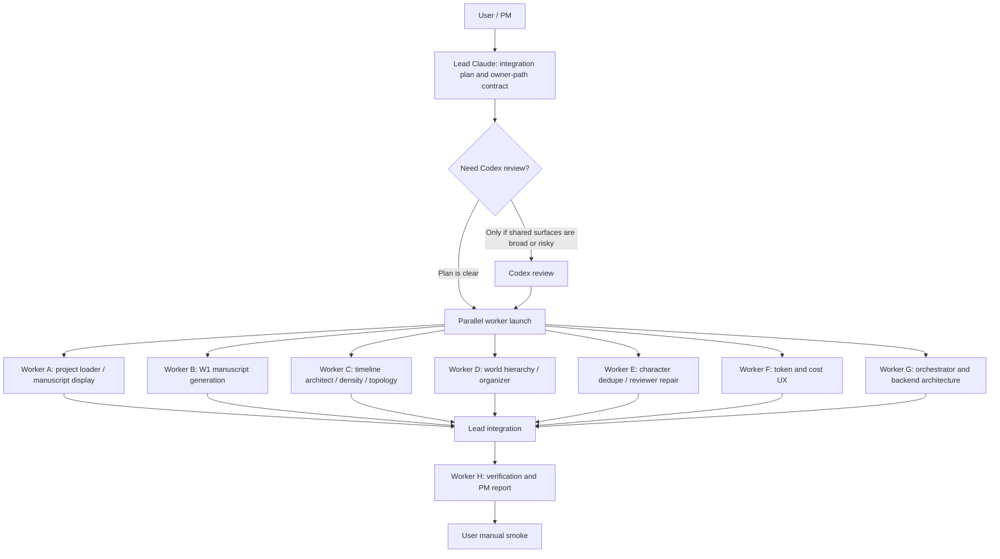

# W1 Import Smoke Defect Analysis And Repair Plan

**Date:** 2026-06-01  
**Project evidence:** `/Volumes/migodam's-external-brain/home/narrative_ide/import_test11` and `import_test12`  
**Scope:** Manuscript, World Model hierarchy, character duplicate/summary quality, Timeline order/topology, token/cost UX.

---

## Executive Summary

这轮问题不是单一 Prompt 坏了，而是 **W1 输出、canonical 分文件存储、project.json 聚合、前端读取/accept 之间仍然割裂**。

最关键证据：

- `import_test11/manuscript.json` 里有 **10 个非空章节**，但 `project.json` 里的 `chapters/scenes/events/worldItems/characters` 全是 `0`。
- `import_test11/writing/chapters/*.json` 和 `writing/scenes/*.md` 其实已经存在正文；前端如果只看 `project.json`，就会像 Manuscript 空了一样。
- `chap_1` / `scene_1` starter 默认项仍然残留。
- `entities/timeline/branches.json` 只有一个 branch：`branch_item 韩立修仙之路`，36 个 event 全部挂在这一条 branch。
- Timeline event 存在大量重复/流水账：多次“王护法接走韩立 / 三叔提议参加测试 / 入门测试开始”。
- World containers 仍包含 `人物关系图`、`事件时间线` 这类模块污染项。
- World items 没有 `categoryPath/parentId`，所以前端无法实现多级标签/层级视图。
- Characters 有重复名字：`舞岩` 2 次、`韩铸` 3 次、`老张叔` 3 次、`王护法` 2 次、`张二` 3 次、`岳堂主` 2 次。

**结论：现在还不能把问题归咎于用户操作。需要修复 W1 canonical write/read consistency。**

---

## External Research: Manuscript / Story Bible Format

Brave Search (`bx`) 调研结论：

| Source | Relevant Takeaway |
|---|---|
| [Sudowrite Story Bible Outline docs](https://docs.sudowrite.com/using-sudowrite/1ow1qkGqof9rtcyGnrWUBS/outline/3owKyHXUm1bCdp41b2Npjk) | Story Bible 的 Outline 可按 chapter-by-chapter 管理，每章 summary 会直接影响后续 beat / draft generation。 |
| [Bath Novel Award manuscript formatting guide](https://bathnovelaward.co.uk/how-to-format-your-manuscript/) | Manuscript 正文需要清晰的章节、场景分隔、段落/对话结构；synopsis/summary 和 extract 正文应区分。 |
| [Advanced Fiction Writing manuscript formatting](https://www.advancedfictionwriting.com/blog/2010/07/16/correctly-formatting-your-novel-manuscript/) | 每章通常独立开始，可带 POV、时间、地点等 scene metadata。 |
| [Shunn sample novel manuscript](https://www.shunn.net/format/novel/) | Novel manuscript 是正文文本，不是只存 event/entity summary。 |
| [Story Bible discussion](https://www.reddit.com/r/writing/comments/bjxfmk/the_story_bible_a_prewriting_process_that_works/) | Story bible 通常包括 pitch、setting/rules、characters、plot；适合作为创作辅助，不应混入正文 manuscript。 |

### Narrative IDE 的建议 Manuscript 结构

W1 导入后应同时产生两层结构：

| Layer | Purpose | Canonical Target |
|---|---|---|
| Chapter Outline | 给创作者看本章概要、目标、备注、关键 beat | `Chapter.summary`, `Chapter.goal`, `Chapter.notes` |
| Manuscript Scene | 原文/正文或导入正文梳理，支持后续继续写作 | `Scene.content`, `Scene.summary`, `Scene.povCharacterId`, `linked*Ids` |
| Story Bible / World Model | 世界规则、地点、组织、功法等长期设定 | `WorldContainer`, `WorldItem.categoryPath`, `parentId` |
| Timeline | 不可逆状态变化 / 主线转折 / 分支节点 | `TimelineEvent`, `TimelineBranch` |

---

## Defect Checklist

| # | Defect | Evidence | Severity | Root Cause Hypothesis |
|---|---|---|---|---|
| 1 | Manuscript 前端为空 | `manuscript.json` 有 10 章非空；`project.json.chapters/scenes` 为 0 | P0 | 分文件 canonical storage 没被聚合回 frontend state，或 proposal accept 后只写 split files 不更新 project.json snapshot |
| 2 | 章节顺序错 | `writing/chapters` 文件名排序为第七/第六/默认 Chapter 1/第一章...；orderIndex 本身正确但 UI/loader 可能按文件名或 project.json 空壳显示 | P0 | Loader/renderer 没按 `orderIndex`/章号排序；starter chapter 未清理 |
| 3 | Chapter Side Card 简介缺失 | `writing/chapters/*.json` imported chapters `summaryLen=0 goalLen=0 notesLen=0` | P1 | `node_write_to_project` chapter proposal 有 summary，但 split-file writer 或 proposal applier没有保留字段 |
| 4 | Scene 正文存在但前端看不到 | `writing/scenes/*.md` 有 contentLen 1700-2499；`project.json.scenes` 为 0 | P0 | frontend project loader 没加载 `writing/scenes/*.md + *.meta.json` |
| 5 | Starter 默认项残留 | `chap_1 Chapter 1`、`scene_1 Scene 1` 仍在 split files | P1 | starter cleanup 只覆盖 project.json/proposal apply，不覆盖 split-file storage |
| 6 | World Model 无多级标签 | world items `categoryPath None parentId None` | P1 | organizer output 未迁移到 existing split files；World model type 无层级字段/loader 没保留 |
| 7 | World 模块污染 | containers 有 `人物关系图`, `事件时间线` | P1 | organizer 是新接入，旧 import_test11 仍是旧输出；还需迁移/cleanup 或重新跑 smoke |
| 8 | Character 重复/简介错误 | duplicate names: 舞岩、韩铸、老张叔、王护法、张二、岳堂主 | P1 | reviewer repair 只生成建议，operation schema 可能不是 executable canonical patch；dedupe merge 不够强 |
| 9 | Timeline 顺序/拓扑错误 | 36 events 全部 `branch_item`，无 fork/merge；大量重复流水账 | P0 | Timeline Architect 当前只按 semantic lane 推 branch，且 branch key 可能被 world item/container 污染成 `branch_item`; event density policy 仍太细 |
| 10 | Token/cost 不可见 | UI 只有 profile 文案，无 live token usage/cost ledger | P2 | sidecar 没聚合 LLM usage；frontend 没 cost card |

---

## Root Cause Details

### A. Manuscript is not actually absent; it is not loaded into canonical UI state

Observed:

```text
import_test11/manuscript.json: 10 chapters, 10 nonempty
project.json: chapters=0, scenes=0
writing/chapters/*.json: imported chapter files exist
writing/scenes/*.md: imported scene content exists
```

This means W1 wrote at least part of the manuscript to disk. The broken path is one of:

1. `projectService.loadProject()` does not hydrate split canonical files into `NarrativeProject`.
2. Split-file writer creates files but `project.json` remains stale.
3. Frontend workspaces render only store arrays hydrated from `project.json`, not split files.
4. Accept All writes split files but not the snapshot arrays.

### B. Timeline order is likely backend + loader, not just frontend

Observed:

```text
branch count: 1
branch: branch_item 韩立修仙之路
36 events all on branch_item
event titles are duplicated / repetitive
globalOrderIndex absent in event files
```

Backend issue:

- `node_architect_timeline()` collapses many events into a single semantic lane.
- Repetitive low-value events survive as canonical events.
- Branch ID/name seems polluted by a category/lane value (`item`) rather than a true story branch.

Frontend issue:

- If `globalOrderIndex` is absent, UI cannot reconstruct cross-branch source order.
- Branch-local `orderIndex` alone is insufficient for imported chapter order.

### C. World hierarchy needs data model support, not just Prompt

Current `WorldItem` supports `tagIds` but no typed `categoryPath` / `parentId`. The organizer produces this conceptually, but legacy imports and frontend model do not preserve/render it.

### D. Reviewer repair packages need executable operations

Previous Codex addendum already noted:

```python
{"type": action_type, ...params}
```

is not the same as frontend Workbench canonical operation:

```ts
{ op, entityType, entityId, fields }
```

So duplicate-fix / reclassify packages may disappear from Inbox without performing real edits.

---

## Proposed Fix Plan

### Track 1 — Canonical Project Loader / Split Storage Consistency

Owner: Frontend persistence / project service.

Files likely involved:

- `src/ui-react/services/projectService.ts`
- `src/ui-react/models/project.ts`
- `tests/e2e/p1/writing_manuscript_import_display.spec.ts`
- unit tests for split-file hydration if available

Implement:

1. Add or fix split-file hydration:
   - Load `writing/chapters/*.json` into `project.chapters`.
   - Load `writing/scenes/*.meta.json` + corresponding `.md` into `project.scenes`.
   - Load `entities/timeline/branches.json` and `entities/timeline/event_*.json`.
   - Load `entities/world/containers.json` and `entities/world/world_*.json`.
   - Load `entities/characters/*.json`.
2. Merge split files into `project.json` snapshot on save or expose them directly in Zustand.
3. Sort chapters by:
   - `orderIndex`
   - parsed chapter number
   - fallback title
   - never by file name.
4. Cleanup starter split files when first W1 import exists:
   - remove/hide `chap_1` + `scene_1` if imported chapters exist.

Tests:

- Fixture with `project.json` empty but split files populated must render chapters/scenes/events/world/characters.
- Imported chapters render `第一章...第十章` in order.
- Starter `Chapter 1 / Scene 1` does not render when imported chapters exist.

### Track 2 — Manuscript Chapter Card Enrichment

Owner: W1 write + manuscript generation.

Files likely involved:

- `sidecar/workflows/w1_import.py`
- `sidecar/prompts/w1_prompts.py`
- `tests/test_w1_import_compiler.py`

Implement:

1. `node_build_manuscript()` should produce:
   - `summary`: 1-3 sentence chapter synopsis.
   - `goal`: writer-facing purpose/conflict/change.
   - `notes`: imported source/chunk IDs + key unresolved questions.
   - optional `scene_breaks`: list of beat summaries.
2. If no LLM manuscript summary exists, deterministic fallback:
   - summary = clipped first/last paragraphs + detected chapter title.
   - goal = “梳理本章导入正文，核对人物、事件与设定引用。”
   - notes = source path + chunk ids + extraction warnings.
3. Ensure split-file writer preserves `summary/goal/notes` in `writing/chapters/*.json`.

Tests:

- `node_build_manuscript()` returns non-empty summary/goal/notes for raw chunks.
- `node_write_to_project()` proposal/split file includes content and metadata.

### Track 3 — Timeline Architect Order + Density + Topology

Owner: W1 timeline architect + frontend sync.

Files likely involved:

- `sidecar/workflows/w1_import.py`
- `sidecar/prompts/w1_prompts.py`
- `sidecar/supervisor/prompt_policy.py`
- `src/ui-react/components/timeline/*`
- `tests/test_w1_import_compiler.py`
- `tests/e2e/p1/timeline_sync_roundtrip.spec.ts`

Implement:

1. Add source-order invariants:
   - every event gets `chapterNumber`, `sourceChunkIds`, `sourceOrder`, `globalOrderIndex`.
   - branch-local `orderIndex` is derived after source order, not from arbitrary dict order.
2. Strengthen density policy:
   - canonical event = irreversible state change / decision / reveal / relationship shift / branch fork/merge.
   - repeated logistics like “X 接走 Y” should merge unless it changes state.
3. Fix branch inference:
   - never generate branch id/name from generic category like `item`.
   - branch IDs must be story-lane semantic: protagonist arc, sect arc, mentor arc, artifact arc, antagonist arc.
   - preserve `forkEventId`, `mergeEventId`, `endMode`.
4. Add deterministic duplicate clustering:
   - duplicate titles with same participants/chapter/action should merge.
   - reviewer should produce executable merge/update operations.

Tests:

- Import fixture with duplicated “王护法接走韩立” yields one canonical event.
- 10 chapter fixture has >1 branch when model emits distinct lanes.
- all events sorted by `globalOrderIndex` match chapter order.
- no `branch_item` generated from world category.

### Track 4 — World Model Multi-Level Tags / Hierarchy

Owner: Organizer + World UI.

Files likely involved:

- `src/ui-react/models/project.ts`
- `src/ui-react/components/WorldWorkspace.tsx`
- `src/ui-react/services/projectService.ts`
- `sidecar/supervisor/organizer.py`
- `tests/test_w1_organizer.py`
- Playwright World Model hierarchy spec

Implement:

1. Add compatibility fields to `WorldItem`:
   - `categoryPath?: string[]`
   - `parentId?: string | null`
   - `importCategoryKey?: string`
2. Add World UI hierarchy view:
   - container -> categoryPath sections -> items.
   - fallback flat list if no categoryPath.
3. Cleanup module contamination:
   - remove/hide containers named `人物关系图`, `事件时间线`.
   - ensure relationship/timeline data stays in those modules, not World Model.
4. Add migration pass for existing import projects:
   - classify items with suffix/context.
   - fill `categoryPath` for existing split files.

Tests:

- `长春功` -> `世界模型 / 功法与术法`.
- `七玄门` -> `世界模型 / 门派组织`.
- `七绝堂` context-sensitive location/organization.
- `人物关系图` and `事件时间线` excluded.

### Track 5 — Character Dedupe / Summary Repair

Owner: Reviewer repair + character reducer.

Files likely involved:

- `sidecar/supervisor/reviewers/quality_reviewer.py`
- `sidecar/supervisor/tools.py`
- `src/ui-react/services/projectService.ts`
- `tests/test_w1_reviewers_quality.py`
- Workbench package tests

Implement:

1. Detect repeated summary phrases:
   - e.g. “十三岁锦衣少年” repeated across same card.
   - e.g. “七玄门堂主” repeated in same summary/background.
2. Convert repair action into executable canonical operation:
   - `op: "update"`
   - `entityType: "character"`
   - `entityId`
   - `fields: { summary, background, aliases }`
3. Duplicate character merge:
   - same normalized Chinese name -> merge aliases/notes/evidence.
   - preserve strongest importance and richest summary.

Tests:

- Reviewer repair package actually updates a character, not just disappears.
- Duplicate `岳堂主` merge keeps one card.

### Track 6 — Token / Cost UX

Owner: sidecar observability + Import UI.

Files likely involved:

- `sidecar/workflows/w1_import.py`
- `sidecar/workflows/w1_run_events.py`
- `sidecar/routers/workflows.py`
- `src/ui-react/services/electronApi.ts`
- `src/ui-react/store.ts`
- `src/ui-react/components/ImportWorkflow.tsx`

Implement:

1. Sidecar usage ledger:
   - `estimated_input_tokens`
   - `estimated_output_tokens`
   - prompt window count
   - model/profile
   - actual API `usage` if provider returns it.
2. Cost policy config:
   - per-provider price table configurable in settings.
   - default DeepSeek V4 Pro/Flash prices can be set as editable placeholders to avoid stale hardcoding.
3. UI card:
   - “Estimated Tokens”
   - “Actual Tokens”
   - “Estimated Cost”
   - “Active API Calls”
   - “Budget stop: 402 hard stop”

Tests:

- mocked status shows token/cost card.
- missing actual usage falls back to estimates.
- no API key shown in UI or artifacts.

---

## Suggested Claude Task Distribution

### Worker A — Project Loader / Manuscript Display

Owned paths:

- `src/ui-react/services/projectService.ts`
- `src/ui-react/models/project.ts`
- `src/ui-react/components/WritingWorkspace.tsx`
- `tests/e2e/p1/writing_manuscript_import_display.spec.ts`

Goal:

Fix split-file hydration so `import_test11` style projects render writing chapters/scenes from `writing/` even when `project.json` arrays are empty.

### Worker B — W1 Manuscript Generation

Owned paths:

- `sidecar/workflows/w1_import.py`
- `tests/test_w1_import_compiler.py`

Goal:

Make `node_build_manuscript()` and split-file write produce non-empty `summary/goal/notes` and manuscript scene content.

### Worker C — Timeline Architect

Owned paths:

- `sidecar/workflows/w1_import.py`
- `sidecar/prompts/w1_prompts.py`
- `sidecar/supervisor/prompt_policy.py`
- `tests/test_w1_import_compiler.py`

Goal:

Fix event order, duplicate event clustering, branch inference, and canonical event density.

### Worker D — World Hierarchy / Organizer

Owned paths:

- `sidecar/supervisor/organizer.py`
- `src/ui-react/components/WorldWorkspace.tsx`
- `src/ui-react/models/project.ts`
- `src/ui-react/services/projectService.ts`
- `tests/test_w1_organizer.py`

Goal:

Implement `categoryPath/parentId` support and hierarchical World Model display.

### Worker E — Character Dedupe / Reviewer Repair

Owned paths:

- `sidecar/supervisor/reviewers/quality_reviewer.py`
- `sidecar/supervisor/tools.py`
- `src/ui-react/services/projectService.ts`
- `tests/test_w1_reviewers_quality.py`

Goal:

Make Reviewer repair packages executable for duplicate names and repeated phrases.

### Worker F — Token Cost UX

Owned paths:

- `sidecar/workflows/w1_import.py`
- `sidecar/routers/workflows.py`
- `src/ui-react/services/electronApi.ts`
- `src/ui-react/store.ts`
- `src/ui-react/components/ImportWorkflow.tsx`

Goal:

Expose token/cost ledger in status and Import UI.

---

## Verification Gate

Run after integration:

```bash
sidecar/.venv/bin/python -m pytest \
  tests/test_w1_import_compiler.py \
  tests/test_w1_organizer.py \
  tests/test_w1_reviewers_quality.py \
  tests/test_w1_quality_rubric.py \
  tests/test_w1_v2_harness.py \
  -q
```

```bash
npm run ui:build
```

```bash
npx playwright test --config tests/playwright.config.ts \
  tests/e2e/p1/writing_manuscript_import_display.spec.ts \
  tests/e2e/p1/timeline_sync_roundtrip.spec.ts \
  tests/e2e/p1/world_model_organizer.spec.ts \
  tests/e2e/p1/workbench_reviewer_repair_package.spec.ts \
  --reporter=list
```

Manual smoke checklist:

- Open `import_test11` or a fresh copy and confirm split-file data renders.
- Chapters sorted 第一章 → 第十章.
- No `Chapter 1 / Scene 1` starter item when imported chapters exist.
- Manuscript scenes show content.
- Timeline has meaningful branch topology, not `branch_item` only.
- Duplicate logistics events merged.
- World Model has hierarchy.
- Character duplicates reduced.
- Import UI shows token/cost estimate and no secrets.

---

## Claude Parallel Execution Pack

### Dispatch Flow

Use this diagram to decide which Claude window to start first and which windows can run in parallel.



### Copy Strategy

Do **not** copy this whole document into every Claude window.

The large diagnosis, Track descriptions, and evidence tables above are the shared repair plan. Each Claude should read this file from the repo when it needs context:

`communication/2026-06-01-w1-smoke-defect-analysis-and-repair-plan.md`

Copy only one bounded block per Claude window:

- `COPY BLOCK: LEAD`
- `COPY BLOCK: WORKER A`
- `COPY BLOCK: WORKER B`
- `COPY BLOCK: WORKER C`
- `COPY BLOCK: WORKER D`
- `COPY BLOCK: WORKER E`
- `COPY BLOCK: WORKER F`
- `COPY BLOCK: WORKER G`
- `COPY BLOCK: WORKER H`

Each copy block is intentionally shorter than the full Track section. It tells Claude what to read, what paths it owns, what it must not touch, and what report/tests are required. This saves context and avoids accidentally pasting every worker's instructions into one window.

### Dispatch Rules

1. Send **Lead** first. Lead should confirm branch/worktree strategy, owner paths, and integration risks.
2. If Lead proposes broad edits to shared surfaces, send Lead's plan to Codex for review. Otherwise continue.
3. Send **Worker A-F** in parallel after Lead confirms no owner-path conflict.
4. Send **Worker G** in parallel or immediately after Lead. G is architecture-first and should not block P0 fixes.
5. Send **Worker H** after A-F have patches or final reports.
6. Codex review is recommended for:
   - Lead integration plan.
   - Worker A because `projectService.ts` is a critical shared surface.
   - Worker C because `w1_import.py` timeline changes are high risk.
   - Worker G because it sets future orchestrator/data-structure direction.
7. Codex review is usually unnecessary for isolated tests, report formatting, or small helper-only patches with passing tests.

### Claude Mode Rules

- Ask each Claude to run in **plan mode first**.
- If the plan is safe and owner paths are clean, let that Claude perform an **initial implementation patch**.
- Every worker must write a report to `communication/`.
- Every worker must update `dev_logs/`.
- No worker may run live model/API calls or full50.
- No worker may read provider keys.

### Fence Format Note

Each prompt begins with an explicit `COPY BLOCK` heading and a `~~~~markdown` fence. Copy from the first line inside the fence through the matching closing `~~~~`. Do not copy the surrounding explanation unless you want to give Claude extra context.

---

## COPY BLOCK: LEAD — Integration Manager

~~~~markdown
PLEASE RUN IN PLAN MODE FIRST. After I approve the plan, implement the initial integration patch.

# W1 Smoke Defect Repair — Lead Integration Manager

## Mission

Coordinate the W1 smoke repair work across multiple Claude Code workers. The current evidence shows the issue is not only Prompt quality. W1 writes split canonical files under `writing/` and `entities/`, but frontend/project loading still treats `project.json` as the main snapshot, causing the UI to appear empty or inconsistent.

You are the Lead. Your job is not to implement every feature yourself. Your job is to:
- protect shared surfaces,
- define integration contracts,
- merge worker outputs,
- keep zero-cost verification green,
- produce PM-grade reporting.

## Hard Constraints

- No live API/model calls.
- No full50.
- Do not read provider keys.
- Do not delete user data or benchmark artifacts.
- Do not revert unrelated dirty files.
- Use deterministic tests first.
- Follow `dev_docs/README.md` and `dev_docs/DEV_RULES.md`.
- Update `dev_logs/` and `communication/`.

## Current Evidence

Project evidence:
- `/Volumes/migodam's-external-brain/home/narrative_ide/import_test11`
- `/Volumes/migodam's-external-brain/home/narrative_ide/import_test12`

Observed:
- `manuscript.json` has 10 nonempty chapters.
- `writing/chapters/*.json` and `writing/scenes/*.md` exist.
- `project.json` arrays for chapters/scenes/events/worldItems/characters are empty.
- `chap_1` and `scene_1` starter files remain.
- Timeline is one branch, `branch_item`, with 36 repetitive events.
- World containers still include `人物关系图` and `事件时间线`.
- World items lack `categoryPath` and `parentId`.
- Character duplicates exist.

## Workers You Manage

- Worker A: Project Loader / Manuscript Display
- Worker B: W1 Manuscript Generation
- Worker C: Timeline Architect / Prompt Density
- Worker D: World Model Hierarchy / Organizer
- Worker E: Character Dedupe / Reviewer Repair
- Worker F: Token Cost UX
- Worker G: AI Orchestrator / Agent Client Architecture and backend data structure robustness
- Worker H: Verification / Reporting

## Initial Lead Tasks

1. Read the shared plan instead of relying on a huge pasted prompt:
   - `dev_docs/README.md`
   - `dev_docs/DEV_RULES.md`
   - `dev_docs/W1_IMPORT_COMPILER.md`
   - `dev_docs/DATA_MODEL.md`
   - `dev_docs/ARCHITECTURE.md`
   - `communication/2026-06-01-w1-smoke-defect-analysis-and-repair-plan.md`
2. Record current `git status --short --branch`.
3. Create a conflict matrix for worker owner paths.
4. Confirm that Worker A owns project loading before any other frontend worker relies on split-file hydration.
5. Define canonical data contracts:
   - `NarrativeProject` hydration from split files.
   - `Chapter.summary/goal/notes`.
   - `Scene.content`.
   - `TimelineEvent.globalOrderIndex/chapterNumber/sourceChunkIds/sourceOrder`.
   - `WorldItem.categoryPath/parentId/importCategoryKey`.
   - reviewer repair proposal operation schema.
   - token cost ledger schema.
6. Make only minimal Lead edits needed to unblock workers, if any.

## Integration Rules

- Worker A and D both touch `projectService.ts`; sequence or merge carefully.
- Worker B and C both touch `sidecar/workflows/w1_import.py`; sequence or merge carefully.
- Worker E touches `tools.py` and `projectService.ts`; coordinate with A/D.
- Worker F touches status/router/store/import UI; coordinate with A if touching `store.ts`.
- Worker G is architecture-only unless you explicitly approve code changes.

## Definition of Done

Lead may mark the iteration ready for user smoke only if:
- split-file data hydrates into UI state;
- imported chapters show in correct order;
- starter chapter/scene hidden or removed;
- manuscript scenes show content;
- timeline no longer collapses into `branch_item` only for deterministic fixture;
- world hierarchy fields preserved;
- character duplicate/repeated-phrase repair is executable or clearly marked advisory;
- token/cost card displays estimates without secrets;
- zero-cost pytest, build, and targeted Playwright pass.

## Required Report

Write:
- `communication/YYYY-MM-DD-w1-smoke-repair-lead-report.md`
- `dev_logs/YYYY-MM-DD-w1-smoke-repair-lead.md`

Report must include:
- worker matrix,
- files changed,
- integration decisions,
- exact commands and results,
- remaining risks,
- manual smoke instructions.
~~~~

---

## COPY BLOCK: WORKER A — Project Loader / Manuscript Display

~~~~markdown
PLEASE RUN IN PLAN MODE FIRST. After approval, implement an initial deterministic patch.

# Worker A — Project Loader / Manuscript Display

## Mission

Fix the frontend/canonical loading gap. `import_test11` has split files under `writing/` and `entities/`, but `project.json` arrays are empty. The UI must hydrate from canonical split files so imported chapters, scenes, timeline events, characters, and world items render even when `project.json` is stale/empty.

This is the highest priority worker. Do this before treating Manuscript as a prompt problem.

Before planning, read:
- `dev_docs/README.md`
- `dev_docs/DEV_RULES.md`
- `communication/2026-06-01-w1-smoke-defect-analysis-and-repair-plan.md`

## Owned Paths

- `src/ui-react/services/projectService.ts`
- `src/ui-react/models/project.ts`
- `src/ui-react/components/WritingWorkspace.tsx` only if display logic needs a small fix
- `tests/e2e/p1/writing_manuscript_import_display.spec.ts`
- Optional unit test file if projectService has existing test patterns

## Forbidden Paths

- `sidecar/workflows/w1_import.py` unless Lead asks.
- `sidecar/prompts/w1_prompts.py`.
- Timeline algorithm files unless Lead asks.

## Evidence To Reproduce

Use project:

`/Volumes/migodam's-external-brain/home/narrative_ide/import_test11`

Observed:
- `project.json` has `chapters=[]`, `scenes=[]`, `timelineEvents=[]`, `worldItems=[]`, `characters=[]`.
- `writing/chapters/*.json` has imported chapters.
- `writing/scenes/*.md` has scene content.
- `entities/timeline/*.json`, `entities/world/*.json`, `entities/characters/*.json` exist.
- Starter files `chap_1` and `scene_1` remain.

## Implementation Requirements

1. Inspect `projectService.ts` load path.
2. Implement split-file hydration:
   - `writing/chapters/*.json` -> `NarrativeProject.chapters`
   - `writing/scenes/*.meta.json` + matching `.md` -> `NarrativeProject.scenes`
   - `entities/timeline/branches.json` -> `timelineBranches`
   - `entities/timeline/event_*.json` -> `timelineEvents`
   - `entities/world/containers.json` -> `worldContainers`
   - `entities/world/world_*.json` -> `worldItems`
   - `entities/characters/*.json` -> `characters`
   - `entities/relationships.json` -> `relationships`
   - `entities/character-tags.json` -> `characterTags`
3. Merge rule:
   - If project.json arrays are non-empty, merge split files by id and prefer richer fields.
   - If project.json arrays are empty, split files are canonical.
4. Sort rule:
   - chapters by `orderIndex`, then parsed chapter number from Chinese/Arabic title, then title.
   - scenes by `chapterId`, `orderIndex`, then title.
   - timeline events by branch/order for branch panels, but preserve `globalOrderIndex` if present.
5. Starter cleanup:
   - If imported chapters exist, hide/drop `chap_1` + `scene_1` when they are blank starter defaults.
   - Do not delete user-authored starter files if content is nonempty.
6. Ensure `saveProject()` does not wipe split-file data after hydration.

## Tests

Add a deterministic Playwright or service-level fixture test:
- Load a project fixture with empty `project.json` arrays but populated split files.
- Assert Writing workspace shows imported chapters 第一章 -> 第十章.
- Assert Scene content is visible/nonempty.
- Assert `Chapter 1 / Scene 1` blank starter is not shown.

If Playwright setup is too heavy, create a minimal temp project fixture and test projectService hydration through Node/TS test infrastructure if available.

## Commands

Run:

- `npm run ui:build`
- targeted Playwright for the new writing manuscript display spec
- existing package/timeline smoke specs if affected

## Report

Write `communication/YYYY-MM-DD-worker-a-project-loader-report.md` with:
- exact hydration behavior,
- before/after evidence using `import_test11`,
- tests run,
- remaining risks.
~~~~

---

## COPY BLOCK: WORKER B — W1 Manuscript Generation

~~~~markdown
PLEASE RUN IN PLAN MODE FIRST. After approval, implement an initial deterministic patch.

# Worker B — W1 Manuscript Generation and Chapter Card Enrichment

## Mission

Make W1 produce useful Manuscript data, not just raw content. A novel import should create:
- ordered chapters,
- chapter summaries,
- writer-facing chapter goals,
- notes/source trace,
- manuscript scene content.

Do not solve frontend loading; Worker A owns that. Your job is W1 output quality.

Before planning, read:
- `dev_docs/README.md`
- `dev_docs/DEV_RULES.md`
- `dev_docs/W1_IMPORT_COMPILER.md`
- `communication/2026-06-01-w1-smoke-defect-analysis-and-repair-plan.md`

## Owned Paths

- `sidecar/workflows/w1_import.py`
- `tests/test_w1_import_compiler.py`
- `dev_docs/W1_IMPORT_COMPILER.md` if behavior changes

## Forbidden Paths

- `src/ui-react/services/projectService.ts`
- frontend UI files unless Lead asks.
- Timeline density logic unless tightly coupled and Lead approves.

## Research Basis

Use the report's research summary:
- Manuscript正文 should be separate from outline/story bible.
- Chapter outline should include summary/goal/notes.
- Scene content should contain the actual imported text or clean chapter text.
- Optional scene metadata may include POV, location/time hints, and scene breaks.

## Implementation Requirements

1. Improve `node_build_manuscript()`:
   - output `summary`, `goal`, `notes` for each chapter.
   - preserve `manuscript_content`.
   - preserve source order.
   - include `chapterNumber` if parseable.
   - include `sourceChunkIds`.
2. Deterministic fallback summary:
   - For Chinese text, use compact first/last paragraph extraction.
   - Do not call an LLM.
   - Avoid leaving summary empty.
3. Deterministic goal:
   - Chinese fallback: `梳理本章导入正文，核对人物、事件与设定引用。`
   - Better if chapter has detected main character/event names.
4. Notes:
   - include source file path,
   - chunk ids,
   - extraction warnings if any.
5. Ensure `node_write_to_project()` proposal data and split-file write preserve:
   - chapter summary,
   - goal,
   - notes,
   - scene content.
6. Do not write live prompts or call model.

## Tests

Add/extend tests:
- raw chunks -> manuscript chapters with non-empty summary/goal/notes.
- Chinese chapter titles parse and sort correctly.
- `node_write_to_project()` creates chapter and scene proposal/split data with content.
- Starter fallback does not generate empty manuscript.

## Commands

Run:

- `sidecar/.venv/bin/python -m py_compile sidecar/workflows/w1_import.py`
- `sidecar/.venv/bin/python -m pytest tests/test_w1_import_compiler.py -q`

## Report

Write `communication/YYYY-MM-DD-worker-b-manuscript-report.md` with:
- fields generated,
- sample before/after chapter record,
- tests run,
- remaining risks.
~~~~

---

## COPY BLOCK: WORKER C — Timeline Architect / Prompt Density

~~~~markdown
PLEASE RUN IN PLAN MODE FIRST. After approval, implement an initial deterministic patch.

# Worker C — Timeline Architect Order, Density, and Topology

## Mission

Fix Timeline being too流水账, wrong order, and collapsed into one meaningless branch. The output must support story topology:
- main branch forks into branches,
- branches may merge back,
- branches may remain independent,
- event order must match source/chapter order,
- repetitive logistics should merge or become manuscript notes, not canonical timeline events.

Before planning, read:
- `dev_docs/README.md`
- `dev_docs/DEV_RULES.md`
- `dev_docs/W1_IMPORT_COMPILER.md`
- `communication/2026-06-01-w1-smoke-defect-analysis-and-repair-plan.md`

## Owned Paths

- `sidecar/workflows/w1_import.py`
- `sidecar/prompts/w1_prompts.py`
- `sidecar/supervisor/prompt_policy.py`
- `tests/test_w1_import_compiler.py`
- Optional: `tests/e2e/p1/timeline_sync_roundtrip.spec.ts` only for added regression.

## Forbidden Paths

- `src/ui-react/services/projectService.ts` unless Lead asks.
- WorldWorkspace or WritingWorkspace.

## Required Diagnosis

Use `import_test11` evidence:
- one branch: `branch_item 韩立修仙之路`
- 36 events all on `branch_item`
- repeated events: 王护法接走韩立, 三叔提议, 入门测试
- `globalOrderIndex` absent from event split files

## Implementation Requirements

1. Source order:
   - every canonical event should carry `chapterNumber`, `sourceChunkIds`, `sourceOrder`, `globalOrderIndex`.
   - compute from chunk/chapter metadata before branch-local reindexing.
2. Density policy:
   - canonical event must be an irreversible story state change:
     - decision,
     - reveal,
     - relationship shift,
     - status change,
     - spatial relocation that opens new plot access,
     - fork/merge/branch milestone.
   - scene beats and logistics should go to manuscript notes/scene beats.
3. Duplicate clustering:
   - merge duplicate logistics with same actor/action/chapter.
   - merge title variants like `王护法接走韩立` and `七玄门王护法接走韩立`.
4. Branch inference:
   - never create branch IDs from generic world categories like `item`.
   - use semantic lanes:
     - protagonist arc,
     - sect/admission arc,
     - mentor/墨大夫 arc,
     - artifact/小瓶 arc,
     - antagonist/faction arc,
     - location journey arc if it has causality.
5. Topology:
   - preserve `parentBranchId`, `forkEventId`, `mergeEventId`, `endMode`, `startAnchor`, `endAnchor`.
   - if no merge exists, `endMode=open`.
6. Prompt deepening:
   - update prompt wording so the model distinguishes canonical timeline events from scene beats.
   - emphasize fewer but more meaningful events.
   - require `why_timeline_worthy`, `state_change`, `causal_predecessors`, `branch_role`.
   - no raw prompt injection from user-provided text; keep static prompt template changes only.

## Context Seven / Open Source Research

If Context Seven is available in your Claude environment, use it to inspect public/open-source approaches for timeline/event graph modeling, CRDT/graph ordering, and label/layout algorithms. Do not copy proprietary leaked source. If you look at Claude Code-related leaked material, use it only for high-level workflow inspiration and do not paste or reproduce code.

Recommended concepts to research:
- event sourcing,
- DAG timelines,
- causality graph,
- sequence CRDT / ordered IDs,
- graph layout with stable topological order.

## Tests

Add tests:
- duplicated “王护法接走韩立” candidates collapse to one canonical event.
- no `branch_item` from category pollution.
- events sorted by `globalOrderIndex` follow chapter/source order.
- branch can fork and remain open.
- branch can fork and merge back.

## Commands

Run:

- `sidecar/.venv/bin/python -m py_compile sidecar/workflows/w1_import.py`
- `sidecar/.venv/bin/python -m pytest tests/test_w1_import_compiler.py -q`
- if prompt_policy changed: relevant prompt policy tests.

## Report

Write `communication/YYYY-MM-DD-worker-c-timeline-report.md` with:
- density policy changes,
- topology contract,
- before/after fixture summary,
- tests run,
- remaining risks.
~~~~

---

## COPY BLOCK: WORKER D — World Model Hierarchy / Organizer

~~~~markdown
PLEASE RUN IN PLAN MODE FIRST. After approval, implement an initial deterministic patch.

# Worker D — World Model Multi-Level Hierarchy and Organizer Robustness

## Mission

World Model needs OneNote-like hierarchy. Current imports are too flat and polluted by module-owned content. Add multi-level taxonomy support and ensure World Model contains only world entities, not relationship graphs or timeline data.

Before planning, read:
- `dev_docs/README.md`
- `dev_docs/DEV_RULES.md`
- `communication/2026-06-01-w1-smoke-defect-analysis-and-repair-plan.md`

## Owned Paths

- `sidecar/supervisor/organizer.py`
- `tests/test_w1_organizer.py`
- `src/ui-react/models/project.ts`
- `src/ui-react/components/WorldWorkspace.tsx`
- `src/ui-react/services/projectService.ts` only for world item hydration/normalization
- Playwright World Model hierarchy spec if needed

## Forbidden Paths

- `sidecar/workflows/w1_import.py` unless Lead asks.
- Timeline Architect.
- WritingWorkspace.

## Implementation Requirements

1. Data model:
   - add/normalize compatibility fields:
     - `WorldItem.categoryPath?: string[]`
     - `WorldItem.parentId?: string | null`
     - `WorldItem.importCategoryKey?: string`
   - preserve these in normalization/hydration.
2. Organizer:
   - ensure output includes `categoryPath` and `parentId`.
   - exclude module contamination:
     - `人物关系图`
     - `事件时间线`
     - relationship graph strings
     - single scene beats
   - classify:
     - `长春功` -> 功法与术法
     - `七玄门` -> 门派组织
     - `神手谷` -> 地理位置
     - `记名弟子/内门弟子` -> not cultivation method; role/institution note or manuscript tag.
3. UI:
   - WorldWorkspace should group by container -> categoryPath sections -> item.
   - fallback flat view when no categoryPath.
   - do not create a visually heavy redesign; use existing visual language.
4. Existing imports:
   - provide deterministic normalization for split files missing categoryPath.
   - do not mutate user files silently unless save/apply is explicit.

## Context Seven / Open Source Research

If Context Seven is available, inspect public patterns for hierarchical note/tree models, tag trees, and outline/tree UI. Do not copy proprietary or leaked code. Extract architecture only.

Suggested concepts:
- materialized path (`categoryPath`),
- adjacency list (`parentId`),
- nested set is probably overkill for this UI,
- tree normalization from flat records.

## Tests

Add/extend:
- organizer categoryPath tests.
- projectService preserves categoryPath/parentId.
- World UI shows hierarchy for fixture.
- module contamination excluded.

## Commands

- `sidecar/.venv/bin/python -m pytest tests/test_w1_organizer.py -q`
- `npm run ui:build`
- targeted Playwright for world hierarchy if added.

## Report

Write `communication/YYYY-MM-DD-worker-d-world-hierarchy-report.md`.
~~~~

---

## COPY BLOCK: WORKER E — Character Dedupe / Reviewer Repair

~~~~markdown
PLEASE RUN IN PLAN MODE FIRST. After approval, implement an initial deterministic patch.

# Worker E — Character Dedupe and Executable Reviewer Repair

## Mission

Character cards currently contain duplicates and repeated phrases. Reviewer repair packages must not merely disappear from Inbox; they must either execute canonical operations or be explicitly marked advisory/manual.

Before planning, read:
- `dev_docs/README.md`
- `dev_docs/DEV_RULES.md`
- `communication/2026-06-01-w1-smoke-defect-analysis-and-repair-plan.md`

## Owned Paths

- `sidecar/supervisor/reviewers/quality_reviewer.py`
- `sidecar/supervisor/tools.py`
- `src/ui-react/services/projectService.ts`
- `tests/test_w1_reviewers_quality.py`
- `tests/e2e/p1/workbench_reviewer_repair_package.spec.ts`

## Forbidden Paths

- `sidecar/workflows/w1_import.py` unless Lead asks.
- Timeline Architect.
- WorldWorkspace.

## Evidence

`import_test11` duplicate names:
- 舞岩 x2
- 韩铸 x3
- 老张叔 x3
- 王护法 x2
- 张二 x3
- 岳堂主 x2

Reported repeated phrase examples:
- 五言 repeated `十三岁锦衣少年`
- 月堂主 repeated `七玄门堂主`

## Implementation Requirements

1. Reviewer checks:
   - duplicate character names by normalized Chinese name.
   - repeated phrases inside summary/background/notes.
   - thin or contradictory summary.
2. Repair actions:
   - duplicate merge action with target primary id and duplicate ids.
   - summary cleanup action with cleaned fields.
3. Proposal schema:
   - Use frontend executable format:
     - `proposedOperations` or `operations` with:
       - `op: "update"` or `op: "delete"` / supported op
       - `entityType: "character"`
       - `entityId`
       - `fields`
   - If delete/merge is unsafe, mark package as advisory and show reason.
4. Frontend applier:
   - ensure accepted reviewer repair package actually updates the character.
   - do not silently no-op.

## Tests

- repeated phrase repaired in character summary.
- duplicate name merge keeps one canonical card.
- accepting repair package updates project state.
- unsupported repair op remains blocked with precise reason.

## Commands

- `sidecar/.venv/bin/python -m pytest tests/test_w1_reviewers_quality.py tests/test_w1_pipeline_tools.py -q`
- `npm run ui:build`
- `npx playwright test --config tests/playwright.config.ts tests/e2e/p1/workbench_reviewer_repair_package.spec.ts --reporter=list`

## Report

Write `communication/YYYY-MM-DD-worker-e-character-repair-report.md`.
~~~~

---

## COPY BLOCK: WORKER F — Token / Cost UX

~~~~markdown
PLEASE RUN IN PLAN MODE FIRST. After approval, implement an initial deterministic patch.

# Worker F — Token and Cost UX

## Mission

The Import UI must show token/cost visibility so the user can see how much input/output budget is being consumed. This should mimic Claude Code-style observability without exposing secrets.

Before planning, read:
- `dev_docs/README.md`
- `dev_docs/DEV_RULES.md`
- `communication/2026-06-01-w1-smoke-defect-analysis-and-repair-plan.md`

## Owned Paths

- `sidecar/workflows/w1_import.py`
- `sidecar/workflows/w1_run_events.py`
- `sidecar/routers/workflows.py`
- `src/ui-react/services/electronApi.ts`
- `src/ui-react/store.ts`
- `src/ui-react/components/ImportWorkflow.tsx`
- `src/ui-react/services/appSettingsService.ts` only if adding editable price config, coordinate with Lead because this file is already dirty.

## Forbidden Paths

- Prompt templates unless Lead asks.
- Project loader.
- Timeline Architect.

## Implementation Requirements

1. Sidecar ledger:
   - estimated input tokens,
   - estimated output tokens,
   - estimated total tokens,
   - prompt window count,
   - model/profile,
   - active API calls,
   - actual provider usage if available.
2. Cost estimate:
   - make price table configurable, not hardcoded forever.
   - if no price configured, display token counts and “cost unavailable”.
   - never show API key.
3. Frontend:
   - ImportWorkflow has a Token / Cost card.
   - show estimated tokens during running.
   - show actual tokens if status/event contains usage.
   - show 402 hard-stop state clearly.
4. Artifacts:
   - include token ledger in import artifacts without secrets.

## Tests

- mocked status renders token/cost card.
- missing actual usage falls back to estimate.
- token ledger secret scan passes.
- 402 still stops and shows red/budget exhausted.

## Commands

- `sidecar/.venv/bin/python -m pytest tests/test_w1_quality_rubric.py tests/test_w1_v2_harness.py -q`
- `npm run ui:build`
- relevant ImportWorkflow Playwright spec.

## Report

Write `communication/YYYY-MM-DD-worker-f-token-cost-report.md`.
~~~~

---

## COPY BLOCK: WORKER G — AI Orchestrator / Agent Client Architecture And Backend Data Structures

~~~~markdown
PLEASE RUN IN PLAN MODE FIRST. This is an architecture-first worker. Do not modify core product code until Lead approves.

# Worker G — AI Orchestrator / Agent Client Architecture and Backend Robustness

## Mission

The product has many AI modules beyond W1 Import. We need a unified orchestrator/client/agent architecture similar in spirit to Claude Code: observable, tool-based, cancellable, repairable, and consistent across workflows.

Also analyze backend data structure robustness. Current structures are shallow arrays/files. For large narrative projects, we need scalable indexes, dependency graphs, and stable ordering without requiring large refactors every time.

Before planning, read:
- `dev_docs/README.md`
- `dev_docs/DEV_RULES.md`
- `dev_docs/ARCHITECTURE.md`
- `dev_docs/DATA_MODEL.md`
- `communication/2026-06-01-w1-smoke-defect-analysis-and-repair-plan.md`

## Owned Paths

Architecture/report first:

- `communication/YYYY-MM-DD-worker-g-orchestrator-data-architecture-report.md`
- `dev_logs/YYYY-MM-DD-worker-g-orchestrator-data-architecture.md`
- optionally `dev_docs/ARCHITECTURE.md`, `dev_docs/WORKFLOW_STATUS.md`, `dev_docs/DATA_MODEL.md` after Lead approval

No code edits unless Lead approves.

## Research Requirements

Use Context Seven if available. Also inspect public/open-source docs/code patterns where license-compatible.

Research topics:
- Claude Code-like agent loop architecture:
  - activity stream,
  - tool registry,
  - approvals,
  - checkpointing,
  - cancellation,
  - review/repair loop.
- Event sourcing for project mutations.
- Dependency graph / DAG for proposal packages.
- Ordered sequence data structures:
  - fractional indexing,
  - LSEQ / sequence CRDT concepts,
  - B-tree/LSM-inspired indexes,
  - red-black tree only if there is a concrete use case.
- Graph indexes for entities:
  - adjacency lists,
  - reverse references,
  - materialized path for world hierarchy.

Important legal/safety rule:

- Do not copy proprietary leaked source code.
- If looking at Claude Code leaked material or unofficial mirrors, use only high-level architectural ideas and do not reproduce code.
- Prefer public docs, open-source repos, and general algorithms.

## Deliverables

1. Unified AI module architecture proposal:
   - W0 Orchestrator,
   - W1 Import,
   - W2 Manuscript Sync,
   - W3 Writing Assistant,
   - W4 Consistency,
   - W5 Simulation,
   - W6 Beta Reader,
   - W7 Metadata Ingestion.
2. Standard workflow contract:
   - `start`,
   - `status`,
   - `activity_entries`,
   - `cancel`,
   - `artifacts`,
   - `reviewer_reports`,
   - `proposal_packages`,
   - token/cost ledger.
3. Standard agent loop:
   - plan,
   - execute tools,
   - observe,
   - review,
   - repair locally,
   - escalate to orchestrator,
   - write proposal package.
4. Backend data structure proposal:
   - project snapshot,
   - split files,
   - indexes,
   - reference graph,
   - ordered sequence strategy,
   - world hierarchy,
   - timeline topology graph.
5. Initial low-risk modifications proposal:
   - add index/cache builder,
   - add reference graph,
   - add sequence ordering helper,
   - add common workflow status schema.

## Initial Patch Scope If Lead Approves

Only implement small scaffolding:

- A shared type/schema module for workflow status/activity/token ledger.
- A pure reference graph/index helper with tests.
- No migration of all workflows yet.

## Report

Write a detailed PM-style report in `communication/`.
Include:
- architecture diagram using Mermaid,
- data structure tradeoff table,
- what to implement now vs later,
- risks,
- exact worker recommendations.
~~~~

---

## COPY BLOCK: WORKER H — Verification / PM Reporting

~~~~markdown
PLEASE RUN IN PLAN MODE FIRST. You are a verification-only worker unless Lead authorizes code changes.

# Worker H — Verification and PM Reporting

## Mission

Verify the W1 smoke repair work across all workers. Do not trust reports blindly. Re-run targeted tests, inspect actual project files, and produce a PM-grade acceptance report.

Before planning, read:
- `dev_docs/README.md`
- `dev_docs/DEV_RULES.md`
- `communication/2026-06-01-w1-smoke-defect-analysis-and-repair-plan.md`

## Owned Paths

- `communication/YYYY-MM-DD-w1-smoke-repair-verification-report.md`
- `dev_logs/YYYY-MM-DD-w1-smoke-repair-verification.md`
- Playwright specs only if adding missing verification coverage after Lead approval.

## Forbidden Paths

- Core product code unless Lead assigns a specific tiny test fix.

## Verification Targets

Use:

- `/Volumes/migodam's-external-brain/home/narrative_ide/import_test11`
- `/Volumes/migodam's-external-brain/home/narrative_ide/import_test12`
- any new synthetic fixtures workers add.

Check:

1. Project loader:
   - split files hydrate into frontend.
   - chapters sorted 第一章 -> 第十章.
   - blank starter removed/hidden.
2. Manuscript:
   - chapters have summary/goal/notes.
   - scenes have content.
3. Timeline:
   - no `branch_item` category pollution.
   - meaningful branches.
   - duplicate logistics events merged.
   - global/source order preserved.
4. World:
   - no `人物关系图` or `事件时间线` containers.
   - items have categoryPath/parentId where appropriate.
   - hierarchy visible.
5. Characters:
   - duplicate names reduced.
   - repeated phrases removed.
   - reviewer repair packages actually modify canonical data.
6. Token/cost:
   - UI shows token/cost estimate.
   - no key leaked.

## Commands

Run the final gate:

- backend pytest selected by Lead,
- `npm run ui:build`,
- Playwright writing/timeline/world/workbench/import specs.

## Report Format

The report must include:

- executive verdict,
- test table,
- per-defect checklist,
- screenshots or screenshot paths if Playwright captured any,
- remaining risks,
- whether user can perform manual smoke.
~~~~

---

## User Operating Steps

1. Open the section `COPY BLOCK: LEAD`.
2. Copy only the text inside that block's `~~~~markdown` fence and send it to the first Claude window.
3. Wait for Lead to produce a plan. Only send to Codex for review if Lead proposes broad edits to shared surfaces or unclear branch/worktree strategy.
4. After Lead confirms owner paths, open each `COPY BLOCK: WORKER ...` section and copy only that worker's fenced block into its own Claude window.
5. Send **Worker A, B, C, D, E, F, G** in parallel if you want maximum throughput.
6. If you want to save tokens:
   - Send A first because loader fixes determine whether UI smoke can be trusted.
   - Send B + C together because both are W1 backend.
   - Send D + E together because they are reviewer/organizer quality.
   - Send F later if you only care about import correctness first.
   - Send G anytime; it is architecture and should not block P0 fixes.
7. Ask each worker for a plan first. If the plan respects owner paths and tests, let it do initial implementation.
8. Send **Worker H** only after the implementation workers have patches or final reports.
9. Send to Codex for review only:
   - Lead integration plan.
   - Worker A plan, because `projectService.ts` is a critical shared surface.
   - Worker C plan, because `w1_import.py` timeline changes are high risk.
   - Worker G architecture proposal, because it sets future direction.
10. Do not send every small worker report to Codex unless tests fail or the worker changes forbidden paths.
