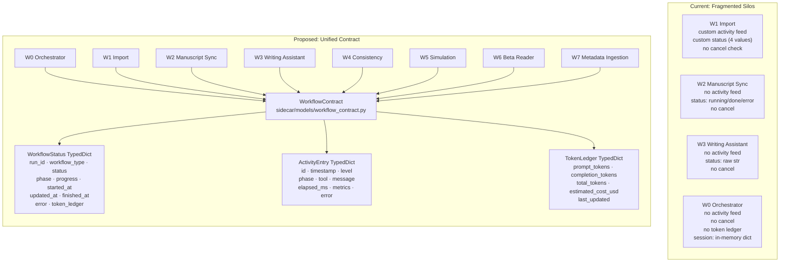
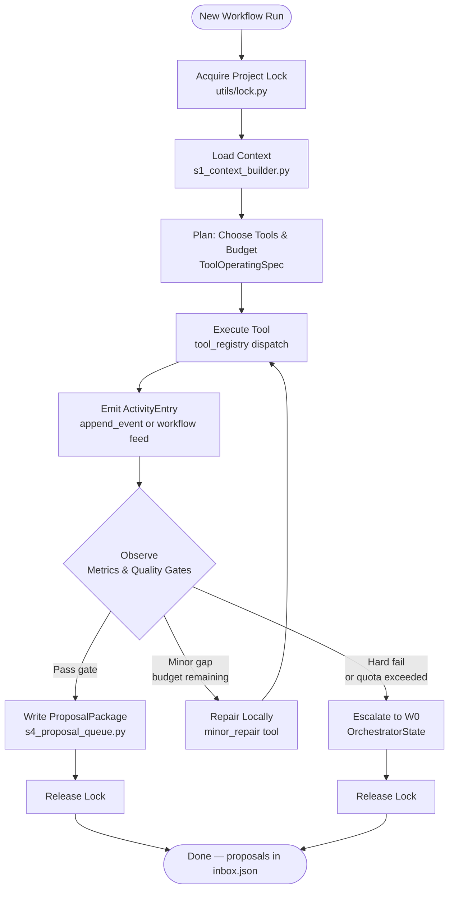
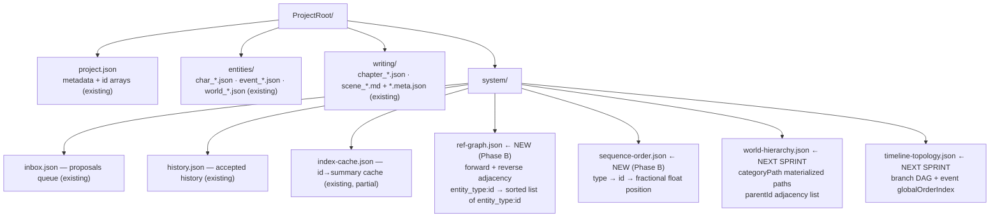

# Worker G — AI Orchestrator & Backend Data Architecture Report

**Date:** 2026-06-01  
**Author:** Worker G (Architecture)  
**Status:** Proposal — Awaiting Lead Approval  
**Branch:** codex/w1-orchestrated-import-quality

---

## Executive Summary

The product's eight AI workflows (W0-W7) currently operate as isolated silos: each defines its own status literals, none expose a common activity stream, no workflow supports real cancellation, and the shared `/workflow/status` FastAPI endpoint returns HTTP 501. Token costs are tracked internally but never surfaced to the UI. On the data layer, entities are stored in flat arrays with integer `orderIndex` fields and no indexed reference graph — creating fragility as narrative projects grow to thousands of entities.

This report proposes:
1. A **Unified Workflow Contract** (standard status, activity, cancel, token ledger, proposal packages) that all workflows can adopt incrementally without rewriting their LangGraph graphs.
2. A **Standard Agent Loop** that formalizes the plan → execute → observe → review → repair → escalate cycle already implicit in the W1 Supervisor.
3. A **Backend Data Structure Roadmap** adding three lightweight index files (`ref-graph.json`, `sequence-order.json`, `world-hierarchy.json`) alongside the existing split-file layout — no migrations required.
4. An **Initial Patch Scope** of two additive pure Python modules and their tests, implementing the shared type schema and reference graph helper. No existing workflow files are changed.

---

## 1. Current State Analysis

### 1.1 Workflow Architecture Gaps

| Gap | Evidence | Risk |
|-----|----------|------|
| No unified status schema | W0: `"planning/executing/waiting_permission/done/error"`, W3: raw `str`, W4-W7: `"running/done/error"` | UI cannot build generic workflow status cards |
| No activity stream (W2-W7) | Only W1 has `w1_run_events.py`; others log to `state["errors"]` only | Long-running imports/syncs appear frozen |
| No real cancellation | `cancel_requested()` exists in `w1_run_events.py` but zero LangGraph nodes check it | Users cannot stop runaway API spending |
| `/workflow/status` returns 501 | `sidecar/routers/status.py` line 18: `raise HTTPException(status_code=501, ...)` | No cross-workflow status dashboard |
| Token costs invisible | `SupervisorDecision.metrics_before/after` tracked internally, never emitted to caller | No 402 early warning; no cost accountability |
| Session registry fragmented | W0: in-memory dict in `routers/orchestrator.py`; W3: in-memory dict in `routers/workflows.py` | State lost on sidecar restart |
| Organizer not wired | `supervisor/organizer.py` exists, passes tests, but `tools.py:proposal_write` never calls it | World Model contamination reaches users |

### 1.2 Data Structure Limitations

| Structure | Current State | Problem |
|-----------|---------------|---------|
| `orderIndex: int` | Integer fields on scenes, chapters, events | Insert-between requires renumbering all siblings |
| Reference links | `linkedCharacterIds`, `linkedEventIds`, etc. stored in each entity's JSON | No reverse index; validating a delete requires scanning all entities |
| World hierarchy | `categoryPath` + `parentId` strings stored per entity | No pre-built path index; hierarchy queries scan all world items |
| Timeline topology | Branch ID stored per event; no DAG structure | Branch traversal requires scanning all 36+ events per query |
| Entity lookup | Project-level arrays or per-file reads | O(n) scan for ID lookup; no summary cache beyond partial `index-cache.json` |

### 1.3 Defect Patterns (from 2026-06-01 Smoke Analysis)

The smoke defect analysis identified six structural weaknesses that map directly to the gaps above:

- **Timeline branch collapse** → no topology graph enforces branch semantic invariants before write
- **Character duplicates surviving** → no reference graph to detect cross-entity ID conflicts before write
- **Organizer not running** → organizer stage not in W1 graph despite passing all unit tests
- **Reviewer repair proposals no-op** → operation schema mismatch: `tools.py` emits `{type}` but frontend `applyProposalOperation` expects `{op, entityType, entityId, fields}`
- **Token 402 surprise** → token ledger not exposed in real time; no proactive budget warning
- **Split-file hydration gap** → no guaranteed read contract specifying canonical source (`project.json` arrays vs. split files)

---

## 2. Unified AI Module Architecture

### 2.1 Current vs. Proposed Architecture



### 2.2 Standard Workflow Contract

Every workflow MUST eventually support these endpoints and fields. The TypedDicts defined in `sidecar/models/workflow_contract.py` are the canonical wire format.

```
POST   /workflows/{type}/start               → { run_id, status: WorkflowStatus }
GET    /workflows/{run_id}/status            → WorkflowStatus
GET    /workflows/{run_id}/activity          → list[ActivityEntry]
POST   /workflows/{run_id}/cancel            → { ok: bool }
GET    /workflows/{run_id}/artifacts         → list[Artifact]
GET    /workflows/{run_id}/reviewer_reports  → list[ReviewReport]
GET    /workflows/{run_id}/proposals         → list[ProposalPackage]
GET    /workflows/{run_id}/token_ledger      → TokenLedger
```

**Adoption is incremental:** workflows add `WorkflowStatus` to their state TypedDict first, then add activity emission, then add cancel token polling. No workflow needs to be rewritten to adopt the contract.

### 2.3 Standard Agent Loop



This loop is already implicit in the W1 Supervisor policy loop (`supervisor/policy.py`). Formalizing it as a shared contract means W2-W7 can adopt it without reimplementing the pattern from scratch.

### 2.4 W0 Orchestrator Role Under Unified Contract

W0 is the cross-workflow orchestrator. It MUST NOT execute AI work itself — it dispatches to W1-W7 as sub-runs. Under the unified contract, W0 gains:

- **Session registry:** Replace per-router in-memory dicts with a shared registry keyed by `run_id`
- **Permission gate:** Driven by `WorkflowStatus.status = "waiting_permission"` from any child workflow
- **Cost accumulator:** Sum `TokenLedger` across all child `run_id`s to report total session cost
- **Escalation receiver:** Child workflows that hit hard-fail route back to W0 via `OrchestratorState.escalation`

---

## 3. Standard Agent Loop Detail

### 3.1 Cancel Token Pattern

The W1 event feed already has `mark_cancel_requested()` / `cancel_requested()` in `w1_run_events.py`, but no LangGraph node ever checks the result. The fix is a two-line check at the top of each graph node — no graph restructuring required:

```python
# Add to the start of any workflow graph node
async def node_execute_tool(state: WorkflowState) -> dict:
    from sidecar.workflows.w1_run_events import cancel_requested
    if cancel_requested(state.get("session_id", "")):
        return {"status": "cancelled", "errors": ["Cancelled by user"]}
    # ... remainder of node logic unchanged
```

For W2-W7, the same `w1_run_events` module can be reused (rename to `workflow_run_events.py` in the next sprint), or each workflow can have its own cancel flag — the contract only requires that the `status` field reflects `"cancelled"` when it happens.

### 3.2 Token Ledger Emission Pattern

W1 Supervisor already tracks tokens implicitly via `SupervisorDecision.metrics_before/after`. The unified pattern standardizes key names so all workflows emit the same `TokenLedger` shape:

```python
# In any tool that calls an LLM (tools.py pattern)
response = await llm.ainvoke(prompt)
usage = getattr(response, "usage_metadata", {}) or {}
token_delta = {
    "prompt_tokens": usage.get("input_tokens", 0),
    "completion_tokens": usage.get("output_tokens", 0),
    "total_tokens": usage.get("input_tokens", 0) + usage.get("output_tokens", 0),
}
# Merge into state["token_ledger"] via accumulator helper
```

### 3.3 Activity Entry Emission Pattern

W1's `append_event(session_id, {...})` from `w1_run_events.py` is the reference implementation. Other workflows adopt the same call signature:

```python
from sidecar.workflows.w1_run_events import append_event, ensure_session

async def node_some_action(state: WorkflowState) -> dict:
    session_id = state.get("session_id", "")
    ensure_session(session_id)
    append_event(session_id, {
        "level": "info",
        "phase": "processing",
        "tool": "my_tool",
        "message": "Starting step 2/5",
    })
    # ... node logic
```

---

## 4. Backend Data Structure Proposal

### 4.1 File Layout



### 4.2 Data Structure Tradeoff Table

| Structure | Problem Solved | Implementation Effort | Migration Risk | Recommendation |
|-----------|---------------|----------------------|----------------|----------------|
| `ref-graph.json` (forward + reverse adjacency) | Dangling ID detection; safe-delete; reviewer cross-validation | Low — pure build from existing entity JSON fields | None — additive file, no existing files modified | **Now (Phase B)** |
| `sequence-order.json` (float fractional positions) | `orderIndex` integer collision on insert-between; fragile drag-drop sort | Low — parallel file alongside existing `orderIndex` int fields | None — parallel field, `orderIndex` unchanged | **Now (Phase B)** |
| `index-cache.json` expansion | O(n) entity scan on lookup | Very Low — partially exists, extend schema | None | **Verify/expand alongside Phase B** |
| `world-hierarchy.json` (materialized path + children adjacency) | Deep hierarchy queries require scanning all world items | Medium — build from `categoryPath`/`parentId` | None — additive file | **Next sprint** |
| `timeline-topology.json` (branch DAG + globalOrderIndex) | Branch collapse defect; topology traversal | Medium — requires `globalOrderIndex` added to event JSON | Low — additive field on event JSON | **Next sprint** |
| String-key lexicographic fractional indexing (LSEQ-style) | True CRDT-safe concurrent inserts, never need rebalance | High — non-trivial alphabet/digit midpoint encoding | Low — replaces float field | **Later (only if concurrent editing added)** |
| `project.db` SQLite full activation | ACID, full-text search, range queries | Very High — all write paths must dual-write | High | **Later (separate major project)** |
| Event sourcing append log | Full audit trail, time-travel, replay | Very High — all mutations emit events | High — fundamentally different architecture | **Future (out of scope)** |

### 4.3 Reference Graph Design

**File:** `system/ref-graph.json`

```json
{
  "forward": {
    "character:char_001": ["event:evt_001", "scene:scene_003"],
    "event:evt_001": ["character:char_001", "character:char_002"]
  },
  "reverse": {
    "event:evt_001": ["character:char_001"],
    "scene:scene_003": ["character:char_001"],
    "character:char_001": ["event:evt_001"],
    "character:char_002": ["event:evt_001"]
  }
}
```

**Key design invariants:**
- Key format: `"entity_type:entity_id"` (colon separator, lowercase type name)
- Values are sorted lists (deterministic serialization for git diff readability)
- Forward and reverse are always kept in sync on add/remove
- Build time: O(total cross-reference fields) — single scan on project load
- Lookup time: O(1) dict access
- Primary use case: before archiving a character, call `get_referrers("character", id)` — if non-empty, surface a warning to the user

**Python module:** `sidecar/shared/s5_reference_graph.py` (see Section 5)

### 4.4 Fractional Sequence Ordering

**File:** `system/sequence-order.json`

```json
{
  "scene": {
    "scene_001": 1000.0,
    "scene_002": 2000.0,
    "scene_003": 1500.0
  },
  "chapter": {
    "chap_001": 1000.0,
    "chap_002": 2000.0
  },
  "event": {
    "evt_001": 1000.0,
    "evt_002": 2000.0
  }
}
```

**Why float, not LSEQ:** The project does not have concurrent multi-user editing. Float arithmetic midpoints (`(prev + next) / 2.0`) handle all real-world ordering operations (insert-between, drag reorder, bulk import) with negligible implementation cost. If floating-point underflow occurs after ~50 repeated inserts between the same two items (gap < 1e-10), `needs_rebalance()` detects it and `rebalance()` corrects it. LSEQ-style string key encoding is deferred until collaborative editing becomes a requirement.

**Migration strategy:** The existing `orderIndex: int` fields stay on entity JSON untouched. `sequence-order.json` is purely additive. When the UI switches to fractional ordering, it reads from `sequence-order.json` first and falls back to `orderIndex` for backwards compatibility.

**Python module:** `sidecar/shared/s6_sequence_order.py` (see Section 5)

### 4.5 World Hierarchy (Next Sprint)

Store materialized paths and children adjacency lists separately from per-entity JSON:

```json
{
  "paths": {
    "world_container:loc_001": "location",
    "world_item:item_001": "location/city",
    "world_item:item_002": "location/city/district"
  },
  "children": {
    "world_container:loc_001": ["world_item:item_001"],
    "world_item:item_001": ["world_item:item_002"]
  }
}
```

This enables O(1) path lookup and O(depth) ancestor traversal without scanning all world items. Build from existing `categoryPath`/`parentId` fields on project load — zero migration.

### 4.6 Timeline Topology (Next Sprint)

Store the branch DAG and global event ordering separately from per-event `branchId`:

```json
{
  "branches": {
    "main": { "label": "Main Timeline", "parent": null, "split_event": null },
    "branch_protagonist": {
      "label": "Protagonist Arc",
      "parent": "main",
      "split_event": "evt_020"
    }
  },
  "global_order": ["evt_001", "evt_002", "evt_003"],
  "branch_membership": {
    "evt_001": "main",
    "evt_020": "main",
    "evt_021": "branch_protagonist"
  }
}
```

This resolves the smoke defect where all 36 events collapsed to `branch_item` — the topology graph enforces branch semantic invariants at write time, not at display time.

---

## 5. Initial Patch Scope (Phase B — Lead Approval Required)

### 5.1 `sidecar/models/workflow_contract.py`

Three TypedDicts. Zero imports from existing workflow modules. Purely additive.

```python
from __future__ import annotations
from typing import Any, Literal, Optional, TypedDict

WorkflowType = Literal["w0", "w1", "w2", "w3", "w4", "w5", "w6", "w7"]

WorkflowStatusLiteral = Literal[
    "idle", "starting", "running", "waiting_permission",
    "paused", "cancelling", "done", "error", "cancelled",
]

class ActivityEntry(TypedDict, total=False):
    id: int
    timestamp: str                        # ISO-8601
    level: Literal["info", "warning", "error"]
    phase: str
    tool: str
    message: str
    elapsed_ms: int
    metrics: dict[str, Any]
    error: str

class TokenLedger(TypedDict, total=False):
    prompt_tokens: int
    completion_tokens: int
    total_tokens: int
    estimated_cost_usd: float
    last_updated: str                     # ISO-8601

class WorkflowStatus(TypedDict, total=False):
    run_id: str
    workflow_type: WorkflowType
    status: WorkflowStatusLiteral
    phase: str
    progress: float                       # 0.0–1.0
    started_at: str                       # ISO-8601
    updated_at: str                       # ISO-8601
    finished_at: Optional[str]
    error: Optional[str]
    token_ledger: TokenLedger
```

### 5.2 `sidecar/shared/s5_reference_graph.py`

`ReferenceGraph` class: `add_reference`, `remove_reference`, `remove_entity`, `get_referrers`, `get_referenced`, `entity_exists_in_graph`, `build_from_project`, `serialize`, `deserialize`. Pure Python, zero external dependencies, zero LLM calls.

### 5.3 `sidecar/shared/s6_sequence_order.py`

Three pure functions: `midpoint(prev, next_pos) → float`, `needs_rebalance(positions) → bool`, `rebalance(count) → list[float]`. Zero dependencies.

---

## 6. Implementation Roadmap

### Now (Phase B, this PR if Lead approves)
- `sidecar/models/workflow_contract.py` — shared type definitions; 0 lines changed in existing files
- `sidecar/shared/s5_reference_graph.py` — reference graph helper with full test coverage
- `sidecar/shared/s6_sequence_order.py` — fractional ordering helper with full test coverage

### Next Sprint
- Wire `workflow_contract.WorkflowStatus` into W2-W7 state TypedDicts (import from `workflow_contract`, add as optional field)
- Implement `/workflow/status` endpoint using `WorkflowStatus` schema (replace HTTP 501)
- Add two-line cancel token check to W2-W7 graph nodes
- Build `world-hierarchy.json` on project load from existing `categoryPath`/`parentId` fields
- Build `timeline-topology.json` with `globalOrderIndex` field on events (resolves branch collapse defect)

### Later (separate projects)
- Migrate all workflows to emit `ActivityEntry` items via shared event feed (extend W1 pattern)
- Real-time token cost surfacing in UI (new sidecar→Electron IPC message + React component)
- String-key lexicographic fractional indexing (only if concurrent collaborative editing is added)
- Full `project.db` SQLite activation (major separate migration project)
- Event sourcing append log (future product requirement)

---

## 7. Risks

| Risk | Likelihood | Impact | Mitigation |
|------|-----------|--------|------------|
| New modules cause circular imports when adopted by workflows | Low | Medium | `workflow_contract.py` and `s5_reference_graph.py` have zero imports from existing sidecar modules |
| `ref-graph.json` becomes stale after entity mutations | Medium | Low | Graph is O(entities) to rebuild; rebuild on project load; mutation helpers `add_reference`/`remove_entity` keep it in sync incrementally |
| Float precision underflow in `sequence-order.json` | Low | Low | `needs_rebalance()` detects gap < 1e-10; `rebalance()` corrects to evenly-spaced values |
| Lead does not approve Phase B | N/A | None | Phase A report has standalone architectural value; Phase B can ship in a later PR |
| Workflows adopt unified contract but copy TypedDict fields instead of importing | Medium | Medium | All adoption PRs must import from `sidecar.models.workflow_contract`; catch in code review |

---

## 8. Worker Recommendations

**Worker A (Project Loader):** After split-file hydration is fixed, call `ReferenceGraph.build_from_project()` on the loaded project and log a warning for any dangling cross-reference ID found (e.g., a character references `evt_999` that does not exist).

**Worker C (Timeline Architect):** When adding `globalOrderIndex` to events, also write `timeline-topology.json` to `system/`. Use `sequence-order.json` fractional positions (via `s6_sequence_order.midpoint`) for new event ordering instead of integer `orderIndex`.

**Worker D (World Hierarchy):** Build `world-hierarchy.json` from existing `categoryPath`/`parentId` fields in world items. Use materialized path lookup for hierarchy display instead of recursive parent traversal.

**Worker E (Character Dedupe):** Before merging a duplicate character, call `ReferenceGraph.get_referrers("character", old_id)` to find all scenes and events referencing the old ID. Update all found referrers atomically before removing the old card.

**Worker F (Token/Cost UX):** Use `TokenLedger` TypedDict from `sidecar.models.workflow_contract` as the sidecar cost endpoint's wire format. Do not define a competing schema.

**All Workflow Workers:** When adding `WorkflowStatus` to your workflow's state TypedDict, import the type from `sidecar.models.workflow_contract`. Do not copy the field definitions inline — type drift across workflows is the failure mode this module prevents.

---

*Report generated by Worker G — Architecture.*  
*Approved edits to `dev_docs/ARCHITECTURE.md`, `dev_docs/WORKFLOW_STATUS.md`, and `dev_docs/DATA_MODEL.md` are deferred until Lead reviews this proposal.*
