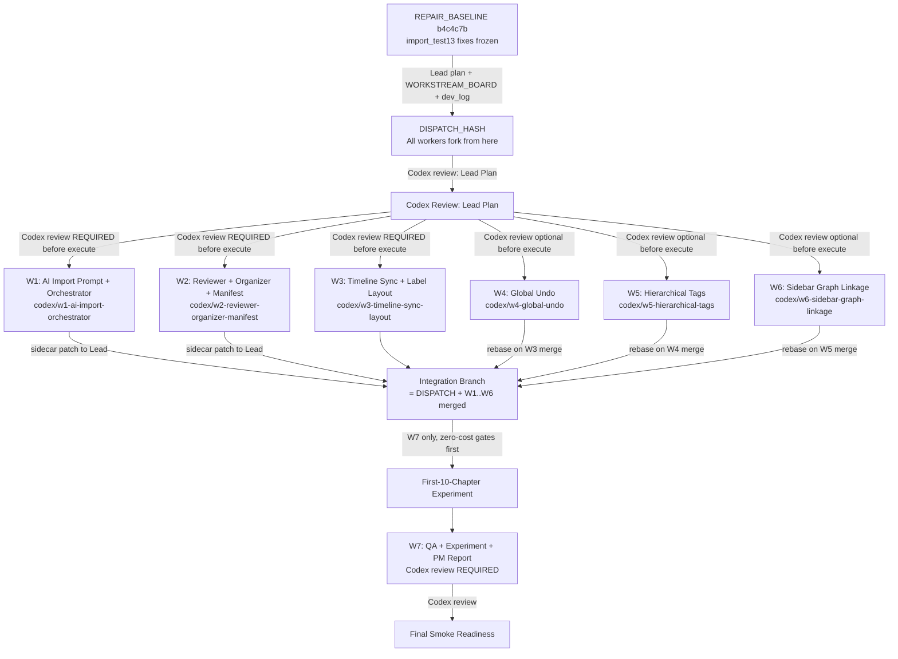

# W1 Import AI + Frontend Consistency — Lead Dispatch Plan

**Date:** 2026-06-04  
**Branch:** `codex/w1-orchestrated-import-quality`  
**Author:** Lead Claude (Plan Mode)  
**REPAIR_BASELINE_HASH:** `b4c4c7b`  
**DISPATCH_HASH:** `a586883`

---

## Executive Summary

This plan dispatches seven parallel workers (W1–W6) and one sequential QA worker (W7) to improve W1 AI import quality and add frontend interaction features. All workers fork from DISPATCH_HASH on `codex/w1-orchestrated-import-quality`. The Lead window writes coordination artifacts only — no business code.

**Baseline state (REPAIR_BASELINE_HASH = `b4c4c7b`):**
- import_test13 code fixes committed: character dedup, manuscript metadata, reviewer integration, timeline branch filtering, project-open normalization
- 12 communication history files restored (not deleted)
- 208 pytest targets pass; build passes

---

## Execution Graph



---

## Worktree Creation Protocol (All Workers)

`.worktrees/` is gitignored (verified at line 96 of `.gitignore`).

```bash
# Before starting implementation, every worker must run:
git status --short --branch           # must show clean state at DISPATCH_HASH
git worktree list --porcelain         # confirm no conflicting worktrees
git worktree add .worktrees/<name> -b codex/<name> <DISPATCH_HASH>
# Record in report header: "DISPATCH_HASH: <hash>"
```

---

## Integration Target

**All workers integrate back to `codex/w1-orchestrated-import-quality` at DISPATCH_HASH.** Not `main`. Not `trunk`.

Serial merge order for `projectService.ts` / `store.ts` shared surfaces: **W3 → W4 → W5 → W6** (each rebases on previous merge before its own merge).

W1 and W2 merge independently (sidecar only; `w1_import.py` patches applied by Lead, not self-applied).

---

## `sidecar/workflows/w1_import.py` — Lead-Owned Integration Surface

- W1 and W2 must NOT freely edit `w1_import.py`.
- Submit a **narrow patch plan** (exact function name, lines to change, or proposed new function with insertion point) to Lead/Codex.
- Workers record in their report: `w1_import.py: PATCH SUBMITTED TO LEAD — not self-applied`.
- Lead applies after Codex review.

---

## First-10-Chapter Experiment Gate

- **Default designated window: W7.** If reassigned, Lead declares it explicitly before dispatch.
- Runs only after: zero-cost tests pass on integration branch + build passes + Lead confirms ready.
- **Any 402 → immediate stop. No retry. No alternate model.**
- W1/W2 use zero-cost synthetic fixtures only. No real API calls.

---

## Per-Worker Task Packs

### WS-W1 — AI Import Prompt + Orchestrator

**Codex review: REQUIRED before execute**

**Branch:** `codex/w1-ai-import-orchestrator`  
**Worktree:** `.worktrees/w1-ai-import-orchestrator`  
**Fork from:** DISPATCH_HASH

**Owned paths:**
- `sidecar/prompts/w1_prompts.py`
- `sidecar/supervisor/planner.py`
- `sidecar/supervisor/prompt_policy.py`
- `sidecar/supervisor/tools.py`
- `tests/test_w1_supervisor_policy.py`, `tests/test_w1_import_compiler.py`
- New: `tests/test_w1_prompt_policy_selection.py`, `tests/test_w1_manifest_revision_schema.py`
- `communication/YYYY-MM-DD-w1-worker1-ai-import-orchestrator-report.md`

**Integration surface (Lead-owned):** `sidecar/workflows/w1_import.py` — submit patch plan only  
**Forbidden:** `src/ui-react/**`, `src/electron/**`, `projectService.ts`, timeline UI  
**Shared (reserve):** `sidecar/models/state.py` — notify Lead before adding state fields

**Product goal:** Orchestrator-selected event density policy (`sparse_turning_points` / `arc_level` / `chapter_level` / `scene_level`). `prompt_policy_decision.json` artifact. Manifest revision schema. Event prompts prefer irreversible state changes over scene beats.

**Read first:**
- `dev_docs/W1_IMPORT_COMPILER.md`
- `dev_docs/W1_AGENTIC_IMPORT_SUPERVISOR.md`
- `communication/2026-06-04-w1-import-test13-defect-repair-report.md`

**Acceptance criteria:**
- Zero-cost fixture: policy changes with source profile (short story → `sparse`; dense CJK webnovel → `scene_level`)
- Event prompt fixtures produce fewer 流水账 canonical candidates
- `prompt_policy_decision.json` generated/simulated in tests (no live API)
- Manifest revision schema schema-validated in a test
- `w1_import.py` patch plan submitted to Lead, not self-applied

**Required tests:**
```bash
sidecar/.venv/bin/python -m py_compile sidecar/prompts/w1_prompts.py sidecar/supervisor/planner.py sidecar/supervisor/prompt_policy.py sidecar/supervisor/tools.py

sidecar/.venv/bin/python -m pytest \
  tests/test_w1_import_compiler.py \
  tests/test_w1_supervisor_policy.py \
  tests/test_w1_prompt_policy_selection.py \
  tests/test_w1_manifest_revision_schema.py \
  -q --tb=short
```

---

### WS-W2 — Reviewer + Organizer + Manifest Repair Loop

**Codex review: REQUIRED before execute**

**Branch:** `codex/w2-reviewer-organizer-manifest`  
**Worktree:** `.worktrees/w2-reviewer-organizer-manifest`  
**Fork from:** DISPATCH_HASH

**Owned paths:**
- `sidecar/supervisor/reviewers/**`
- `sidecar/supervisor/organizer.py`
- `tests/test_w1_reviewers_quality.py`, `tests/test_w1_reviewers_fact.py`, `tests/test_w1_reviewers_consistency.py`, `tests/test_w1_organizer.py`
- New: `tests/test_w1_reviewer_manifest_revision.py`
- `communication/YYYY-MM-DD-w1-worker2-reviewer-organizer-manifest-report.md`

**Integration surface (Lead-owned):** `sidecar/workflows/w1_import.py` — submit patch plan only  
**Forbidden:** `src/ui-react/**`, timeline rendering, prompt templates outside reviewer policy

**Product goal:** Three reviewer action levels (`local_repair`, `manifest_revision`, `orchestrator_rerun_request`). Quality Reviewer detects repeated phrases and duplicate chapters. Manifest revision is a structured diff. Organizer routes 功法/地点/门派 correctly.

**Read first:**
- `sidecar/supervisor/reviewers/` (all files)
- `sidecar/supervisor/organizer.py`
- `communication/2026-06-04-w1-import-test13-defect-repair-report.md`

**Acceptance criteria:**
- Quality Reviewer `local_repair` for "23岁" / "十岁" repetition in synthetic fixture
- Quality Reviewer detects duplicate 第九章 / 第十章 in synthetic manifest
- Organizer routes correctly; excludes character/person terms
- Manifest revision schema-validated in test (no live API)
- Report table: issue → detected? → repaired locally? → escalated?

**Required tests:**
```bash
sidecar/.venv/bin/python -m py_compile sidecar/supervisor/organizer.py

sidecar/.venv/bin/python -m pytest \
  tests/test_w1_reviewers_quality.py \
  tests/test_w1_reviewers_fact.py \
  tests/test_w1_reviewers_consistency.py \
  tests/test_w1_organizer.py \
  tests/test_w1_reviewer_manifest_revision.py \
  -q --tb=short
```

---

### WS-W3 — Timeline Front/Back Consistency + Label Layout

**Codex review: REQUIRED before execute**

**Branch:** `codex/w3-timeline-sync-layout`  
**Worktree:** `.worktrees/w3-timeline-sync-layout`  
**Fork from:** DISPATCH_HASH

**Owned paths:**
- `src/ui-react/components/timeline/**`
- `src/ui-react/components/TimelineWorkspace.tsx`
- `tests/e2e/p1/timeline_sync_roundtrip.spec.ts`, `tests/e2e/p1/timeline_topology_import.spec.ts`
- New: `tests/e2e/p1/timeline_label_collision.spec.ts`
- `communication/YYYY-MM-DD-w1-worker3-timeline-sync-layout-report.md`

**Limited (Lead-approved only):**
- `src/ui-react/services/projectService.ts` — timeline persistence/sync contract only
- `sidecar/workflows/w1_import.py` — timeline schema/artifact contract only, submit to Lead

**Forbidden:** Character/World components, `store.ts` beyond timeline slice  
**Shared (reserve):** `projectService.ts` — W3 merges first; W4 and W5 rebase after

**Product goal:** Timeline drag/drop/fork/merge → persist → reload roundtrip. Label layout non-overlapping for 30+ events. Generic empty import branches cleaned; user-named planning branches preserved.

**Read first:**
- `dev_docs/FRONTEND_BACKEND_CHECKLIST.md`
- `dev_docs/W1_IMPORT_COMPILER.md` (Timeline Requirements section)
- `communication/2026-06-04-w1-import-test13-defect-repair-report.md`

**Acceptance criteria:**
- Playwright: drag event to branch → persist → reload → correct `branchId`/`orderIndex`
- Playwright: 30+ events, labels do not overlap above threshold
- Imported artifact with 4 branches → 4 branches after accept (no flattening)
- Generic empty import branches cleaned on open; user-named branches preserved

**Required tests:**
```bash
npm run ui:build

npx playwright test --config tests/playwright.config.ts \
  tests/e2e/p1/timeline_sync_roundtrip.spec.ts \
  tests/e2e/p1/timeline_topology_import.spec.ts \
  tests/e2e/p1/timeline_label_collision.spec.ts \
  --reporter=list
```

---

### WS-W4 — Global Undo / Redo Transaction System

**Codex review: optional before execute; REQUIRED before merge**

**Branch:** `codex/w4-global-undo`  
**Worktree:** `.worktrees/w4-global-undo`  
**Fork from:** DISPATCH_HASH  
**Merge after:** W3

**Owned paths:**
- `src/ui-react/store.ts` (undo stack slice)
- `src/ui-react/services/projectService.ts` (undo persistence — rebase on W3 merge first)
- `src/ui-react/hooks/**` or command handlers (if present)
- Shell-level keyboard handling in `src/ui-react/components`
- New: `tests/e2e/p1/undo_transaction.spec.ts`
- `communication/YYYY-MM-DD-w1-worker4-global-undo-report.md`

**Forbidden:** W1 prompt templates, sidecar import workflow, timeline rendering internals  
**Shared (reserve):** `store.ts` — coordinate with W6 on slice boundaries; `projectService.ts` — rebase on W3 merge

**Product goal:** Global Ctrl+Z / Cmd+Z persists through `projectService` to folder project files. Exclude ephemeral UI state (selection, hover, panel open, route). Undo is P0; Redo is P2.

**Undo transaction schema:**
```typescript
{
  id: string; timestamp: number; label: string;
  before: ProjectSnapshot | EntityPatch;
  after: ProjectSnapshot | EntityPatch;
  affectedEntityRefs: { type: string; id: string }[];
  source: "user_edit" | "proposal_accept" | "import";
}
// setSelectedEntity calls must NOT create undo entries
```

**Acceptance criteria:**
- Playwright: edit character field, Ctrl+Z, reload → old value restored
- Playwright: timeline drag, Ctrl+Z, reload → old branch/position restored
- Playwright: selection changes do not add undo stack entries
- Report: mutation coverage table with uncovered paths

**Required tests:**
```bash
npm run ui:build
npx playwright test --config tests/playwright.config.ts tests/e2e/p1/undo_transaction.spec.ts --reporter=list
```

---

### WS-W5 — Hierarchical Tags + Windows-like Drag Drop

**Codex review: optional before execute; REQUIRED before merge**

**Branch:** `codex/w5-hierarchical-tags`  
**Worktree:** `.worktrees/w5-hierarchical-tags`  
**Fork from:** DISPATCH_HASH  
**Merge after:** W4

**Owned paths:**
- `src/ui-react/models/project.ts` (tag hierarchy model)
- `src/ui-react/services/projectService.ts` (tag persistence — rebase on W4 merge first)
- `src/ui-react/components/WorldWorkspace.tsx` or related world components
- `src/ui-react/components/CharacterWorkspace.tsx` or related character components
- New: `tests/e2e/p1/hierarchical_tags.spec.ts`
- `communication/YYYY-MM-DD-w1-worker5-hierarchical-tags-report.md`

**Forbidden:** `sidecar/prompts/**`, timeline sync internals  
**Shared (reserve):** `project.ts` — coordinate if W3/W4 also add model fields; `projectService.ts` — rebase on W4 merge

**Hierarchical tag schema (canonical):**
```typescript
{ id: string; name: string; parentId: string | null; sortOrder: number;
  scope: "world" | "character" | "shared"; collapsed: boolean; metadata?: Record<string, unknown> }
// Existing flat characterTags → root level (parentId = null) via openProject() normalization
```

**Acceptance criteria:**
- Playwright: create nested tags 4 levels deep
- Playwright: drag level-4 → level-2 parent, reload, hierarchy persists
- Playwright: drag cannot create parent-child cycle
- World item assignable to nested category; character assignable to nested tag
- Migration unit test: flat tags become root-level nodes

**Required tests:**
```bash
npm run ui:build
npx playwright test --config tests/playwright.config.ts tests/e2e/p1/hierarchical_tags.spec.ts --reporter=list
```

---

### WS-W6 — Sidebar Collapse + Relationship Graph Linkage

**Codex review: optional before execute; REQUIRED before merge**

**Branch:** `codex/w6-sidebar-graph-linkage`  
**Worktree:** `.worktrees/w6-sidebar-graph-linkage`  
**Fork from:** DISPATCH_HASH  
**Merge after:** W5

**Owned paths:**
- Relationship graph UI components (grep: `RelationshipGraph`, `CharacterGraph`)
- Character sidebar/folder components
- `store.ts` graph filter slice
- New: `tests/e2e/p1/sidebar_graph_linkage.spec.ts`
- `communication/YYYY-MM-DD-w1-worker6-sidebar-graph-linkage-report.md`

**Forbidden:** `sidecar/workflows/w1_import.py`, world hierarchy model (unless W5 exposes shared interface approved by Lead)  
**Shared (reserve):** `store.ts` — coordinate with W4 on slice boundaries; rebase after W4+W5 merge

**Product goal:** Core/main filter in sidebar collapses non-core groups AND hides non-core graph nodes. Data unchanged by filter toggle. Selection not persisted as content mutation.

**Acceptance criteria:**
- Playwright: core/main filter → sidebar non-core groups collapse, graph hides non-core nodes
- Playwright: expand group → graph includes it when linkage on
- Relationship graph data unchanged after filter toggle
- Selection not persisted as content mutation

**Required tests:**
```bash
npm run ui:build
npx playwright test --config tests/playwright.config.ts tests/e2e/p1/sidebar_graph_linkage.spec.ts --reporter=list
```

---

### WS-W7 — QA, First-10-Chapter Experiment, and PM Report

**Codex review: REQUIRED**

**Branch:** `codex/w7-qa-experiment-report`  
**Worktree:** `.worktrees/w7-qa-experiment-report`  
**Fork from:** Integration branch (after W1–W6 merged or time-boxed)

**Owned paths:**
- `tests/e2e/p1/**` QA specs (read-only unless gap fix needed and Lead approves)
- `communication/YYYY-MM-DD-w1-import-ai-frontend-final-qa-report.md`
- `dev_logs/YYYY-MM-DD-w1-import-ai-frontend-qa.md`

**Forbidden:** Core source files. W7 does not implement business logic.

**Read first:** All W1–W6 communication reports; verify each records DISPATCH_HASH.

**QA flow:**

```bash
# Zero-cost gate
sidecar/.venv/bin/python -m py_compile \
  sidecar/workflows/w1_import.py \
  sidecar/supervisor/organizer.py \
  sidecar/supervisor/planner.py \
  sidecar/supervisor/prompt_policy.py \
  sidecar/supervisor/tools.py

sidecar/.venv/bin/python -m pytest \
  tests/test_w1_import_compiler.py \
  tests/test_w1_organizer.py \
  tests/test_w1_reviewers_quality.py \
  tests/test_w1_reviewers_fact.py \
  tests/test_w1_reviewers_consistency.py \
  tests/test_w1_supervisor_tools.py \
  tests/test_w1_supervisor_policy.py \
  -q --tb=short

npm run ui:build

npx playwright test --config tests/playwright.config.ts \
  tests/e2e/p1/import_activity_status.spec.ts \
  tests/e2e/p1/timeline_sync_roundtrip.spec.ts \
  tests/e2e/p1/world_model_organizer.spec.ts \
  tests/e2e/p1/workbench_reviewer_repair_package.spec.ts \
  tests/e2e/p1/undo_transaction.spec.ts \
  tests/e2e/p1/hierarchical_tags.spec.ts \
  tests/e2e/p1/sidebar_graph_linkage.spec.ts \
  --reporter=list

# First-10-chapter experiment (only if above passes AND Lead confirms ready)
# Any 402 → stop immediately. No retry.
# Record: model, profile, chapter count, prompt windows, token estimate, artifact paths
```

**Artifact inspection:**
- `review_report.json` has `reviewer_reports`
- `organizer_output.json` exists
- `prompt_policy_decision.json` exists (if W1 implemented)
- Manifest revisions exist (if W2 implemented)

**Final PM report must include:**
- Per-worker contribution table
- Per-user-requirement acceptance matrix
- Command/test results with pass/fail
- First-10-chapter experiment summary (or documented gap)
- Remaining blockers and manual smoke steps

---

## Shared Data Contracts

### Manifest Revision Schema (W1 + W2 agree before coding)
```json
{
  "revision_id": "string",
  "revision_type": "local_repair | manifest_revision | orchestrator_rerun_request",
  "target_entity_type": "character | event | world | chapter",
  "chapter_range": [1, 10],
  "before_patch": {},
  "after_patch": {},
  "reason": "string",
  "reviewer_source": "quality_reviewer | fact_reviewer | consistency_reviewer"
}
```

### Reviewer Report Schema (in `review_report.json["reviewer_reports"]`)
```json
{
  "reviewer_type": "quality_reviewer | fact_reviewer | consistency_reviewer",
  "action_level": "local_repair | manifest_revision | orchestrator_rerun_request",
  "findings": [],
  "local_repairs": [],
  "manifest_revisions": [],
  "rerun_requests": []
}
```

### Organizer Output Schema (existing — do not change)
`organizer_output.json`: `world_containers`, `world_items`, `excluded_items`, `merge_candidates`, `proposal_packages`, `warnings`

### Timeline Branch/Event Schema (W3 must not remove/rename without updating docs)
- Branch: `id`, `parentBranchId`, `forkEventId`, `mergeEventId`, `rankStart`, `rankEnd`, `laneId`, `sortOrder`, `endMode`, `startAnchor`, `endAnchor`
- Event: `branchId`, `orderIndex`, `locationIds`, `participantCharacterIds`, `linkedSceneIds`, `linkedWorldItemIds`, `tags`

---

## Shared Surfaces Reservation Table

| Surface | Owner | Serial Merge Order | Rule |
|---------|-------|--------------------|------|
| `sidecar/workflows/w1_import.py` | **Lead (integration surface)** | Lead applies after Codex review | W1/W2 submit patch plan only |
| `sidecar/models/state.py` | Lead (arbiter) | — | Notify Lead before adding state fields |
| `store.ts` | W4 (undo slice) + W6 (graph filter slice) | W4 then W6 | Coordinate slice boundaries |
| `projectService.ts` | W3 → W4 → W5 | W3 first, W4 rebases, W5 rebases | Each rebase before merge |
| `project.ts` | W5 (tag schema) | W5 owns; W3 may add timeline fields (coordinate) | Notify Lead on schema changes |

---

## Final Integration Checklist

- [ ] REPAIR_BASELINE_HASH `b4c4c7b` verified committed
- [ ] DISPATCH_HASH committed; recorded in this document
- [ ] Lead plan Codex-reviewed and approved before worker dispatch
- [ ] W1–W6 worktrees created from DISPATCH_HASH; each report records DISPATCH_HASH
- [ ] W1: zero-cost tests pass; `w1_import.py` patch submitted to Lead (not self-applied)
- [ ] W2: reviewer suite passes; manifest revision schema tested; `w1_import.py` patch submitted to Lead
- [ ] W3: timeline roundtrip Playwright pass; label layout pass; merges first
- [ ] W4: undo Playwright pass; rebases on W3 merge
- [ ] W5: hierarchical tags Playwright pass; rebases on W4 merge
- [ ] W6: graph linkage Playwright pass; rebases on W5 merge
- [ ] Lead applies W1+W2 `w1_import.py` patches; re-runs py_compile + pytest
- [ ] `npm run ui:build` passes on integration branch
- [ ] `pytest tests/test_w1_*.py -q` passes on integration branch
- [ ] First-10-chapter experiment (W7); artifacts inspected; 402 stop enforced
- [ ] Final QA PM report written
- [ ] `WORKSTREAM_BOARD.md` WS-W1 through WS-W7 entries updated
- [ ] `WORKFLOW_STATUS.md` updated if workflow status changed
- [ ] `W1_IMPORT_COMPILER.md` updated if artifact schema changed
- [ ] `DECISION_LOG.md` updated with integration decisions
- [ ] Codex final review before merge to integration line

---

## Hard Constraints (All Workers)

- No full50 run
- First-10-chapter experiment: single designated window (W7 by default), only after zero-cost gates pass
- Any API 402 → immediate stop, no retry, no alternate model
- Do not read or print provider keys
- Worker reports must record DISPATCH_HASH in header
- Do not self-handle unrelated dirty files from Lead's worktree
- No weakening tests to make them pass
- Communication history files must not be deleted without explicit user approval
