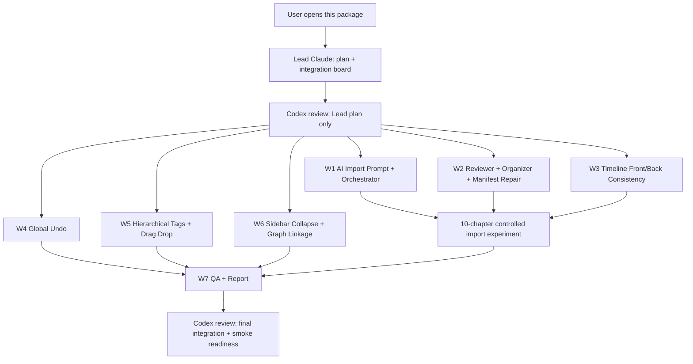

# W1 Import AI + Frontend Consistency Parallel Claude Prompt Package

Date: 2026-06-04

Purpose: This document is a distribution package for multiple Claude Code windows running in plan mode. Each prompt below is intended for a separate Claude instance and preferably a separate branch/worktree. Do not paste the whole document into one Claude window. Copy one fenced prompt block at a time.

## Product Goal

We need to keep improving W1 smart import while also adding frontend interaction features that make the Narrative IDE feel like a real authoring system:

- Import AI should improve prompt quality, workflow robustness, orchestrator policy decisions, and reviewer/organizer repair loops.
- We are allowed to run a limited first-10-chapter experiment using the prepared novel file, but no full50 run.
- Frontend and backend must stay consistent: undo, timeline sync, tag hierarchy, graph filtering, and manifest repair must persist through canonical project data.
- Detailed completion reports must be written into `communication/`, not only summarized in chat.

## Distribution Flow



## Recommended Execution Order

| Wave | Claude Window | Can Run In Parallel? | Codex Review Needed? | Reason |
|---|---|---:|---:|---|
| 0 | Lead Claude | No | Yes | Must freeze branches, define exact ownership, and prevent file conflicts |
| 1 | W1 AI Import Prompt + Orchestrator | Yes, after Lead | Yes | High-risk prompt/workflow changes affect live import quality and cost |
| 1 | W2 Reviewer + Organizer + Manifest Repair | Yes, after Lead | Yes | High-risk repair loop can mutate prior manifest and project content |
| 1 | W3 Timeline Front/Back Consistency | Yes, after Lead | Yes | Critical canonical data contract and sync correctness |
| 1 | W4 Global Undo | Yes, after Lead | Optional before execute; required before merge | Broad state/persistence impact |
| 1 | W5 Hierarchical Tags + Drag Drop | Yes, after Lead | Optional before execute; required before merge | Data-model/UI change but lower risk than timeline/import |
| 1 | W6 Sidebar Collapse + Graph Linkage | Yes, after Lead | Optional before execute; required before merge | UI behavior and graph filtering |
| 2 | W7 QA + PM Report | After W1-W6 | Yes | Must verify integration and produce final report |

## Copy Prompt 0 — Lead Claude

```text
You are Lead Claude for Narrative IDE W1 Import AI + Frontend Consistency.

Run in PLAN MODE first. Do not execute until the user approves your plan.

This prompt is for one Claude window only. Other Claude windows will receive separate worker prompts W1-W7 on separate branches/worktrees. Your job is to coordinate, not to implement every file yourself.

Repository:
/Volumes/migodam's-external-brain/Development/Narrative_IDE

Read first:
- AGENTS.md
- dev_docs/README.md
- dev_docs/DEV_RULES.md
- dev_docs/PARALLEL_WORKTREE_PROTOCOL.md
- dev_docs/SHARED_SURFACES.md
- dev_docs/TASK_PACK_TEMPLATE.md
- dev_docs/WORKSTREAM_BOARD.md
- communication/2026-06-04-w1-import-test13-defect-repair-report.md
- communication/2026-06-01-w1-smoke-defect-analysis-and-repair-plan.md

Hard constraints:
- No full50 run.
- First-10-chapter experiment is allowed only after zero-cost tests pass.
- Do not read or print provider keys.
- If any API run hits 402 or insufficient balance, stop immediately. No retry.
- Keep detailed reports in communication/.
- Do not overwrite other agents' dirty work.

Your plan must define:
1. Branch/worktree naming for W1-W7.
2. Exact owned files and forbidden files for each worker.
3. Integration sequence.
4. Which worker plans need Codex review before execution:
   - W1 AI Import Prompt + Orchestrator: Codex review required.
   - W2 Reviewer + Organizer + Manifest Repair: Codex review required.
   - W3 Timeline Front/Back Consistency: Codex review required.
   - W4/W5/W6: Codex review optional before execution, required before merge.
   - W7 final QA: Codex review required.
5. A shared data-contract checklist:
   - Timeline branch/event schema.
   - Manifest revision schema.
   - Reviewer report schema.
   - Organizer output schema.
   - Undo transaction schema.
   - Hierarchical tag schema.
6. A test matrix:
   - Python zero-cost unit tests.
   - npm run ui:build.
   - Playwright specs.
   - Limited first-10-chapter experiment and artifacts to inspect.

Deliverables:
- Update or create communication/YYYY-MM-DD-w1-import-ai-frontend-lead-plan.md.
- Include a Mermaid execution graph.
- Include per-worker acceptance criteria.
- Include final integration checklist.

Do not implement code in this Lead window unless the user explicitly asks you to.
```

## Copy Prompt W1 — AI Import Prompt + Orchestrator

```text
You are Worker W1: AI Import Prompt + Orchestrator Quality.

Run in PLAN MODE first. This prompt is for a dedicated Claude instance/branch, not for the Lead window.

Repository:
/Volumes/migodam's-external-brain/Development/Narrative_IDE

Read first:
- AGENTS.md
- dev_docs/README.md
- dev_docs/DEV_RULES.md
- dev_docs/W1_AGENTIC_IMPORT_SUPERVISOR.md
- dev_docs/W1_IMPORT_COMPILER.md
- communication/2026-06-04-w1-import-test13-defect-repair-report.md

Owned paths:
- sidecar/prompts/w1_prompts.py
- sidecar/supervisor/planner.py
- sidecar/supervisor/prompt_policy.py
- sidecar/supervisor/tools.py
- sidecar/workflows/w1_import.py only for orchestrator-policy integration points approved by Lead
- tests related to W1 prompt policy / planner / import quality
- communication/W1 worker report

Forbidden paths unless Lead approves:
- src/ui-react/**
- src/electron/**
- projectService.ts
- timeline UI components

Product problem:
Current import events are too流水账, topology can flatten, and prompt density is too static. The orchestrator should decide event density and prompt policy from source profile, project topology, and reviewer feedback, instead of hard-coded Codex guesses.

Design requirements:
1. Convert event density into an orchestrator-selected policy:
   - sparse_turning_points
   - arc_level
   - chapter_level
   - scene_level
2. The policy must be explainable in an artifact:
   - prompt_policy_decision.json
   - include chosen density, reason, source profile signals, existing timeline topology signals, and reviewer feedback used.
3. Prompt changes should emphasize:
   - canonical events are irreversible state changes.
   - scene beats belong in manuscript/notes, not timeline.
   - event must include state_change, causal_predecessors, branch_role, why_timeline_worthy.
   - avoid extracting logistics-only events unless they later change plot state.
4. PromptPolicyPatch remains allowlisted only:
   - No raw prompt injection.
   - Add only typed knobs if needed.
5. The orchestrator may modify earlier manifest entries if later chapters reveal importance dilution, but this must be a structured manifest revision, not free-form mutation.

First-10-chapter experiment:
- You are allowed to run a controlled first-10-chapter experiment only after zero-cost tests pass.
- Use the prepared novel file already present in the workspace/project environment. Locate it without printing secrets.
- Do not run full50.
- Stop on 402.
- Record model, profile, chapter count, prompt windows, token estimate if available, artifacts inspected.

Acceptance criteria:
- Zero-cost fixture shows event density policy changes with source profile.
- Event prompt produces fewer流水账 canonical event candidates in synthetic fixtures.
- prompt_policy_decision.json is generated or simulated in tests.
- First-10-chapter experiment report explains whether events are more author-useful.

Tests:
- py_compile changed Python files.
- pytest targeted W1 planner/prompt/policy/import compiler tests.
- Add tests for policy selection and manifest revision schema.

Report:
- communication/YYYY-MM-DD-w1-worker1-ai-import-orchestrator-report.md
- Include exact files changed, policy decisions, tests, artifacts, and remaining risks.
```

## Copy Prompt W2 — Reviewer + Organizer + Manifest Repair

```text
You are Worker W2: Reviewer + Organizer + Manifest Repair Loop.

Run in PLAN MODE first. This prompt is for a dedicated Claude instance/branch.

Repository:
/Volumes/migodam's-external-brain/Development/Narrative_IDE

Read first:
- AGENTS.md
- dev_docs/README.md
- dev_docs/DEV_RULES.md
- communication/2026-06-04-w1-import-test13-defect-repair-report.md
- sidecar/supervisor/reviewers/*
- sidecar/supervisor/organizer.py

Owned paths:
- sidecar/supervisor/reviewers/**
- sidecar/supervisor/organizer.py
- sidecar/workflows/w1_import.py only for reviewer/organizer repair-loop integration approved by Lead
- tests/test_w1_reviewers_*.py
- tests/test_w1_organizer.py
- new tests for manifest revision and repair loops
- communication/W2 worker report

Forbidden paths unless Lead approves:
- src/ui-react/**
- timeline rendering code
- prompt templates outside reviewer-policy needs

Product problem:
The user asks: "Reviewer 真的在干活吗?" Existing reviewer tests can pass while real imports still contain repeated character phrases, empty manuscript, duplicate chapters, empty branches, and wrong World Model categories. Reviewer must identify small issues and fix them locally when safe; larger issues must be escalated to orchestrator as structured rerun/manifest revision requests.

Design requirements:
1. Define reviewer action levels:
   - local_repair: deterministic, safe, no model call.
   - manifest_revision: update earlier chapter/entity/event manifest with structured diff.
   - orchestrator_rerun_request: re-open a bounded window.
2. Quality Reviewer:
   - detect repeated character facts and repeated age phrases.
   - detect流水账 timeline density.
   - detect empty/duplicate chapters.
   - detect world model empty containers and wrong module pollution.
3. Fact Reviewer:
   - lightweight RAG only.
   - compare extracted facts against small source snippets, not whole novel.
   - report obvious mismatch only; no expensive broad verification.
4. Consistency Reviewer:
   - compare current import with previous project manifest.
   - protect important early facts from later dilution.
   - produce manifest_revision when later chapters change importance/role.
5. Organizer:
   - keep world model only for world content.
   - route 人物关系图, event timeline, and character identities out of World Model.
   - support categoryPath / parentId for hierarchy.

Acceptance criteria:
- Reviewers produce repair actions for repeated "23岁" / "十岁" style phrases.
- Reviewers detect duplicate 第九章/第十章 in synthetic manifest.
- Organizer routes 功法, 地点, 门派组织 correctly and excludes character/person terms.
- Manifest revision diff is structured and testable.
- No live API calls in tests.

Tests:
- pytest reviewer and organizer suites.
- Add tests for local repair output and manifest revision output.
- Add regression fixture based on import_test13 symptoms.

Report:
- communication/YYYY-MM-DD-w1-worker2-reviewer-organizer-manifest-report.md
- Include table: issue -> reviewer detected? -> repaired locally? -> escalated?
```

## Copy Prompt W3 — Timeline Front/Back Consistency + Label Layout

```text
You are Worker W3: Timeline Frontend/Backend Consistency and Label Layout.

Run in PLAN MODE first. Codex review is required before execution because this is a high-risk canonical data contract task.

Repository:
/Volumes/migodam's-external-brain/Development/Narrative_IDE

Read first:
- AGENTS.md
- dev_docs/README.md
- dev_docs/DEV_RULES.md
- dev_docs/FRONTEND_BACKEND_CHECKLIST.md
- dev_docs/W1_IMPORT_COMPILER.md
- communication/2026-06-04-w1-import-test13-defect-repair-report.md

Owned paths:
- src/ui-react/components/timeline/**
- src/ui-react/components/TimelineWorkspace.tsx
- src/ui-react/services/projectService.ts only for timeline persistence/sync contract
- sidecar/workflows/w1_import.py only for timeline schema/artifact contract approved by Lead
- tests/e2e/p1/timeline_*.spec.ts
- timeline unit tests if present
- communication/W3 worker report

Product problem:
Frontend timeline operations must be real canonical edits, not visual-only play. Drag/drop, branch drag, event movement, branch fork/merge edits, and sync must persist to backend project files and reload correctly. Text labels overlap when events stack.

Architecture target:
Think of the timeline UI as a renderer/editor for canonical backend topology JSON:
- Parse canonical timeline branch/event JSON into frontend render model.
- User interactions mutate a transaction/draft.
- Persist mutations through projectService, not direct UI storage.
- Reload project and get the same topology.

Tasks:
1. Audit current timeline persisted schema:
   - timelineBranches
   - timelineEvents
   - branch anchors: parentBranchId, forkEventId, mergeEventId, endMode, startAnchor, endAnchor
   - derived fields vs persisted fields.
2. Fix sync warnings:
   - missing schema
   - timeline entity field mismatch
   - derived-field false positives
3. Implement/verify roundtrip:
   - event dragged to branch -> persisted branchId/orderIndex/position.
   - branch fork/merge metadata persists.
   - reload preserves topology.
4. Label layout:
   - deterministic candidate label placement.
   - avoid overlapping SVG text.
   - hide low-importance labels with tooltip if needed.
   - support dense 30+ event scenario.
5. Preserve complex topology:
   - main branch forks into branch and merges back.
   - independent branch that never merges.
   - multiple fork/merge anchors.

Acceptance criteria:
- Playwright: drag event, sync, reload, no warning.
- Playwright: complex topology 30+ events, labels do not overlap above threshold.
- Imported artifact with 4 branches must not become 1 branch unless branches are invalid.
- Generic empty import branches may be cleaned; user-named empty planning branches must not be deleted.

Tests:
- npm run ui:build.
- Playwright timeline sync roundtrip.
- Playwright label collision dense topology.
- Python test if backend timeline artifact conversion changes.

Report:
- communication/YYYY-MM-DD-w1-worker3-timeline-sync-layout-report.md
- Include screenshots or screenshot paths if Playwright captures useful states.
```

## Copy Prompt W4 — Global Undo / Redo Transaction System

```text
You are Worker W4: Global Undo / Redo Transaction System.

Run in PLAN MODE first. This prompt is for a dedicated Claude instance/branch.

Repository:
/Volumes/migodam's-external-brain/Development/Narrative_IDE

Read first:
- AGENTS.md
- dev_docs/README.md
- dev_docs/DEV_RULES.md
- dev_docs/FRONTEND_BACKEND_CHECKLIST.md
- src/ui-react/store.ts
- src/ui-react/services/projectService.ts

Owned paths:
- src/ui-react/store.ts
- src/ui-react/services/projectService.ts
- src/ui-react/hooks or command handlers if present
- src/ui-react/components shell-level keyboard handling
- tests/e2e/p1 undo-related specs
- communication/W4 worker report

Forbidden paths unless Lead approves:
- W1 prompt templates
- sidecar import workflow
- timeline rendering internals beyond using the transaction API

Product problem:
The app needs global Control+Z undo that stays synced with canonical backend project data. Undo must not include selection-only UI state.

Architecture target:
Use command/transaction snapshots, not ad-hoc component undo:
- Track persisted project mutations as undoable transactions.
- Exclude ephemeral UI selection, hover, panel open state, current route.
- After undo, save through projectService and update Zustand state.
- Redo can be planned if easy, but Control+Z is P0.

Tasks:
1. Audit all mutation entry points:
   - writing edits
   - timeline drag/drop/sync
   - world model edits
   - character edits
   - proposal accept/package accept
2. Define transaction shape:
   - id, timestamp, label, before, after, affectedEntityRefs, source
3. Implement global keyboard:
   - Control+Z / Cmd+Z support.
   - Do not fire when native text field should handle local typing unless project transaction was committed.
4. Backend/frontend sync:
   - undo must persist to folder project files.
   - reload must show undone state.
5. Exclude selection:
   - selectedEntity must not create undo entries.
   - switching pages must not create undo entries.

Acceptance criteria:
- Playwright: edit character field, save, Control+Z, reload -> old value restored.
- Playwright: timeline drag, Control+Z, reload -> old branch/position restored.
- Playwright: selection changes do not add undo stack entries.
- UI shows basic undo availability if existing command surface supports it.

Tests:
- npm run ui:build.
- Playwright undo specs.
- Unit tests for transaction reducer if practical.

Report:
- communication/YYYY-MM-DD-w1-worker4-global-undo-report.md
- Include mutation coverage table and known uncovered mutation paths.
```

## Copy Prompt W5 — Hierarchical Tags + Windows-like Drag Drop

```text
You are Worker W5: Hierarchical Tags and Windows-like Drag/Drop.

Run in PLAN MODE first. This prompt is for a dedicated Claude instance/branch.

Repository:
/Volumes/migodam's-external-brain/Development/Narrative_IDE

Read first:
- AGENTS.md
- dev_docs/README.md
- dev_docs/DEV_RULES.md
- src/ui-react/models/project.ts
- src/ui-react/services/projectService.ts
- World Model and Character management components

Owned paths:
- src/ui-react/models/project.ts for tag hierarchy data model
- src/ui-react/services/projectService.ts for persistence/migration
- src/ui-react/components/WorldWorkspace.tsx or related world components
- src/ui-react/components/CharacterWorkspace.tsx or related character components
- tests/e2e/p1 world/character tag specs
- communication/W5 worker report

Forbidden paths unless Lead approves:
- sidecar W1 import prompts
- timeline sync internals

Product problem:
World Model and character management need two-level, three-level, four-level, and effectively unlimited-level tags/categories. User should be able to drag tags between hierarchy levels with Windows Explorer-like interaction.

Architecture target:
Represent tags as a tree:
- id
- name
- parentId
- sortOrder
- scope: world | character | shared
- collapsed
- metadata

World items and characters should reference tags/categoryPath without flattening the taxonomy.

Tasks:
1. Audit existing world containers, categoryPath, parentId, characterTags.
2. Define unified hierarchy model or compatible migration layer.
3. Implement drag/drop:
   - move into folder/tag.
   - move before/after sibling.
   - prevent cycles.
   - preserve sortOrder.
   - keyboard/mouse behavior should feel like Windows Explorer.
4. Support unlimited nesting in UI:
   - indentation.
   - collapse/expand.
   - drag target highlight.
5. Persistence:
   - save hierarchy through projectService.
   - reload preserves nesting.
6. Migration:
   - existing flat tags become root-level tags.
   - existing World Model categoryPath maps into hierarchy when safe.

Acceptance criteria:
- Playwright: create nested tags 4 levels deep.
- Playwright: drag level-4 tag to level-2 parent, reload, hierarchy persists.
- Playwright: drag cannot create a parent-child cycle.
- World item can be assigned to nested category.
- Character can be assigned to nested tag.

Tests:
- npm run ui:build.
- Playwright hierarchy drag/drop tests.
- Migration unit test if projectService helpers are pure enough.

Report:
- communication/YYYY-MM-DD-w1-worker5-hierarchical-tags-report.md
- Include data model before/after and migration risks.
```

## Copy Prompt W6 — Sidebar Collapse + Relationship Graph Linkage

```text
You are Worker W6: Sidebar Collapse and Relationship Graph Linkage.

Run in PLAN MODE first. This prompt is for a dedicated Claude instance/branch.

Repository:
/Volumes/migodam's-external-brain/Development/Narrative_IDE

Read first:
- AGENTS.md
- dev_docs/README.md
- dev_docs/DEV_RULES.md
- relationship graph components
- character sidebar/folder components
- src/ui-react/store.ts

Owned paths:
- relationship graph UI components
- character sidebar/folder components
- shared filters in store.ts if needed
- tests/e2e/p1 relationship/graph specs
- communication/W6 worker report

Forbidden paths unless Lead approves:
- sidecar W1 import workflow
- world hierarchy core model unless shared with W5 through Lead

Product problem:
Sidebar folder collapse state should link with relationship graph filtering. If user shows only main/core nodes, other characters should be collapsed/hidden in sidebar and graph should show only the core subgraph.

Tasks:
1. Audit current character grouping:
   - main/core/supporting/minor groups.
   - folder collapse state.
   - relationship graph node filtering.
2. Define shared graph visibility state:
   - visibleImportanceGroups
   - collapsedCharacterGroups
   - graphFilterMode
3. Implement linkage:
   - selecting main/core updates sidebar collapse.
   - collapsing sidebar group updates graph filter if linkage mode is on.
   - provide clear UI toggle if needed.
4. Preserve manual selection:
   - changing selection should not be undoable.
   - filtering should not delete data.
5. Avoid expensive graph recomputation; derive visible subgraph from existing relationship data.

Acceptance criteria:
- Playwright: choose main/core filter -> sidebar non-core groups collapse and graph hides non-core nodes.
- Playwright: expand group -> graph can include that group when linkage mode permits.
- Relationship graph data remains unchanged after filter toggles.
- Selection state not persisted as content mutation.

Tests:
- npm run ui:build.
- Playwright graph/sidebar linkage tests.

Report:
- communication/YYYY-MM-DD-w1-worker6-sidebar-graph-linkage-report.md
- Include UI behavior table and persistence/non-persistence decisions.
```

## Copy Prompt W7 — QA, 10-Chapter Experiment, and PM Report

```text
You are Worker W7: Integration QA, First-10-Chapter Experiment, and PM Report.

Run in PLAN MODE first. This prompt is for a dedicated Claude instance/branch, ideally after W1-W6 have delivered patches or reports.

Repository:
/Volumes/migodam's-external-brain/Development/Narrative_IDE

Read first:
- AGENTS.md
- dev_docs/README.md
- dev_docs/DEV_RULES.md
- all W1-W6 communication reports
- communication/2026-06-04-w1-import-test13-defect-repair-report.md

Owned paths:
- tests/e2e/p1 QA specs only if needed
- communication/final report
- dev_logs QA log

Forbidden paths unless Lead approves:
- Core source files. QA worker should not implement business logic unless explicitly asked by Lead.

Task:
Verify integration quality and prepare a PM-style report. You may run the first-10-chapter experiment only after zero-cost tests and build pass, and only if the user/Lead has approved that the branch state is ready.

QA flow:
1. Collect W1-W6 reports and changed files.
2. Run zero-cost verification:
   - py_compile touched Python files.
   - targeted pytest suites.
   - npm run ui:build.
   - Playwright specs for import activity, timeline sync, undo, hierarchy, graph linkage.
3. Run first-10-chapter experiment:
   - Use prepared novel file.
   - No full50.
   - Stop on 402.
   - Record model/profile/chapter count/windows/API calls if visible.
4. Inspect artifacts:
   - review_report.json has reviewer_reports.
   - organizer_output.json exists.
   - prompt_policy_decision.json exists if W1 implemented it.
   - manifest revisions exist if W2 implemented them.
5. Inspect product quality:
   - Manuscript not blank.
   - No duplicate chapters.
   - No generic empty timeline branches.
   - Timeline events are not overly流水账.
   - World Model classification is reasonable.
   - Character bios do not repeat obvious facts.
   - Undo persists after reload.
   - Tag hierarchy persists after reload.
   - Graph/sidebar linkage works.

Final report:
- communication/YYYY-MM-DD-w1-import-ai-frontend-final-qa-report.md
- Include:
  - per-worker contribution table.
  - per-user-requirement acceptance matrix.
  - command/test results.
  - first-10-chapter experiment summary.
  - screenshots or screenshot paths if available.
  - remaining blockers and exact next manual smoke steps.

Do not claim live quality certification if the first-10-chapter experiment was not run.
```

## Self-Review of This Prompt Package

| Check | Status |
|---|---|
| Mermaid execution diagram included | PASS |
| Each Claude window has its own separate copy block | PASS |
| Prompts explicitly say they are for separate Claude instances/branches | PASS |
| Plan mode required for every Claude | PASS |
| Codex review points identified | PASS |
| First-10-chapter experiment allowed but full50 forbidden | PASS |
| Frontend features included: global undo, hierarchical tags, drag/drop, graph linkage | PASS |
| Import AI workflow included: prompt policy, reviewers, organizer, manifest revisions | PASS |
| No nested fenced code blocks inside copy prompts | PASS |

