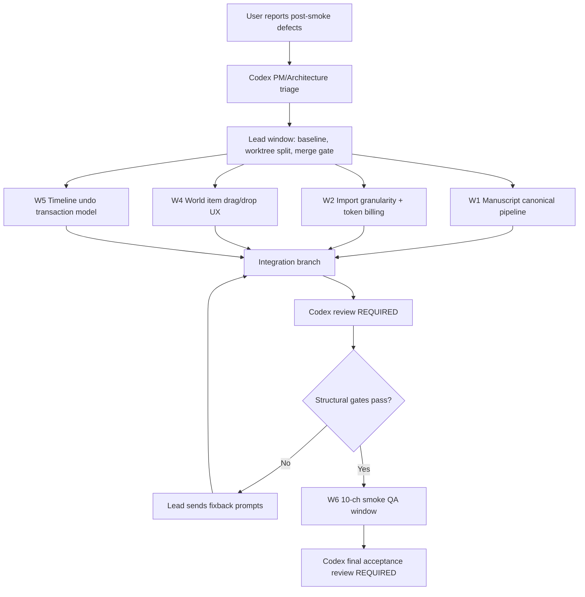

# W1 Post-Smoke Defect Repair — Product/Architecture Plan + Claude Parallel Prompts

**Date:** 2026-06-05  
**Author:** Codex  
**Purpose:** Package the new post-smoke defects into a decision-complete multi-Claude repair workflow.

## 0. Dispatch Flow



## 1. Recommended Execution Order

| Step | Action | Can Run In Parallel? | Codex Review Needed? |
|---|---|---:|---:|
| 1 | Send **Lead Prompt** first. Lead freezes branch, records baseline, and creates worker instructions/worktrees. | No | Optional; only paste back if Lead changes scope |
| 2 | Send **W1 Manuscript**, **W2 Granularity/Billing**, **W4 World Drag/Drop**, **W5 Timeline Undo** after Lead baseline. | Yes | W1 and W5 plans must be pasted to Codex before execution; W2/W4 can proceed if scoped narrowly |
| 3 | Lead integrates W1/W2/W4/W5 and runs zero-cost gates. | No | Yes, paste integration summary |
| 4 | Send **W6 QA/10-ch Smoke** only after integration gates pass. | No | Yes, paste W6 final report |

Why W3 is missing: World taxonomy/reviewer behavior is owned by W1 Manuscript/Organizer pipeline plus W4 UI drag/drop. If you prefer an extra worker, split taxonomy into a separate W3, but the default keeps context smaller.

## 2. Root Cause Analysis

| Defect | Likely Root Cause | Architecture-Level Fix |
|---|---|---|
| Writing Studio has no Manuscript | Repo has two manuscript concepts: imported `manuscript.json` / chapters/scenes and UI `manuscriptNodes` / `writing/manuscript/*.md`. W1 writes source content, but Writing Studio mainly renders manuscript nodes or chapter/scene routes. | Define one canonical manuscript projection: W1 import must create visible `manuscriptNodes` linked to imported chapters/scenes, and Writing navigation must expose `/writing/manuscript`. |
| Import granularity options too few | UI exposes only a tiny subset of backend `ImportGranularityProfile` / `PromptPolicyPatch` knobs. Backend now has density strategies, topology fidelity, character granularity, window size, relationship/manuscript switches, but UI does not reveal them coherently. | Add an Auto-first “Orchestrator decides” mode plus advanced profiles: Sparse turning points, Chapter-level, Scene-level, Character-rich, Relationship-light, Manuscript-only toggles. Keep raw prompt injection forbidden. |
| Codex/Flash billing unavailable | Cost ledger price table only matches known model substrings. Current model alias such as `deepseek-v4-flash`, `codex-flash`, or provider-specific alias is missing, so UI shows `cost_unavailable_reason`. | Add model alias normalization and price-table entries; UI should show “estimated / actual / unavailable reason” distinctly and never treat unavailable as zero. |
| World item in wrong category | Organizer currently treats explicit raw category hints too strongly. Names like `项甲功` include `功` and likely indicate method/item, but if upstream says rule/system it can survive under `修炼境界与制度`. QualityReviewer detects some pollution but does not directly apply world reclassification repairs. | Add deterministic Chinese taxonomy scoring: name suffix/semantic hints beat weak upstream category; reviewer emits reclassify repair proposals and organizer auto-routes obvious cases before proposal write. |
| Need drag-move item between World categories | Store has `moveWorldCategory`, but not a first-class `moveWorldItemToCategory`. UI category tree tests cover category nodes, not item drag/drop. | Add item-level reparent/reclassify action: update `containerId`, `category`, `categoryPath`, and `parentId`; implement drag target affordances like Windows Explorer. |
| Timeline Cmd+Z returns to import-before state | Undo snapshot stack captures large project snapshots and may retain the pre-import baseline as the most recent meaningful entry after timeline drag/sync flows. Some timeline pointer operations update runtime position without a granular undo transaction. `saveProject()` also rehydrates derived state, which can confuse stack order. | Replace timeline undo with transaction-scoped snapshots: begin on drag start, commit on drag end only if canonical fields changed, ignore synchronize/read-only analysis, clear import-accept undo boundary or mark it as non-step rollback. |

## 3. Product Rules For All Workers

- Do not run full50.
- Do not run live API/model calls unless W6 smoke is explicitly authorized.
- If any live run hits 402 / insufficient balance, stop immediately and record it.
- Prefer modifying existing architecture over adding new layers.
- Every worker must write a PM-style report to `communication/`.
- Every worker must include tests that fail before the fix and pass after the fix.
- Do not commit `.claude/`, Playwright traces/videos, benchmark run dirs, API keys, or `docs/superpowers/` unless Lead explicitly says it is in scope.

## 4. Copy Prompt — Lead Window

```text
You are the Lead integration engineer for W1 post-smoke defect repair.

This prompt is for one Claude window only. Other Claude windows will receive separate worker prompts on separate branches/worktrees. You coordinate, integrate, and verify; do not implement all business code yourself unless a worker fails.

Goal:
Close the post-smoke defects:
1. Writing Studio has no visible Manuscript after W1 import.
2. Import granularity choices are too few.
3. Codex/Flash token billing shows unavailable.
4. World Model taxonomy misroutes items such as 项甲功 into 修炼境界与制度 instead of 功法与物品 / 功法与术法.
5. World Model needs drag-moving items between category levels.
6. Timeline Cmd+Z reverts to import-before state instead of undoing one timeline operation.

Hard constraints:
- No full50.
- No live API/model calls in Lead.
- Do not stage docs/superpowers, Playwright traces/videos, timestamped benchmark outputs, API keys, or .claude files.
- Start with git status --short --branch and git log --oneline -8.
- Record DISPATCH_HASH.
- Use separate worktrees/branches for W1, W2, W4, W5 workers.
- Each worker must produce a communication report.

Lead tasks:
1. Freeze baseline:
   - Record git status, current branch, DISPATCH_HASH, recent commits.
   - Confirm no unexpected dirty source files before worker merge.
2. Dispatch workers:
   - W1 Manuscript canonical pipeline.
   - W2 Import granularity + token billing.
   - W4 World item drag/drop UX.
   - W5 Timeline undo transaction model.
3. Integration rules:
   - Merge only worker commits with passing tests.
   - Resolve conflicts by preserving canonical data contracts and existing W1 safety gates.
   - Do not merge a worker if it only mocks success without fixing the real code path.
4. Integration gates:
   - Python compile for touched sidecar files.
   - pytest targeted W1 compiler/reviewer/organizer/token tests.
   - npm run ui:build.
   - Playwright targeted specs for writing manuscript visibility, import settings/token cost, world hierarchy drag/drop, timeline undo.
   - run_harness.py --no-write.
5. Report:
   - Write communication/YYYY-MM-DD-w1-post-smoke-lead-integration-report.md.
   - Include per-defect status: fixed / partial / not fixed / needs live smoke.
   - Include exact commands and pass/fail results.
   - Include remaining risks and W6 smoke readiness.

Deliverable:
Commit only Lead integration/report changes after all worker merges. Do not run W6 live smoke yourself.
```

## 5. Copy Prompt — W1 Manuscript Canonical Pipeline

```text
You are Worker W1: Manuscript canonical pipeline and Writing Studio visibility.

This prompt is for one Claude window only. You work on your own branch/worktree from Lead's DISPATCH_HASH. Do not edit unrelated import billing, world drag/drop, or timeline undo files.

Problem:
After a real 10-chapter W1 import, Writing Studio shows no Manuscript. The backend appears to create manuscript_chapters/manuscript.json, but the UI Writing Studio uses manuscriptNodes and/or chapter/scene routes. The product needs imported manuscript content to be visible and useful in Writing Studio.

Root-cause hypothesis to verify:
- There are multiple manuscript representations:
  - W1 backend: manuscript_chapters, manuscript.json, writing/chapters, writing/scenes.
  - UI: manuscriptNodes and writing/manuscript/*.md rendered by ManuscriptWorkspace.
- W1 import may write chapters/scenes but not create ManuscriptNode entries, or route navigation may hide /writing/manuscript.

Scope:
- sidecar/workflows/w1_import.py
- sidecar/supervisor/tools.py only if needed for manuscript state propagation
- src/ui-react/services/projectService.ts
- src/ui-react/store.ts
- src/ui-react/components/WritingWorkspace.tsx
- src/ui-react/components/ManuscriptWorkspace.tsx
- tests for W1 compiler/write and Playwright writing UI
- communication report

Required design:
1. Define canonical manuscript projection:
   - Every imported chapter must create or update:
     - Chapter entity with summary/goal/notes/orderIndex.
     - Scene entity with non-empty content linked to chapter.
     - ManuscriptNode tree:
       - root/project manuscript node if missing.
       - chapter node linkedChapterId.
       - scene node linkedSceneId and markdown content saved under writing/manuscript/<nodeId>.md OR an explicit bridge to scene content.
   - Do not duplicate default Scene 1 / Chapter 1 starter blanks.
2. UI visibility:
   - Writing Studio must expose a clear Manuscript tab/route.
   - If manuscriptNodes are empty but imported chapters/scenes exist, show a migration/rebuild action or auto-derived read-only fallback.
   - Empty state must explain what is missing.
3. Import acceptance:
   - Accepting W1 import package must populate the canonical manuscript projection.
   - Reopening the project must preserve visible Manuscript.

Tests:
- Python:
  - node_build_manuscript creates non-empty chapter content from chunks.
  - node_write_to_project writes chapter/scene/manuscript node projection.
  - duplicate starter Chapter 1 / Scene 1 is removed on first W1 import.
- Frontend/unit or Playwright:
  - Open imported project fixture; /writing/manuscript shows imported chapter nodes.
  - Clicking a manuscript chapter shows non-empty content.
  - Reopen/reload preserves manuscript tree.

Acceptance:
- A 10-chapter import cannot finish with Writing Studio Manuscript empty if source chunks have content.
- Imported manuscript content is visible without requiring the user to know internal file paths.
- No live API calls; use synthetic fixtures.

Report:
Write communication/YYYY-MM-DD-w1-manuscript-canonical-pipeline-report.md with:
- root cause found,
- data contract before/after,
- files changed,
- tests run,
- screenshots if Playwright screenshots are generated,
- remaining live-smoke checks.
```

## 6. Copy Prompt — W2 Import Granularity + Token Billing

```text
You are Worker W2: Import granularity controls and token billing/cost display.

This prompt is for one Claude window only. Work on your own branch/worktree from Lead's DISPATCH_HASH. Do not edit manuscript, world drag/drop, or timeline undo code unless required for tests.

Problems:
1. Import UI offers too few granularity options.
2. Codex/Flash or Flash-model billing always shows unavailable.

Root-cause hypotheses to verify:
- ImportWorkflow exposes only a small part of backend ImportGranularityProfile and PromptPolicyPatch.
- Backend supports event_density_strategy, topology_fidelity, timeline_label_granularity, character_granularity, relationships/manuscript toggles, window size, and output budget, but UI does not present these as coherent presets.
- w1_run_events.py price table lacks aliases such as deepseek-v4-flash, codex-flash, gpt-5-codex, or the model string actually used by the app; unavailable is being rendered as if cost is zero/unknown forever.

Scope:
- src/ui-react/components/ImportWorkflow.tsx
- src/ui-react/services/electronApi.ts
- src/ui-react/store.ts
- src/ui-react/services/appSettingsService.ts
- sidecar/models/state.py only if profile contract needs typed additions
- sidecar/workflows/w1_run_events.py
- tests/test_w1_token_ledger.py
- tests/e2e/p1/import_token_cost.spec.ts and import workflow specs
- communication report

Required design:
1. Import granularity UX:
   - Keep Auto / Orchestrator decides as recommended default.
   - Add visible presets:
     - Sparse turning points
     - Chapter-level
     - Scene-level
     - Character-rich
     - Relationship-light
     - Manuscript-only or Manuscript-focused
   - Add toggles:
     - Extract Manuscript
     - Extract Relationships
     - Extract World Model
     - Extract Timeline
   - Advanced panel may expose max chapters per window, output token budget, character granularity, topology fidelity.
   - UI must serialize only allowlisted knobs; no raw prompt text.
2. Token billing:
   - Add model alias normalization for known app labels/model IDs.
   - Add price table entries or alias mapping for the Flash model actually used in settings.
   - UI must distinguish:
     - Actual cost available.
     - Estimated input only.
     - No configured price for this exact model.
   - Never display unavailable as zero cost.
3. Safety:
   - No API keys in logs.
   - 402 stop behavior unchanged.

Tests:
- Unit:
  - session_token_ledger returns cost for deepseek-v4-flash or configured Flash alias.
  - unknown model still returns cost_unavailable_reason.
  - longer model aliases win over shorter aliases.
- Playwright:
  - Import settings show all new presets/toggles.
  - Selecting sparse turning points stores expected profile patch.
  - Token card shows cost for Flash fixture and unavailable reason for unknown model fixture.

Acceptance:
- User can explicitly choose the import content scope and granularity without editing JSON.
- Flash model cost is no longer permanently unavailable when model alias is known.
- Unknown model remains honest: shows unavailable reason, not $0.

Report:
Write communication/YYYY-MM-DD-w2-import-granularity-token-billing-report.md with:
- root cause,
- UI changes,
- pricing aliases added,
- tests,
- remaining pricing assumptions.
```

## 7. Copy Prompt — W4 World Item Drag/Drop + Taxonomy Repair

```text
You are Worker W4: World Model item drag/drop and taxonomy repair loop.

This prompt is for one Claude window only. Work on your own branch/worktree from Lead's DISPATCH_HASH. Do not edit timeline undo or import billing code.

Problems:
1. World Model still misclassifies content, e.g. 项甲功 is placed under 修炼境界与制度 but should be 功法与物品 / 功法与术法.
2. Quality Reviewer should identify and repair obvious world taxonomy errors, but current behavior is insufficient.
3. UI lacks drag-moving a world item into a new category.

Root-cause hypotheses to verify:
- Organizer's _normalize_category gives explicit raw category or system/rule hints too much weight.
- Name-level Chinese semantic hints such as 功, 法, 诀, 术, 甲功 are not strong enough.
- QualityReviewer detects module contamination but does not emit concrete reclassify operations for world category misroutes.
- Store has moveWorldCategory, but no moveWorldItemToCategory / reclassifyWorldItem action that updates categoryPath/containerId/category.

Scope:
- sidecar/supervisor/organizer.py
- sidecar/supervisor/reviewers/quality_reviewer.py
- sidecar/supervisor/reviewers/schemas.py if needed
- sidecar/supervisor/pipeline_tools.py if repair actions need deterministic application
- src/ui-react/store.ts
- src/ui-react/components/WorldWorkspace.tsx
- src/ui-react/models/project.ts
- tests/test_w1_organizer.py
- tests/test_w1_reviewers_quality.py
- tests/e2e/p1/world_hierarchy.spec.ts or new world_item_drag_drop.spec.ts
- communication report

Required design:
1. Taxonomy scoring:
   - Implement deterministic classify_world_item(name, raw_category, description) with weighted signals.
   - Strong name hints:
     - 功 / 功法 / 法诀 / 术 / 秘术 => cultivation_method unless description says rank/system.
     - 境界 / 层 / 炼气期 / 筑基期 / 制度 / 门规 => rule/system.
     - 甲 / 剑 / 瓶 / 丹 / 符 / 法器 => item/artifact unless paired with 功 as method name.
   - 项甲功 fixture must route to cultivation_methods or a product-approved equivalent category, not rules.
2. Reviewer repair:
   - QualityReviewer detects world item categoryPath inconsistent with semantic category.
   - Emits deterministic proposed_operations: reclassify world_item to target category/container/categoryPath.
   - If safe and local, Organizer may auto-correct before proposal write.
3. UI drag/drop:
   - Add moveWorldItemToCategory(itemId, targetCategoryId or categoryPath).
   - Update item.containerId, item.category, item.categoryPath, parentId.
   - Implement drag affordance:
     - Long press or drag item row.
     - Category rows are drop targets.
     - Show insertion/highlight state.
     - Prevent dropping into invalid/cyclic category.
   - Behavior should feel like Windows Explorer: drag item onto folder/category to move.

Tests:
- Python:
  - 项甲功 raw_category=rule/system routes to cultivation_method.
  - 修炼境界 routes to rule/system.
  - 记名弟子 / 内门弟子 excluded or routed to manuscript notes, not world item.
  - QualityReviewer emits reclassify repair for misrouted 项甲功.
- Playwright:
  - Inject world item 项甲功 under 修炼境界与制度.
  - Drag/drop it onto 功法与术法 / 功法与物品 category.
  - Assert categoryPath/container changes in store and persists after save/reload.

Acceptance:
- User can fix wrong World Model placement manually via drag/drop.
- Reviewer/Organizer catches obvious taxonomy mistakes automatically before or during review.
- No timeline/relationship entities are placed into World Model.

Report:
Write communication/YYYY-MM-DD-w4-world-taxonomy-dragdrop-report.md with:
- taxonomy algorithm,
- reviewer repair behavior,
- drag/drop UX evidence,
- tests,
- remaining ambiguous cases.
```

## 8. Copy Prompt — W5 Timeline Undo Transaction Model

```text
You are Worker W5: Timeline undo transaction model.

This prompt is for one Claude window only. Work on your own branch/worktree from Lead's DISPATCH_HASH. Do not edit manuscript, import billing, or world taxonomy unless required by undo tests.

Problem:
In Timeline, after operations like dragging an Event out or moving it, pressing Command+Z may revert the whole project to the import-before state rather than undoing only the last timeline operation. This is unacceptable: undo must be stepwise and local.

Root-cause hypotheses to verify:
- captureUndoSnapshot stores full project slices and may keep a huge import-accept baseline as the nearest undo entry.
- Timeline drag/pointer operations may update transient position without committing a clear transaction boundary.
- Synchronize may trigger save/reload/deriveState and disturb undoStack ordering.
- saveProject currently rehydrates derived state after every undo/redo, which may reset or mutate stack-adjacent state.

Scope:
- src/ui-react/store.ts
- src/ui-react/components/TimelineWorkspace.tsx
- src/ui-react/components/timeline/TimelineCanvas.tsx
- src/ui-react/components/timeline/TimelineOperations.ts
- src/ui-react/services/projectService.ts only if save/derive interaction is root cause
- tests/e2e/p1/global_undo.spec.ts
- tests/e2e/p1/timeline_sync_roundtrip.spec.ts or new timeline_undo_transactions.spec.ts
- communication report

Required design:
1. Transaction API:
   - Add beginUndoTransaction(label, scope), commitUndoTransaction(), cancelUndoTransaction() or equivalent.
   - For drag:
     - Capture pre-drag snapshot once on pointerdown/drag start.
     - Update transient UI state during drag without pushing snapshots.
     - Commit one undo entry on pointerup only if canonical timeline fields changed.
   - For simple store moveTimelineEvent calls, still push one undo entry.
2. Import boundary:
   - Accepting/importing a large package may create a named checkpoint, but normal Cmd+Z after later timeline operations must first undo latest timeline operation.
   - Do not leave pre-import baseline as the top undo entry after a successful timeline drag.
3. Synchronize:
   - Synchronize/read-only analysis must not push undo entries.
   - If Synchronize writes canonical topology changes, it must push exactly one labeled transaction.
4. Persistence:
   - Undo/redo must save canonical state, but saveProject must not reorder undoStack or replace it with stale stack.
   - selectedEntity and other selection/UI state remain outside undo.

Tests:
- Playwright:
  - Simulate post-import project with imported chapters/events and one branch.
  - Move timeline event A to branch B.
  - Press Meta+Z.
  - Assert only event A branch/orderIndex reverts; imported chapters/manuscript/world items remain.
  - Repeat with Synchronize clicked before Meta+Z.
  - Assert undoStack depth changes by exactly one per committed drag.
  - Assert dragging but cancelling/no canonical change does not push undo.
- Unit/store:
  - transaction begin/commit pushes one snapshot.
  - transient update does not push.
  - selection state excluded.

Acceptance:
- Cmd+Z never jumps from a timeline edit directly to pre-import state unless the user has undone all intermediate steps.
- Timeline drag undo works before and after Synchronize.
- Existing global undo tests still pass.

Report:
Write communication/YYYY-MM-DD-w5-timeline-undo-transaction-report.md with:
- root cause evidence,
- transaction model,
- tests,
- remaining UX notes.
```

## 9. Copy Prompt — W6 QA + 10-Chapter Smoke

```text
You are Worker W6: final QA and controlled 10-chapter smoke.

This prompt is for one Claude window only. Run only after Lead confirms W1/W2/W4/W5 integration gates are green.

Goal:
Verify the repaired post-smoke defects with zero-cost automation first, then prepare or run the controlled 10-chapter live smoke only if explicitly authorized and API key is available.

Hard constraints:
- No full50.
- Live run only if user/Lead explicitly approves.
- Stop immediately on 402 / insufficient balance.
- Record model, profile, prompt density, estimated windows/API calls, session/import_run_id, budget_exhausted, and artifact paths.

Zero-cost QA:
1. Python:
   - W1 compiler manuscript tests.
   - W1 organizer taxonomy tests.
   - W1 reviewer quality tests.
   - token ledger tests.
   - run_harness.py --no-write.
2. Frontend:
   - npm run ui:build.
   - Playwright manuscript visibility.
   - Playwright import granularity/token card.
   - Playwright world item drag/drop.
   - Playwright timeline undo transaction.
3. Artifact simulation:
   - Verify prompt_policy_decision.json schema using synthetic run artifact.
   - Verify organizer_output.json schema using synthetic run artifact.
   - Verify review_report.json reviewer_reports non-empty in synthetic review state.

If live 10-ch smoke is approved:
1. Use first 10 chapters file already prepared in benchmark_results or user-provided path.
2. Use deep profile unless Lead says otherwise.
3. Prefer Auto/Orchestrator granularity; record selected policy.
4. After import, inspect:
   - Writing Studio Manuscript visible and non-empty.
   - No duplicate 第九章/第十章.
   - Timeline event density not流水账; branches attached.
   - Cmd+Z after one timeline move only undoes that move.
   - World Model 项甲功 / 长春功 / 修炼境界 categories correct.
   - Token ledger shows actual usage and cost or honest unavailable reason.
   - prompt_policy_decision.json exists.
   - organizer_output.json exists.
   - review_report.json has reviewer_reports.

Report:
Write communication/YYYY-MM-DD-w6-post-smoke-final-qa-report.md with:
- automated test table,
- live smoke status: run / not run,
- screenshots or artifact paths if available,
- defect checklist with fixed/partial/not fixed,
- recommendation for manual user acceptance.
```

## 10. Codex Review Rules

Paste these back to Codex before execution:

| Prompt | Paste Plan To Codex? | Reason |
|---|---:|---|
| Lead | Only if it changes scope or wants to merge broad/unrelated files | Lead mostly coordinates |
| W1 Manuscript | Yes | High risk: two manuscript models need careful unification |
| W2 Granularity/Billing | Optional | Lower risk if scoped to UI + token ledger tests |
| W4 World Drag/Drop | Optional for plan; paste final if it changes taxonomy model | Medium risk: user-facing DnD plus classification |
| W5 Timeline Undo | Yes | High risk: undo can corrupt project state if wrong |
| W6 QA/Smoke | Yes | Must confirm whether live API is being used and whether 402 stop is respected |

## 11. Acceptance Checklist

- [ ] Writing Studio shows imported Manuscript after W1 import.
- [ ] Import UI exposes Auto plus richer granularity/content toggles.
- [ ] Flash/Codex model billing no longer permanently shows unavailable for known model aliases.
- [ ] Unknown model billing remains honest and does not show false $0.
- [ ] QualityReviewer/Organizer detects and fixes obvious world taxonomy misroutes.
- [ ] `项甲功` routes to 功法与术法 / 功法与物品 equivalent, not 修炼境界与制度.
- [ ] User can drag a world item into a different category and save/reload preserves it.
- [ ] Timeline Cmd+Z after a timeline edit undoes only the last timeline edit.
- [ ] Timeline Cmd+Z after Synchronize still undoes stepwise, not pre-import rollback.
- [ ] All worker reports exist in `communication/`.
- [ ] W6 confirms whether live 10-ch smoke was run.
