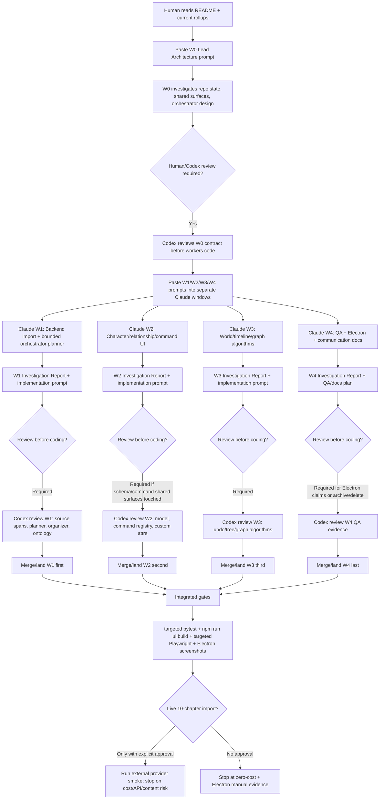

# Narrative IDE Next-Wave Execution Guide And Solution Architecture

Date: 2026-06-06  
Author: Codex  
Purpose: answer the user's missing questions: where the Claude prompts are, how to execute them, which plans require review, and what the proposed algorithm/frontend/backend/operation design is for the current quality problems.

## 0. Where The Prompts Are

Use these files in this order:

| Order | File | How to use it |
|---:|---|---|
| 1 | `communication/README.md` | Start here. It tells Claude which communication docs are current. |
| 2 | `communication/2026-06-06-current-state-rollup.md` | Current state, risks, and reading order. |
| 3 | `communication/2026-06-06-communication-merged-evidence-rollup.md` | Historical evidence merged from old reports. |
| 4 | `communication/2026-06-06-task-completion-audit.md` | One-by-one checklist against your original issues. |
| 5 | `communication/2026-06-06-orchestrator-design-and-prompt-hardening-addendum.md` | Extra hardening prompt: orchestrator design, subagent trace, algorithm specs, must-fail tests. |
| 6 | `communication/2026-06-06-w1-next-wave-multiagent-claude-plan.md` | Main copy-paste prompt package for W0-W4 Claude windows. |

The actual Claude prompts are mainly in:

- `communication/2026-06-06-w1-next-wave-multiagent-claude-plan.md`
- `communication/2026-06-06-orchestrator-design-and-prompt-hardening-addendum.md`

The addendum should be pasted after W0/W1 prompts and after any worker prompt that touches algorithms, commands, or data structures.

## 1. Execution Mermaid



## 2. Review Rules

| Claude window | Must Codex/human review before coding? | Why |
|---|---:|---|
| W0 Lead Architecture | Yes | It freezes baseline, merge order, shared surfaces, orchestrator decision. |
| W1 Backend Import Quality | Yes | It touches source-text contract, planner, reviewer/organizer, relation ontology. |
| W2 Character / Relationship / Command UI | Yes if it changes schema, commands, store, project model, or relationship ontology | It owns custom attributes, merge UX, command registry, typed clipboard. |
| W3 World / Timeline / Graph Algorithms | Yes | It touches undo transactions, world tree data model, layout algorithms, store/persistence. |
| W4 QA + Communication Merge | Review required for Electron completion claims, live smoke, archive/delete, or canonical doc changes | It can otherwise run read-only QA and docs indexing. |

No live 10-chapter provider smoke should run unless you explicitly approve:

- external API provider;
- local manuscript text leaving the machine;
- token/cost risk;
- stop condition.

## 3. Subagent Thinking Result

This is the useful output from the subagent analysis, summarized without raw hidden reasoning.

| Topic | Result |
|---|---|
| Prompt quality | The prompt was not empty, but it was too task-list-like. It needed harder execution contracts: state machines, invariants, evidence tables, must-fail tests. |
| Orchestrator | Your critique is basically correct. W1 is fixed supervisor pipeline plus bounded planner hooks, not a true model-driven orchestrator. |
| Right next architecture | Do not build a fully free ReAct agent. Build a bounded orchestrated pipeline: model proposes strategy, validators enforce safety, deterministic executor runs. |
| Docs merge | Previous cleanup was only index/rollup. It needed a real merged evidence rollup and file classification inventory; now added. |
| Claude execution | W0 must freeze architecture first. W1/W2/W3/W4 should investigate first, write implementation prompts, then code only after required reviews. |

## 4. Overall Solution Design

### Product principle

The app should behave like a serious novelist's desktop IDE:

- source text is stable and inspectable;
- AI output is metadata/proposal/evidence, not silent mutation;
- folders/tags/characters/relationships are editable objects;
- every user command can be undone;
- right-click, keyboard shortcuts, command palette, and buttons all run the same command system.

## 5. Problem-By-Problem Design

### 5.1 Chapter Split / Manuscript

Root cause:

- The current pipeline risks treating chapter text as something the LLM generates or rewrites.
- That burns tokens and can truncate body text.
- `Chapter` and `ManuscriptNode` are not sharply separated as product objects.

Algorithm:

- Build a source-span index from raw text.
- Store each normal chapter as an atomic span.
- Split only a single oversized chapter, and only on paragraph/scene boundary.
- LLM outputs:
  - `source_start`
  - `source_end`
  - `summary`
  - `beats`
  - `characters`
  - `world_refs`
  - `evidence`
- Reconstruct body text deterministically from raw source.

Backend:

- Create one shared source-text accessor for manuscript persistence, chapter proposals, scenes, extraction, reviewers, and diagnostics.
- Persist span metadata and reconstruction hashes.
- Add tests proving no CJK chapter loses body length/hash.

Frontend:

- `Chapter` view: source-structure object with chapter title, span, summary, source body.
- `Manuscript` view: author-facing projection/outline node that can be reorganized, annotated, and edited.
- UI should show a subtle source-span/projection distinction; not two identical lists.

Acceptance:

- LLM never outputs full canonical chapter body.
- Normal chapter body hash equals raw-source span hash.
- ManuscriptNode and Chapter are visibly and structurally different.

### 5.2 Character Module

Root cause:

- Extraction does not reliably populate background/experience.
- UI exposes too few fields and can duplicate text.
- There is no flexible custom attribute model.
- Dedupe exists more as reviewer logic than user workflow.

Algorithm:

- Character profile has stable sections:
  - identity;
  - background;
  - experience timeline;
  - personality/evidence;
  - relationships;
  - custom attributes.
- Dedupe computes candidate pairs by normalized Chinese name, aliases, evidence overlap, and relationship/event references.
- Merge produces a reference-remap plan before applying.

Backend:

- Extract background and experience as evidence entries with source spans.
- Normalize duplicates but do not silently delete important referenced characters.
- Reviewer emits Workbench proposals for merge/archive/remap.

Frontend:

- Profile page exposes full editable sections.
- Add custom attribute button and inline edit.
- Merge modal shows:
  - duplicate candidates;
  - fields to keep;
  - relationships/events/tags to remap;
  - archive/delete result.
- Delete defaults to archive if references exist.

Acceptance:

- Han Li has non-empty background and experience after supported import.
- User can add arbitrary custom attribute.
- Duplicate characters can be merged with reference remap preview.

### 5.3 Relationship Module

Root cause:

- Raw LLM phrases are being promoted to relationship type.
- Relationship UI is flat and hard to scan.
- Graph layout does not handle dense relationship data.

Algorithm:

- Relationship canonical type is a Chinese allowlist, for example:
  - 师徒
  - 同门
  - 亲属
  - 盟友
  - 对手
  - 雇佣
  - 组织隶属
  - 暂不确定
- Raw text like `解惑`, `选拔`, `冷冰冰的师兄` becomes:
  - evidence phrase;
  - note;
  - event;
  - trait clue;
  - confidence reason.
- Relationship rows group by counterpart -> type -> direction -> status.

Backend:

- Add relationship ontology normalizer.
- Add demotion rules for action/event/description labels.
- Reviewer fails if canonical type is not allowlisted Chinese.

Frontend:

- Relationship panel uses indentation:
  - Character
  - relationship groups
  - individual edges/evidence
- Inline edit relationship type/status/note.
- Right-click relationship row supports edit, regroup, archive, open participants.

Graph:

- Radial layout for ego networks.
- Cluster layout for factions/communities.
- Force-lite layout with deterministic bounded iterations for dense graphs.
- Edge labels use HTML overlay/portal or collision-aware offsets.

Acceptance:

- False labels never become canonical type.
- Dense graph has reset/auto-layout and label collision handling.

### 5.4 Chinese Tags

Root cause:

- Internal English enum/default labels leak into user-visible Chinese project UI.

Algorithm:

- Separate internal enum from localized display label.
- Source language policy controls visible labels.
- For zh project, visible labels must be Chinese.

Backend:

- Prompt asks for Chinese display labels.
- Reducer/reviewer validates visible tags, traits, relationship labels, and world labels.

Frontend:

- UI renders display labels, not internal enum keys.
- Tag chips and menus are checked by Playwright.

Acceptance:

- English enum is allowed only internally.
- Any English visible tag in a zh import is a failure.

### 5.5 Timeline Undo

Root cause:

- Dragging an event changes multiple fields, but undo treats it as scattered mutations or snapshots.

Algorithm:

Use command transaction:

```text
pointerdown: capture before-state
pointermove: stage visual movement
pointerup: commit one transaction
Esc/pointercancel: discard staged state
Meta/Ctrl+Z: undo exactly one drag transaction
```

Backend/persistence:

- Store one patch with before/after:
  - position;
  - branch;
  - order;
  - timestamps;
  - affected IDs.

Frontend:

- Drag handle and event card use same transaction API.
- Undo indicator should show one action, e.g. "Move timeline event".

Acceptance:

- Drag event, press Meta/Ctrl+Z once, only that drag is undone.
- No unrelated import/workbench state is reverted.

### 5.6 World Model

Root cause:

- `categoryPath` and visible category labels are doing the job of a real tree.
- Items are routed by strings instead of stable folder IDs.
- Drag UI exposes handles but lacks valid nesting/drop behavior.

Algorithm:

Data model:

```text
WorldNotebook
  rootFolderId hidden
WorldFolder
  id
  parentId
  title
  kind
  sortOrder
WorldItem
  id
  folderId
  title
  type
  attributes
  evidence
```

Rules:

- Hidden root exists in data but is not shown as a folder.
- `categoryPath` is legacy compatibility metadata only.
- Organizer emits `targetFolderId`, not guessed `categoryPath[1]`.
- Drag/drop supports before/inside/root.
- Cycle prevention is mandatory.

Backend:

- Classifier maps item semantics to stable folder targets.
- Ambiguous items go to "待整理" with reason, not wrong folder.

Frontend:

- World sidebar is a file/folder tree.
- Valid drop zones are visible.
- Folder/item can be moved, renamed, copied, cut, pasted.
- Inspector shows evidence and classification reason.

Acceptance:

- User does not see top-level `category`.
- World drag persists.
- `七仙门十三处兽卡`-style ambiguous items do not get blindly shoved under organization/faction.

### 5.7 Right-Click And Operation Logic

Root cause:

- Existing context menu is a visual list of callbacks, not a command system.
- There is no shared operation model for menu, shortcut, command palette, toolbar.

Core design:

```text
CommandContext
  projectId
  surface
  targetType
  targetId
  selection
  clipboard
  permissions

AppCommand
  id
  label
  icon
  shortcut
  appliesTo(context)
  enabled(context)
  disabledReason(context)
  execute(context)
  undoMode
```

Typed clipboard:

```text
ClipboardPayload
  kind: copy | cut
  entityType
  entityIds
  sourceParentId
  serializedPreview
  pasteConstraints
```

User operation rules:

- Right-click selects the object under cursor unless multi-selection is active.
- Context menu is generated from command registry.
- Disabled actions show reason.
- Copy/cut/paste works for domain objects, not just text.
- Long-press drag is move/reorder, not context menu.
- Paste validates target type before applying.
- Delete is archive-first when references exist.

Minimum menus:

| Surface | Menu |
|---|---|
| Character | New Character, Edit, Add Attribute, Copy, Cut, Duplicate, Merge, Archive/Delete, Open Relationships |
| Relationship | Edit Type, Add Note, Copy, Cut, Delete/Archive, Open Source, Open Target |
| World folder | New Folder, New Item, Rename, Copy, Cut, Paste, Move, Delete/Archive |
| World item | Edit, Copy, Cut, Duplicate, Move To, Archive/Delete |
| Timeline event | Edit, Duplicate, Move To Branch, Copy, Cut, Delete/Archive |
| Blank workspace | New Object, Paste, Select All |

Frontend:

- `ContextMenu` becomes renderer only.
- `commandRegistry` owns behavior.
- Command palette and shortcuts call same registry.
- Use stable `data-testid` selectors for each menu and command.

Backend/persistence:

- Commands go through store/services, not direct storage mutation.
- Every mutating command declares undo behavior.
- Cross-object operations emit reference impact.

Acceptance:

- Right-click menu appears in Electron and Playwright.
- Clicking menu item changes state.
- Same command works from shortcut/command palette.
- Undo works for mutating commands.

## 6. Backend Design Summary

Backend should become stricter and more evidence-based:

- raw source span index;
- bounded `PlannerProposal` live planner;
- deterministic validators;
- reviewer findings mapped to repair/proposal/risk;
- relationship ontology normalizer;
- world folder target resolver;
- artifact audit trail for planner, judge, organizer, reviewer, and source reconstruction.

## 7. Frontend Design Summary

Frontend should become more like a desktop editor:

- left trees are real trees, not fake category headers;
- right-click works everywhere important;
- inspector exposes editable fields;
- drag/drop has visible valid targets;
- command palette, context menu, toolbar, and shortcuts share commands;
- undo is action-based, not accidental snapshot rollback.

## 8. What Claude Must Produce Before Coding

Every implementation worker must submit:

```text
Investigation Report
+ Subagent Decision Trace
+ Algorithm Mini-Spec
+ Must-Fail Test
+ Implementation Prompt
+ Acceptance Evidence Plan
```

No worker should be accepted if it only says "I will add a button" or "I will adjust the prompt".

The repair must connect:

```text
user symptom
-> UI behavior
-> store/service behavior
-> project data
-> backend/prompt/reviewer source
-> tests/artifacts proving the fix
```

