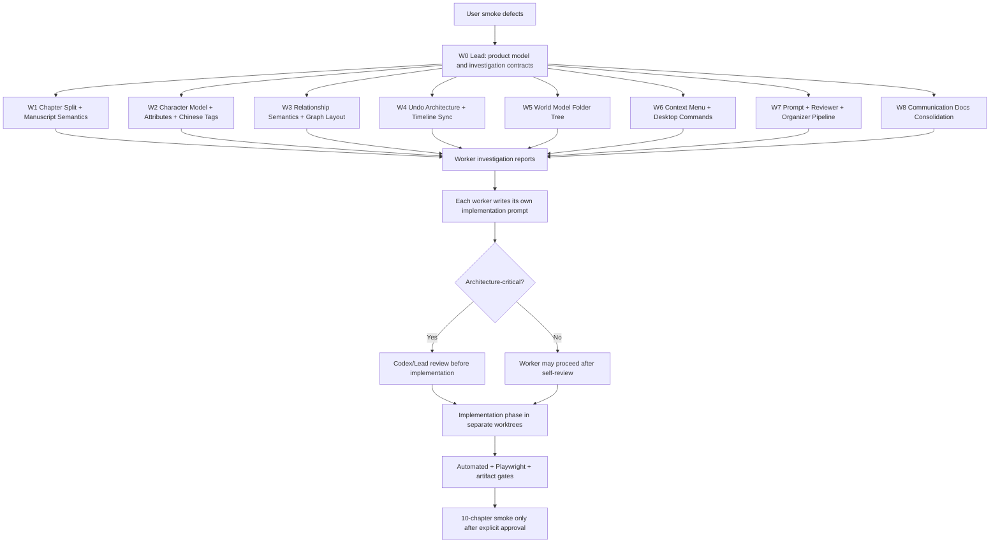
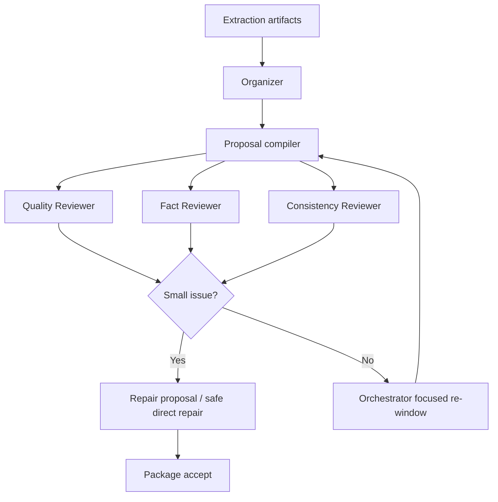

# W1 Import Deep Diagnostic Multi-Agent Flow

Date: 2026-06-06  
Author: Codex  
Purpose: give Claude workers a PM/architect-level investigation workflow before any implementation prompts are written.

---

## 0. Why This Exists

The latest smoke results show that the project does not need another shallow "add a field, add a button" pass. The recurring failures are structural:

| Area | User-visible failure | Likely class of root cause |
|---|---|---|
| Chapter split | Chapter body is truncated; LLM appears to output or transform too much source text | Wrong source-of-truth boundary between raw text, chapter span, scene content, and LLM metadata |
| Manuscript | Manuscript and Chapter are not meaningfully different | Product model ambiguity, not just UI visibility |
| Character | Han Li background/experience empty; duplicate profile text; no flexible attributes | Extraction prompt, reviewer repair, merge/dedupe, and frontend profile model all under-specified |
| Relationship | False relationships like `解惑` / `选拔`; graph unreadable | Relationship ontology and graph layout are both too weak |
| Tags | English tags appear in Chinese novel projects | Prompt/default data/reviewer normalization leak |
| Undo | Dragging a timeline event makes undo unusable or rolls back too far | Snapshot-based undo cannot support graph/timeline editor semantics |
| World Model | Category/folder hierarchy is confused; modules pollute each other | Canonical data model does not match file/folder-like product intent |
| Context menu | Right-click does nothing useful | Missing desktop command model, not a one-component bug |
| Communication docs | Too many reports with unclear current source of truth | Documentation lifecycle missing canonical index and archive policy |

This document is not a set of final implementation prompts. It is a multi-agent investigation and design protocol. Each Claude worker must first understand the product intent, inspect real UI/data/code evidence, research relevant algorithms and UX references, then write its own implementation prompt.

---

## 1. Operating Principles

1. Do not start by coding.
2. Do not write shallow prompts.
3. Do not patch symptoms in the frontend if the canonical model is wrong.
4. Do not let LLM output full chapter bodies.
5. Do not preserve `categoryPath` as the primary World Model structure.
6. Do not treat reviewer reports as success unless repairs are applied or actionable packages are created.
7. Do not claim a UI fix without Playwright or Electron visual evidence.
8. Do not claim a backend fix without artifact and persistence evidence.
9. Encourage refactors when the current architecture is the problem.
10. Every worker must produce an investigation report and then an implementation prompt draft.

---

## 2. Required Claude Skills And Plugins

The user's Claude environment has the following relevant capabilities. Workers must explicitly use them where applicable.

| Skill / Plugin | Required use |
|---|---|
| `superpowers:brainstorming` | Open the problem space before deciding a design |
| `superpowers:systematic-debugging` | Build a root-cause chain from user symptom to code/data/prompt failure |
| `superpowers:subagent-driven-development` | Split each worker into Explorer, Researcher, Architect, Prompt Author, Reviewer |
| `superpowers:dispatching-parallel-agents` | Lead dispatches W1-W8 in parallel after contracts are frozen |
| `superpowers:using-git-worktrees` | Every implementation worker uses an isolated branch/worktree |
| `superpowers:test-driven-development` | Worker prompts must define failing tests before code |
| `superpowers:verification-before-completion` | No report may say "done" without command output and UI/artifact evidence |
| `frontend-design:frontend-design` | Required for Character, Relationship Graph, World Model, Context Menu, Manuscript UI |
| `playwright MCP` | Required for real UI reproduction and screenshot evidence |
| `context7 MCP` | Required for React Flow, dnd-kit, Zustand, Playwright, Electron, schema/state libraries |
| `brave-search MCP` | Required for Scrivener, novelWriter, yWriter, OneNote, Finder, Windows Explorer, graph layout, undo architecture research |
| `typescript-lsp` | Required for frontend type/reference tracing |
| `code-review` and `superpowers:requesting-code-review` | Each worker's investigation report and prompt draft need reviewer pass |
| `claude-md-management:claude-md-improver` | Required for W8 communication consolidation |

If a skill is unavailable in a branch/session, the worker must state the missing capability and choose the closest replacement.

---

## 3. Model And Agent Allocation

Use `Claude Sonnet 4.6 256k` for all main workers. These tasks require long-context synthesis across product intent, storage, UI projection, prompts, reviewers, and tests.

Each main worker should create internal subagents:

| Internal role | Job |
|---|---|
| Explorer | Read-only diagnosis; inspect UI, artifacts, tests, storage, prompts, and current reports |
| Researcher | Use Brave Search, Context7, Playwright, and frontend-design references |
| Architect | Propose data structures, algorithms, and pipeline boundaries |
| Prompt Author | Write the final implementation prompt for the future coding Claude |
| Reviewer | Attack the prompt for shallow assumptions, missing tests, and hidden product risks |

Architecture-critical worker reports must be reviewed before implementation:

| Worker | Needs Lead/Codex review before implementation? | Reason |
|---|---:|---|
| W0 Lead contracts | Yes | Defines canonical model and worker boundaries |
| W1 Chapter / Manuscript | Yes | Changes text source-of-truth |
| W4 Undo architecture | Yes | Affects global mutation model |
| W5 World Model tree | Yes | Changes canonical ontology and UI hierarchy |
| W7 Prompt / Reviewer / Organizer | Yes | Affects AI quality loop and repair semantics |
| W2 Character | Optional if scoped to investigation first | Important but can follow W0 contract |
| W3 Relationship / Graph | Optional if scoped to investigation first | Can proceed after W0 ontology rules |
| W6 Context Menu | Optional if it does not own data models | Shared UX layer |
| W8 Docs consolidation | No, unless deleting files | Prefer archive over deletion |

---

## 4. Dispatch Mermaid



---

## 5. Global Investigation Protocol

Every worker starts with:

```bash
git status --short --branch
sed -n '1,220p' dev_docs/README.md
sed -n '1,260p' dev_docs/DEV_RULES.md
```

Then each worker must answer:

| Question | Evidence required |
|---|---|
| What is the user-facing failure? | Screenshot, artifact, or exact reproduction steps |
| What is the product object supposed to be? | PM interpretation and canonical model mapping |
| What data exists on disk after import? | File paths and minimal excerpts |
| What data exists in Zustand/UI state? | Type references and selectors |
| What did LLM/prompt/reviewer output? | Artifact path or mocked fixture |
| Where is the write/apply boundary? | Backend node, proposal applier, or projectService function |
| Why did previous fixes not work? | Concrete missing link, not speculation |
| What algorithm/data structure should replace the weak part? | Design with alternatives rejected |
| What would prove it fixed? | Tests, Playwright, screenshots, artifact diff |

---

## 6. W0 Lead: Product And Architecture Investigation

### Mission

Lead establishes the product ontology before workers design fixes. Lead does not write all prompts and does not implement all code.

### Core questions

1. What should W1 Import produce for a novelist using Narrative IDE?
2. Which objects are canonical and which are projections?
3. Which modules must remain separate?
4. What data must be immutable source text versus AI-generated metadata?
5. What are proposal package semantics after import?
6. Which existing reports remain canonical?

### Required investigation

| Area | Files / surfaces to inspect |
|---|---|
| Product docs | `dev_docs/PRODUCT_SPEC.md`, `dev_docs/ARCHITECTURE.md`, `dev_docs/DATA_MODEL.md`, `dev_docs/W1_IMPORT_COMPILER.md` if present |
| Workflow bridge | `dev_docs/FRONTEND_BACKEND_CHECKLIST.md`, `sidecar/routers/workflows.py`, `src/ui-react/services/electronApi.ts` |
| Project storage | `src/ui-react/services/projectService.ts`, `src/ui-react/models/project.ts` |
| Import pipeline | `sidecar/workflows/w1_import.py`, `sidecar/supervisor/tools.py`, `sidecar/supervisor/policy.py` |
| Reports | `communication/2026-06-06-w1-import-p0-bug-checklist.md`, latest live-smoke and QA reports |

### Deliverable

Lead produces:

1. Product object map.
2. Import data flow diagram.
3. Canonical ownership matrix.
4. Worker owned-path matrix.
5. Review-before-implementation matrix.
6. A list of non-negotiable invariants.

### Lead output format

```markdown
# W0 Lead Architecture Investigation

## Product Intent
## Canonical Object Map
## Import Data Flow
## Root Cause Matrix
## Worker Boundaries
## Review Gates
## Implementation Prompt Requirements
```

---

## 7. W1 Chapter Split + Manuscript Semantics

### User problem

The chapter body is truncated, only a small section is visible, and Manuscript is indistinguishable from Chapter. LLM API must not output full chapters.

### Investigation questions

| Question | What to inspect |
|---|---|
| Does the LLM output full chapter content? | W1 prompts, artifacts, JSON schemas, generated proposals |
| Where does chapter body come from? | raw txt chunk, source span, LLM output, scene md file |
| Is truncation caused by JSON output limit? | prompt max tokens, repair_json path, artifact excerpts |
| What does Writing Studio actually render? | ManuscriptWorkspace, WritingWorkspace, routes, store |
| What is source of truth? | `manuscript.json`, `writing/scenes/*.md`, `writing/manuscript/nodes.json` |
| How should novelist tools treat manuscript? | Scrivener, novelWriter, yWriter references |

### Required external research

Use Brave Search:

```text
Scrivener binder synopsis manuscript chapter scene notes
novelWriter outline scene manuscript design
yWriter scene chapter notes design
fiction writing software manuscript outline workflow
```

Use Context7:

```text
Playwright screenshot locator testing
React state projection pattern
```

### Design hypothesis to test

The correct architecture is:

| Object | Meaning |
|---|---|
| Raw source | Immutable full imported text |
| Chapter span | Deterministic start/end offsets into raw source |
| Chapter | Canonical story unit with title, order, summary, status, sceneIds |
| Scene | Body-bearing text unit reconstructed from source span |
| Manuscript node | Author notebook node with outline, beats, revision notes, questions |

LLM should output only:

```json
{
  "chapter_id": "chapter_001",
  "title": "第一章 山边小村",
  "source_start": 0,
  "source_end": 12345,
  "summary": "...",
  "beats": ["..."],
  "author_notes": ["..."]
}
```

LLM should not output:

```json
{
  "full_chapter_body": "..."
}
```

### Worker report must include

1. Whether current prompts ask for full text.
2. Whether current import writes truncated LLM text as canonical body.
3. How to reconstruct full body from deterministic source spans.
4. How Manuscript differs from Chapter in UI.
5. Fixture strategy proving no body truncation.
6. Implementation prompt draft written by W1.

---

## 8. W2 Character Model + Attributes + Chinese Tags

### User problem

Han Li's background/experience is empty, character profile text duplicates, custom attributes cannot be added freely, right-click does nothing, and English tags appear in a Chinese novel project.

### Investigation questions

| Question | What to inspect |
|---|---|
| Does Character schema support background, experience, attributes? | `src/ui-react/models/project.ts`, projectService serialization |
| Does prompt require background and experience? | W1 character prompts and extraction schema |
| Where do duplicates enter? | artifact, proposal merge, reviewer repair, UI projection |
| Where do English tags originate? | seed project, default tags, prompt schema, reviewer normalization |
| Does right-click dispatch a command? | CharactersWorkspace contextmenu handlers and ContextMenu component |

### Required external research

Use Brave Search:

```text
character bible software character profile attributes
Scrivener character sketch custom metadata
Campfire writing character relationships attributes
novel character sheet background experience UI
```

Use `frontend-design:frontend-design`:

```text
Design a novelist-facing Character profile UI with identity, aliases, background, experience timeline, traits, relationship groups, Chinese tags, and custom attributes.
```

Use Playwright:

1. Right-click character item.
2. Inspect whether context menu appears.
3. Screenshot empty background.
4. Screenshot duplicated character text.

### Design hypothesis to test

Character should be a structured dossier:

| Section | Expected content |
|---|---|
| Identity | canonical name, aliases, role, importance |
| Background | origin, family, social status, sect/faction context |
| Experience | dated or chapter-linked experience entries |
| Traits | personality and capabilities |
| Custom attributes | user-defined key/value fields |
| Relationships | grouped relationship references |
| Tags | Chinese normalized labels |

Duplicate cleanup should happen before canonical accept:

1. Normalize repeated age/title phrases.
2. Merge identical or near-identical sentences.
3. Preserve evidence source spans.
4. Reviewer repairs pending proposals and optionally already-landed data through safe repair packages.

### Worker report must include

1. Character schema gap analysis.
2. Prompt/reviewer gap analysis.
3. English tag origin.
4. Right-click event chain.
5. Proposed attribute model and dedupe algorithm.
6. Implementation prompt draft written by W2.

---

## 9. W3 Relationship Semantics + Graph Layout

### User problem

Relationship extraction treats actions or descriptions as relationships. Character relationship view lacks organization. Relationship graph is visually tangled and labels overlap.

### Investigation questions

| Question | What to inspect |
|---|---|
| What is current relationship ontology? | prompt schema, model types, reviewer checks |
| Are relation types free text? | artifacts and accepted relationship data |
| How are relationships shown inside a character? | CharactersWorkspace relationship tab |
| What graph layout algorithm is used? | CharacterRelationshipFlow |
| How are edge labels placed? | custom edge component or React Flow default label |

### Required external research

Use Brave Search:

```text
relationship graph layout label overlap algorithm
force directed graph edge label overlap
social network graph high degree node radial layout
character relationship chart writing software
```

Use Context7:

```text
React Flow custom edges labels nodeOrigin layouting
React Flow edge label background interactionWidth
D3 force collide graph label overlap
```

### Design hypothesis to test

Relationship must be durable:

| Not a relationship | Correct destination |
|---|---|
| 解惑 | event evidence or note |
| 选拔 | event / process |
| 冷冰冰的师兄 | character trait plus possible weak association |
| 一次指导 | event evidence unless repeated mentorship |

Allowed relationship groups should be Chinese ontology:

```text
亲属
师徒
同门
组织上下级
敌对
盟友
交易/债务
救助/恩情
控制/胁迫
未知/待确认
```

Graph layout should use:

1. High-degree anchor detection.
2. Circular/radial neighbor placement.
3. Community clustering for secondary groups.
4. Edge label offset lanes.
5. Collision pass for labels.
6. Tooltip fallback for low-priority labels.

### Worker report must include

1. False-positive relationship evidence.
2. Proposed relationship ontology.
3. Character relationship indentation design.
4. Graph algorithm with collision strategy.
5. Playwright screenshot requirements.
6. Implementation prompt draft written by W3.

---

## 10. W4 Undo Architecture + Timeline Sync

### User problem

Dragging a timeline event breaks undo, and undo can revert the whole project to pre-import state. This cannot be fixed by adding one more snapshot.

### Investigation questions

| Question | What to inspect |
|---|---|
| Is undo currently snapshot-based? | `src/ui-react/store.ts` |
| What enters undo stack? | import accept, timeline drag, graph move, world move, selection |
| Does timeline drag write runtime-only fields or canonical fields? | Timeline components and projectService |
| What does synchronize do? | timeline sync services and warnings |
| Can backend storage round-trip frontend drag state? | persisted timeline event/branch fields |

### Required external research

Use Brave Search:

```text
command pattern undo redo architecture graph editor
transactional undo desktop application
collaborative editor undo model inverse patch
diagram editor undo redo command pattern
```

Use Context7:

```text
Zustand undo redo state management
Playwright keyboard shortcut testing
React Flow node drag transaction
```

### Design hypothesis to test

Replace whole-project ordinary undo with:

```ts
type Command = {
  id: string;
  type: string;
  label: string;
  affectedIds: string[];
  before: Patch[];
  after: Patch[];
  inverse: Patch[];
  timestamp: string;
  transactionId?: string;
};
```

Rules:

1. Drag preview is not undoable.
2. Pointer up commits one command.
3. Escape cancels drag transaction.
4. Import accept creates a checkpoint, not a normal undo step.
5. Selection/filter/sidebar collapse are not undoable.
6. Undo applies inverse patch and persists through service layer.
7. Redo applies forward patch.

### Worker report must include

1. Current undo stack behavior.
2. Timeline drag reproduction.
3. Proposed command/patch transaction model.
4. Migration path from snapshots.
5. Tests proving one-step undo.
6. Implementation prompt draft written by W4.

---

## 11. W5 World Model Folder Tree

### User problem

The World Model hierarchy is conceptually wrong. The user does not want a top-level `category` abstraction. They want a file/folder-like structure. Current taxonomy mixes Timeline, Character, concepts, cultivation systems, methods, locations, and organizations incorrectly.

### Investigation questions

| Question | What to inspect |
|---|---|
| What are `container`, `category`, `categoryPath`, `worldCategories`, `parentId` today? | models, projectService, WorldWorkspace |
| Why does UI show category? | WorldWorkspace grouping/render logic |
| Why cannot drag nest into folders? | dnd-kit collision/drop handling |
| Does Organizer output folder IDs or free category strings? | organizer output artifacts |
| Why do timeline/person modules appear in World Model? | contamination filters, prompts, reviewer |

### Required external research

Use Brave Search:

```text
OneNote notebook section page hierarchy
Windows Explorer tree drag drop UX
macOS Finder sidebar folder drag drop UX
Scrivener binder folders documents hierarchy
worldbuilding software folder taxonomy
```

Use Context7:

```text
dnd-kit nested sortable tree collision detection
dnd-kit keyboard accessible drag drop
React tree view accessibility
```

Use `frontend-design:frontend-design`:

```text
Design a Notebook -> Folder Tree -> Item worldbuilding UI for a Chinese fantasy novel IDE.
Include drag inside, insertion line, hover expand, empty folder drop, right-click menus, and invalid drop feedback.
```

### Design hypothesis to test

Canonical model:

```ts
type WorldNotebook = {
  id: string;
  name: string;
  sortOrder: number;
};

type WorldFolder = {
  id: string;
  notebookId: string;
  parentId: string | null;
  name: string;
  sortOrder: number;
};

type WorldItem = {
  id: string;
  notebookId: string;
  parentId: string | null;
  name: string;
  itemType: string;
  fields: Record<string, unknown>;
  sourceRefs: SourceRef[];
};
```

Default notebooks:

```text
势力与地图
世界地理
功法与术法
物品与法器
修炼境界与制度
文化与习俗
概念与设定
```

Routing examples:

| Item | Correct direction |
|---|---|
| 七玄门 | 势力与地图 / 门派组织 |
| 神手谷 | 世界地理 |
| 七玄堂 / 供奉堂 | Context decides: location if spatial place, organization if institution |
| 项甲功 / 无名口诀 | 功法与术法 or 功法与物品 depending schema |
| 记名弟子 / 内门弟子 | 修炼境界与制度 / 身份制度 |
| Timeline | Not World Model |
| 人物关系图 | Not World Model |
| 人物志 | Not World Model |

### Worker report must include

1. Current data model truth table.
2. Why category UI is wrong.
3. Folder tree schema.
4. Migration strategy.
5. Organizer target-ID routing design.
6. Drag/drop algorithm.
7. Implementation prompt draft written by W5.

---

## 12. W6 Context Menu + Desktop Interaction

### User problem

Right-click has no useful behavior. The Electron app needs desktop-style context menus and object commands.

### Investigation questions

| Question | What to inspect |
|---|---|
| Is there one global ContextMenu or many ad hoc menus? | ContextMenu component and page usage |
| Are right-click events blocked? | event handlers, CSS overlays, Electron dev behavior |
| Do menu items call real store/projectService actions? | action functions |
| Is there typed clipboard state? | store and service layer |
| Which object types need menus? | Character, folder, item, relationship, timeline event, canvas |

### Required external research

Use Brave Search:

```text
Windows Explorer context menu UX copy cut paste folder
macOS Finder context menu file tree UX
Electron context menu best practices
desktop app tree context menu design
```

Use `frontend-design:frontend-design`:

```text
Design a desktop-class context menu system for a fiction IDE with Character, World folders, Timeline events, Relationship edges, and blank canvas commands.
```

Use Playwright:

1. Right-click Character.
2. Right-click World notebook/folder/item.
3. Right-click Timeline event.
4. Right-click Relationship edge/node.
5. Verify menu appears and actions change data.

### Design hypothesis to test

Use a command registry:

```ts
type CommandContext = {
  objectType: string;
  selectedIds: string[];
  clipboard: InternalClipboard | null;
  targetId?: string;
};

type AppCommand = {
  id: string;
  label: string;
  enabled: boolean;
  shortcut?: string;
  danger?: boolean;
  execute: () => void;
};
```

Menu matrix:

| Object | Commands |
|---|---|
| Notebook | New Folder, New Item, Paste, Rename, Delete if empty |
| Folder | New Subfolder, New Item, Rename, Copy, Cut, Paste Into, Delete, Move To |
| Item | Rename, Copy, Cut, Duplicate, Delete, Move To |
| Character | Add Attribute, Duplicate, Merge Duplicate, Copy, Cut, Delete |
| Relationship | Edit, Convert To Note, Copy, Delete |
| Timeline Event | Edit, Duplicate, Delete, Snap To Branch, Move To Branch |
| Blank Canvas | New, Paste if valid |

### Worker report must include

1. Current right-click event chain.
2. Command registry proposal.
3. Typed clipboard proposal.
4. Menu matrix.
5. Electron/Playwright validation design.
6. Implementation prompt draft written by W6.

---

## 13. W7 Prompt / Reviewer / Organizer Pipeline

### User problem

Reviewer appears not to work. Prompt quality is too shallow. Small quality issues should be fixed directly. Large issues should go back to Orchestrator for focused reprocessing.

### Investigation questions

| Question | What to inspect |
|---|---|
| Where do reviewers run? | qa_review, policy graph, workflow nodes |
| Do reviewers inspect proposals or landed project data? | reviewer inputs |
| Can reviewer repairs be applied? | proposal schema and projectService applier |
| Does Fact Reviewer have source spans? | artifact/source ref model |
| Can Consistency Reviewer revise previous manifest? | manifest revision schema |
| Does Organizer output canonical folder targets? | organizer output |
| Does activity feed show reviewer work? | w1_run_events and ImportConsole |

### Required external research

Use Brave Search:

```text
LLM evaluator repair loop structured extraction
RAG fact checking extracted entities source spans
data quality reviewer pipeline entity extraction repair
agent orchestrator reviewer repair workflow
```

Use Context7:

```text
LangGraph workflow reviewer loop
Pydantic structured output validation
JSON schema validation repair pipeline
```

### Design hypothesis to test

Reviewer lifecycle:



Reviewer responsibilities:

| Reviewer | Checks |
|---|---|
| Quality Reviewer | empty backgrounds, duplicate phrases, English tags, false relationship types, World contamination, truncated chapter body |
| Fact Reviewer | extracted claim has source span evidence |
| Consistency Reviewer | cross-import continuity, manifest revision, importance dilution |
| Organizer | canonical folder/tree placement and module separation |

### Worker report must include

1. Reviewer current lifecycle.
2. Whether repairs really apply.
3. Small vs large issue threshold.
4. Source-span evidence policy.
5. Prompt changes needed.
6. Implementation prompt draft written by W7.

---

## 14. W8 Communication Docs Consolidation

### User problem

The `communication/` folder has too many reports and no clear current-state index.

### Investigation questions

| Question | What to inspect |
|---|---|
| Which docs are canonical current state? | latest reports and checklist |
| Which docs are old worker reports? | file dates and titles |
| Which docs contain unique test evidence? | verification tables |
| Which docs can be rolled up? | duplicated plans/prompts |
| Is there a README/index? | communication root |

### Required skills

Use:

```text
claude-md-management:claude-md-improver
superpowers:systematic-debugging
superpowers:verification-before-completion
```

### Design hypothesis to test

Do not delete history first. Consolidate:

1. Create `communication/README.md` current index.
2. Mark docs as canonical, superseded, worker-report, or archive-candidate.
3. Merge worker reports into a dated rollup.
4. Preserve test evidence.
5. Move only after Lead approval, or archive with links.

### Worker report must include

1. Inventory table.
2. Canonical doc list.
3. Superseded doc list.
4. Rollup proposal.
5. Archive/move plan.
6. Implementation prompt draft written by W8.

---

## 15. Standard Worker Investigation Report Template

Each worker must produce this before writing implementation prompt:

```markdown
# Worker X Investigation Report

## Product Intent
What creator workflow this module should support.

## Current Behavior Evidence
- UI screenshot path:
- Artifact path:
- Storage path:
- Code path:
- Reproduction command:

## Root Cause Chain
1. User-visible symptom
2. UI state / behavior
3. Stored project data
4. Backend / prompt / reviewer / persistence source
5. Why previous fixes did not solve it

## External References
- Brave Search findings:
- Context7 docs:
- Playwright screenshots:
- Frontend design references:

## Proposed Architecture
- Data structure:
- Algorithm:
- Frontend interaction:
- Backend pipeline:
- Prompt / reviewer changes:

## Rejected Alternatives
- Alternative:
- Why rejected:

## Implementation Prompt Draft
The worker writes the next Claude prompt here.

## Acceptance Criteria
- Unit tests:
- Backend tests:
- Playwright:
- Manual smoke:
- Must not pass if:
```

---

## 16. Lead Review Rubric

Lead should reject a worker report if any of these are true:

| Rejection reason | Example |
|---|---|
| No real evidence | "Probably prompt issue" without artifact or screenshot |
| Shallow UI patch | Adds a button but does not define command/data path |
| Wrong source of truth | Keeps LLM-generated chapter body as canonical text |
| World category shell game | Renames categoryPath but still uses it as primary structure |
| Snapshot undo patchwork | Adds another special case instead of command/transaction design |
| Reviewer theater | Reviewer writes report but no repair/apply path |
| No tests | No failing fixture or Playwright plan |
| No external reference | Does not use required research skills for UX/algorithm-heavy work |

Lead should accept only if:

1. Product intent is clear.
2. Data ownership is clear.
3. Algorithm is explicit.
4. UI behavior is testable.
5. Backend/prompt/reviewer boundaries are clear.
6. Implementation prompt is deep enough for a separate Claude window.

---

## 17. Recommended Dispatch Order

| Step | Action | Review needed |
|---|---|---:|
| 1 | Send W0 Lead first | Yes |
| 2 | W0 freezes contracts and worker boundaries | Yes |
| 3 | Start W1-W8 investigation in parallel | W1/W4/W5/W7 reports must return for review |
| 4 | Workers write implementation prompt drafts | Architecture-critical prompts need review |
| 5 | Implementation windows run in separate worktrees | Lead integration required |
| 6 | Automated + Playwright gates | Required |
| 7 | 10-chapter smoke | Only after explicit external API/cost approval |

---

## 18. Notes For The User

You should not paste a shallow "fix these bugs" prompt into every Claude window. Paste W0 first. After W0 returns architecture contracts, open W1-W8 windows and paste only the relevant worker section plus W0 contracts.

The first deliverable from each worker should be an investigation report, not a code diff. If a worker jumps directly into code without screenshots/artifacts/root-cause chain, send it back.

The main review pressure should be on W1, W4, W5, and W7 because those define whether the system becomes robust or remains a pile of patches.

