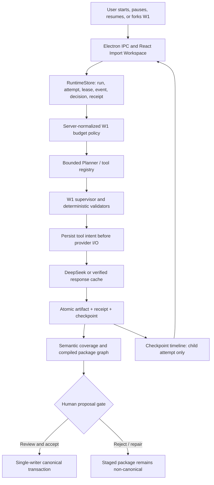

# Agent Runtime and Harness Reviewer-Ready Report

**Date:** 2026-07-25
**Code baseline:** `codex/agent-runtime-resilience` at `3716e92`
**Scope:** W1 import, durable agent runtime, Time Travel, package safety, Agent Dock, and product interaction hardening.
**Status:** the authorized 10-chapter Flash canary completed within budget, and a zero-provider-call deterministic replay produced an atomic reviewer-ready pending package. No canonical project data was accepted.

## Executive Summary

The W1 failure pattern was not one bug. The import path had several authorities that could disagree: an in-memory agent loop, attempt artifacts, package proposals, and UI state. A power loss could therefore leave a partial checkpoint, an untraceable provider call, stale paths, and a package whose dependency order no longer matched the executor.

This wave gives the product a durable control plane. Every W1 execution now has a lineage, a unique attempt, a lease/fencing token, durable events, tool-call receipts, a bounded budget, and a proposal gate. Recovery and Time Travel create child attempts instead of editing history. Canonical project data remains unchanged until a complete compiled package is explicitly accepted.

The first fresh-canary runner stalled because it bypassed the durable RuntimeStore and watched only graph yields while waiting for a provider boundary. The repaired runner now binds workflow and runtime identities, persists intent and activity, releases locks, and fails the run when the quality gate fails instead of reporting a false completion.

The authorized retry then completed 22 provider calls for `$0.034208`. Its raw extraction artifacts were complete, but the proposal gate correctly rejected the first package because supervisor completion receipts, runtime/artifact identities, scene/event evidence, World relocation, and relationship ontology were inconsistent. Those Harness contracts were repaired, and the verified response artifacts were replayed without another provider call. The resulting package has 74 pending proposals, zero blocking diagnostics, and zero canonical writes.

## Root Causes and Repairs

| Product symptom | Root cause | Implemented repair | Evidence boundary |
| --- | --- | --- | --- |
| Power loss could lose import state | Session/checkpoint and event state were partly memory-only | Project-local SQLite WAL RuntimeStore plus persisted LangGraph checkpoints, leases, events, receipts, decisions, and recovery discovery | Recovery, snapshot, runtime, and Electron smoke tests |
| Resume could create wrong proposals | Snapshot state omitted writer dependencies and could retain source prose | `W1SupervisorSnapshot/v1`, typed body-free resume DTO, source-span reconstruction, full proposal-operation equivalence checks | 869 W1 tests reported by the final snapshot worker |
| Time Travel could rewrite history or resume a fake checkpoint | UI and runtime accepted incomplete snapshot references; fork paths were not uniformly fenced | Immutable child attempt, strict reference validation, parent-chain validation, owner/fence checks, preview-only downgrade | Focused recovery Playwright and Electron smoke |
| Provider retry could double-charge | Unknown outcomes had no durable intent/decision boundary | Intent before I/O, receipt after I/O, exact one-time human retry authorization, receipt reuse before provider call | Runtime/unknown-outcome focused tests |
| Browser import could exceed approved spend | Product request/resume did not normalize an enforceable budget | Shared server-side policy: Flash maximum `$3`, Pro maximum `$8`; calls and token limits also fail closed | 926 runtime/W1 tests reported by budget worker |
| `Accept package` repeatedly blocked | UI, compiler, and apply path did not consume one dependency order | `w1-package-graph-v2`, semantic-coverage gate, package-scoped atomic write-ahead transaction, repair distinct from accept | Package compiler and Electron acceptance/restart evidence; no automatic accept |
| Import status looked like disconnected chunks | Raw stream state was surfaced directly | Durable Agent Dock projection: plan, agent, tool, review, approval, artifact, checkpoint, result/error and cost | UI and Electron replay coverage |

## Durable Runtime Architecture

### Runtime algorithm

1. A start creates stable `lineageId` and unique `attemptId`; a worker obtains a lease with a fencing token.
2. Each provider/tool operation records an idempotent intent before I/O. A verified receipt is reused; ambiguous cancellation becomes `unknown_outcome`.
3. Artifact receipt and checkpoint are written only under the current lease/fence. A stale worker cannot publish a resumable checkpoint.
4. Recovery validates source digest, config, artifact receipt, snapshot hash, snapshot parent chain, and budget before creating a child attempt.
5. W1 snapshots contain typed state and `SourceSpan` references, not full source prose, hidden reasoning, API keys, or absolute project paths. Source text is reconstructed only after hash verification.
6. Planner, Self-Ask, Plan-Execute, and ReAct behavior remains bounded: typed tools only, max steps/budget/time, deterministic validator outside the model, and single-writer canonical publication.

### Runtime and data contracts

- `W1SupervisorSnapshot/v1`: immutable snapshot reference, hash, lineage/attempt identity, parent chain, recovery mode, and body-free resume state.
- `W1SourceTextRef/v1`: source-span evidence used when a state value is source-derived. Any source substring is converted or rejected; it is not written verbatim to snapshot JSON.
- `ArtifactRef/v2`: project-relative path, SHA-256, contract version, lineage ID, and attempt ID. Traversal, symlink, source/hash mismatch, and cross-attempt artifacts fail closed.
- `W1BudgetPolicy`: server-normalized hard ceilings. Resume can only tighten prior limits.
- `w1-package-graph-v2`: the complete proposal package carries the authoritative topological order used by validation and apply in one transaction.

## Product Experience and Interaction Design

### Import, recovery, and agent feedback

- Import is a package workflow, not an opaque spinner. The user can see current plan/stage, agent/tool summary, chapter/window progress, cost/calls/token usage, artifacts, checkpoints, retry reason, and blocked dependency.
- Recovery Center discovers expired/interrupted attempts. It shows compatible source, reusable work, remaining work, estimated cap, and any unknown paid call before the user decides whether to resume, cancel, or authorize one retry.
- The event stream is durable and monotonic. Electron reconnects by cursor/Last-Event-ID and falls back to polling, so a transient UI disconnect does not lose the visible execution chain.
- Time Travel is a fork preview. Existing accepted data is never silently overwritten; a valid selected checkpoint creates a child attempt and later produces a new staged proposal.

### Chapters, manuscript, character, relationship, and World rules

- LLM extraction returns source spans, summaries, beats, and evidence. It does not return/rewrite entire chapter body. Chapter/scene text is reconstructed deterministically from verified raw source.
- Chapter is canonical story structure; Manuscript is a separate outline/projection created after package acceptance, not a duplicate chapter-body view.
- Character merge is field-level: background, experience, aliases, traits, notes, confidence, and conflict evidence are retained. Chinese project tags are normalized; user-visible English tags are a failure condition.
- Relationship types are a Chinese allowlist with directed/symmetric metadata. `解惑`, `选拔`, and descriptive phrases such as `冷冰冰的师兄` become events, evidence, or notes rather than relation types.
- World is one `Notebook -> Folder -> Item` tree with stable `parentId`/`folderId`; `categoryPath` is legacy migration input only. The organizer/reviewer can quarantine or relocate ambiguous candidates before canonical acceptance.

### Commands, drag, and Undo

- `AppCommand`, `CommandContext`, and a typed clipboard drive object menus for create, copy, cut, paste, rename, move, merge, archive/delete, and edit. Menus respect language and theme and explain disabled actions.
- Character/World context commands are structured commands, not ad hoc label/action arrays.
- Timeline, World, and graph movement use an `UndoTransaction`: capture before state at pointer-down, commit final position once at pointer-up, cancel on Esc, and undo exactly one user action with Meta/Ctrl+Z.
- Graph drag now waits for a ready React Flow surface and commits authoritative final coordinates on drag-stop; repeat testing reported 10/10 stable moves.

## Paid Canary And Deterministic Replay

### Paid execution

- Project: `/tmp/narrative_ide_w1_flash_canary_retry_authorized_20260725/20260725_073831/project`
- Model: `deepseek-v4-flash`
- Scope: first 10 chapters
- Provider calls: `22`
- Input/output tokens: `136,162` / `54,090`
- Total tokens: `190,252`
- Actual cost: `$0.034208`, below the cumulative `$3` ceiling
- Unknown outcomes: `0`
- Source verification: 10 continuous spans covering offsets `0..20,949`; source hash and every substring hash match

The provider run reached the graph terminal node, but its initial package did not pass the semantic gate. This was a Harness failure, not a missing provider result: per-domain completion evidence was lost, runtime and artifact identities diverged, some scene/event links lacked proof, `韩父` was misrouted into World, and raw relationship labels bypassed the ontology. The proposal gate blocked the package, so no bad data reached canonical storage.

### Harness repair and replay

- The runner now supplies real runtime lineage/attempt identity to W1 and reports `review_failed` when the terminal quality probe fails.
- Supervisor completion receipts preserve exact window/domain evidence and fail closed when evidence is absent.
- A strict legacy identity bridge verifies one matching RuntimeStore run, exact model/source/usage, 22 result calls, 22 response hashes, and 3 windows x 5 domain start/success pairs.
- Scene/event links require overlapping source spans or shared evidence; shared chunk membership alone is insufficient.
- World relocation moved `韩父` into evidence-backed character proposals and removed the contaminated World candidate.
- Relationship output is normalized to the Chinese allowlist; action/descriptive labels are demoted to evidence or notes.
- The package compiler uses one atomic dependency graph and replaces stale pending proposals only for the same lineage after backup.

### Final staged result

- Replay attempt: `replay_99b38a49c8d4`
- Provider calls during replay: `0`
- Pending proposals: `74`
- Proposal breakdown: 19 characters, 1 timeline branch, 5 timeline events, 7 World containers, 12 World items, 10 relationships, 10 chapters, and 10 scenes
- Package graph: `w1-package-graph-v2`, atomic, 134 resolved edges, no blocking errors, no dangling references
- Diagnostics: every symptom flag is false
- Canonical counts: all zero; the package remains at the human proposal gate
- Review-only warnings: 6 scene/event links lack sufficient evidence for automatic linking; 12 character cards remain thin

## Verification Matrix

| Area | Latest evidence in this wave | Result / interpretation |
| --- | --- | --- |
| W1 snapshot/resume | Final snapshot worker reported `869 passed` W1 tests | Pass for typed snapshot, source span, full operation equivalence, and stable-label leak cases |
| Runtime, W1, adapter, and replay | Current combined integration run: `984 passed` in `13.09s` | `tests/test_w1_*.py`, `tests/test_agent_runtime.py`, `tests/test_runtime_api.py`, and `tests/test_harness_workflow_adapters.py` |
| Latest focused review set | `123` / `101` reported by final review streams | Focused hardening gates passed; retain command logs for exact selection |
| Browser tests | Post-merge full P0/P1 run: `282/282 passed` with `--retries=0` | Includes package acceptance/compiler, Recovery, Import budget, World, Timeline, right-click, Graph drag, and Undo |
| Electron | `npm run electron:smoke` passed | Real preload/main/sidecar Runtime recovery, fork reference, SSE replay, and shutdown cleanup covered |
| UI static checks | `npm run ui:lint` and `npm run ui:build` passed in worker handoffs | Build retains existing bundle-size warning |
| Paid canary and replay | 22 calls, `$0.034208`; replay made zero provider calls | Ten source spans verified; 74-proposal atomic package staged; all diagnostics false |
| Full repository pytest | Earlier bounded run: `986 passed`, `11 failed`, `7 errors` | Remaining failures are legacy/reference `src/core`/V3 tests and missing `tests/api_key.txt`; they are not silently waived |

## Reviewer Gate and Residual Risks

### Ready for review

- Durable snapshot, resume, fork, fence, source-provenance, exact retry authorization, package graph, budget, and Electron bridge behavior have targeted automated evidence.
- W1 import remains proposal-gated and package acceptance remains explicit, package-scoped, and transactional.
- The fresh 10-chapter Flash extraction and its deterministic replay are suitable for Workbench proposal review. They are not evidence that all 74 proposals should be accepted without human inspection.

### Still open

1. Review the 74 pending proposals in Workbench. Resolve the 6 unproven scene/event links and inspect the 12 thin character cards before package acceptance.
2. Perform a headed Electron acceptance/reviewer-quarantine replay on a copied project before accepting the original package.
3. Do not run 50 chapters or Pro yet. First close the human review warnings and prove one package-scoped acceptance plus restart persistence.
4. The UI bundle-size warning and legacy `src/core`/V3 test debt remain P2/non-active-stack work.

## Related Evidence

- [Stall root cause and repaired runner](../dev_logs/2026-07-25-w1-live-canary-harness-stall-fix.md)
- [Verified legacy identity bridge and final offline replay](../dev_logs/2026-07-25-w1-offline-replay-legacy-runtime-bridge.md)
- [Resume budget guard](../dev_logs/2026-07-25-runtime-resume-budget-guard.md)
- [Original paid-resume evidence](../dev_logs/2026-07-15-import-text18-paid-resume.md)
- [Package compiler and acceptance repair](2026-07-25-claude-code-harness-and-package-compiler-report.md)
- [World/semantic reviewer report](2026-07-25-world-model-harness-reviewer-redesign-report.md)
