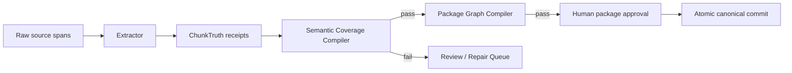

# Import Test 18 质量回退与 Harness 修复门

日期：2026-07-25  
状态：`canonical-current`  
结论：禁止立即运行 DeepSeek Pro 50 章；先修 P0 运行真实性与语义验收缺口。

## 1. 一句话结论

`Import Test 18` 不是正文被截断，也不是 package compiler 把数据改坏了。

真正的问题是：第 5-10 个 chunk 的语义提取因 lease/fencing 失效而失败，但运行器仍把“只保留正文的空提取结果”计入已完成 checkpoint；reviewer 又依赖进程内 `_chunk_log`，重启或离线修复后看不到持久化失败文件，于是错误地给出 `pass/warning`，最后 package compiler 把这批语义不完整的数据可靠地写入 canonical 项目。

这是一处 **run truth 与 review gate 的系统性缺陷**，不是单纯的模型质量波动。

## 2. 已确认事实

### 2.1 正文完整

- 原文：`20949` 字符。
- SHA-256：`6c7cfd49949e89cecb8b00a4bd9ab374e7393ff1b4fe84a0e8a809e060cb522d`。
- 章节：恰好 10 章。
- `staged_manuscript_projection.json` 的 10 个章节正文与对应 source span 一致。

所以当前“明显下滑”主要发生在人物、事件、关系、World 和场景关联，不是 manuscript body。

### 2.2 第 5-10 个 chunk 的语义提取失败

真实 attempt：

`system/imports/lineage_68b3fe6d3172718a45f6ca66/attempts/legacy_attempt_614123c9b409771fcdf06f0c`

其中存在：

- `chunks/chunk_4_failures.json`
- `chunks/chunk_5_failures.json`
- `chunks/chunk_6_failures.json`
- `chunks/chunk_7_failures.json`
- `chunks/chunk_8_failures.json`
- `chunks/chunk_9_failures.json`

这些文件中的 character、event、world、relationship、scene 提取均报告：

`lease is missing, expired, or fenced`

但同一 attempt 的 `checkpoint.json` 仍把 0-9 全部写入 `committed_chunk_ids`。

### 2.3 Review 报告没有说出真相

运行器当前存在三处直接原因：

1. `_write_recovery_checkpoint()` 只要 extraction 有 `chunk_id` 就视为 committed，不检查语义域是否成功。
2. chunk 抛出普通异常后，代码生成一个空人物、空事件、空 World、空关系、空场景的“minimal extraction”，随后继续 checkpoint。
3. `node_review_import()` 的 `failed_chunks` 来源是进程内 `_chunk_log`，而不是 `chunks/*_failures.json` 或 durable runtime ledger。

离线 repair 还会根据当前内存中的 `warnings/errors` 重算 review status，却不扫描 durable failure artifact。结果是：

```text
持久化失败文件存在
  -> checkpoint 仍显示 10/10 committed
  -> review failed_chunks 为空
  -> package 可被接受
```

### 2.4 语义质量的实际表现

- 人物重复：`韩立 / 二愣子（韩立）`、`韩铸 / 二哥韩铸`、`三叔 / 韩胖子（三叔）`。
- 身份误并：`神秘客人` 的关系描述实际指向 `王护法`，但两者同时存在。
- 时间线只有 5 个事件，且全部缺少 scene/world/location 链接。
- 10 个场景全部使用泛化标题 `章节正文`，没有人物、事件、World、POV 链接。
- `韩立离家赴仙途` 与 `韩立离家入七玄门` 是近重复事件。
- `外门`、`内门` 被放入 `修炼境界与制度`。
- `七绝堂`、`百锻堂`、`七玄门分堂` 在组织单元与地点之间错误摆放。
- “选拔考官与候选弟子”“护行承诺”“梦中敌对”等一次性行为被错误升级为长期人物关系。

Package compiler 只保证依赖闭合、拓扑顺序和原子写入；它没有生成这些错误语义。当前缺少的是 package compiler 之前的 **Semantic Coverage Compiler**。

## 3. 为什么现在不能跑 Pro 50 章

立即跑 50 章会把已知缺陷放大：

- lease 再次失效时，更多空语义 chunk 可能被伪装成 completed；
- reviewer 仍可能把失败运行标成可接受；
- 重复人物、错误关系和 World 错位会跨 50 章进一步合并污染；
- Pro 的额外 token 只能提高单次推理上限，不能修复错误的 checkpoint、lease、review 和 acceptance 状态机；
- 50 章结果一旦进入 canonical，清理成本远高于先修 Harness。

因此当前决策为：

```text
DeepSeek Pro 50 chapters = BLOCKED
```

解除条件不是“测试能跑完”，而是下面两套 compiler 都通过：



## 4. Harness 的目标结构

### 4.1 RunTruth / ChunkTruth

禁止再用一个模糊的 `completed` 同时表示“正文保存了”和“语义提取成功了”。

每个 chunk 固定状态：

```text
semantic_complete
manuscript_only
failed
unknown_outcome
```

`ChunkTruth` 至少记录：

- source span/hash；
- character/event/world/relationship/scene 各域状态；
- provider call receipt；
- failure artifact；
- lease/fencing token；
- artifact hash；
- reviewer result；
- retry/fork lineage。

只有所有 required semantic domains 完成，chunk 才能进入 `committed_chunk_ids`。正文保存成功但语义失败时必须是 `manuscript_only`，不得伪装为完成。

### 4.2 Fail-closed lease 与 provider handling

- `LeaseLostError`、fencing mismatch、cancel、unknown paid-call outcome 必须从 extraction node 向上抛出。
- 这些错误不得被通用 `except Exception` 转成空 extraction。
- lease 丢失后 attempt 进入 `interrupted/recoverable`，停止继续调用 API 和发布 proposal。
- 恢复时创建新 attempt，验证可复用 receipt 后再继续。

### 4.3 Durable review truth

Reviewer 只能读取 durable truth：

- `ChunkTruth` receipts；
- `chunks/*_failures.json`；
- runtime `tool_calls` / `run_events`；
- artifact receipts；
- semantic coverage matrix。

`_chunk_log` 只能用于实时 UI，不得参与最终验收结论。

任何 required domain 为 `failed`、`manuscript_only` 或 `unknown_outcome` 时：

- review status 必须为 `fail`；
- proposal publication 必须停止；
- package acceptance 必须不可用；
- UI 必须显示具体 chunk、domain、原因和恢复动作。

### 4.4 两级 Compiler

**Semantic Coverage Compiler**

- 检查每章语义覆盖；
- 人物 alias/dedupe 与 evidence；
- 长期关系 ontology；
- World entity type 与 folder routing；
- event-scene-world-character linkage；
- 模糊项目进入 quarantine，不自动接受；
- 输出 typed findings 和阻塞原因。

**Package Graph Compiler**

- 检查 producer/reference；
- 构建 DAG/SCC；
- 生成确定性拓扑顺序；
- 保证 package 原子写入与回滚。

两者职责分离，且必须依次通过。

### 4.5 受约束的 Agent Harness

继续保留现有 SQLite runtime、attempt、checkpoint、lease、human decision、artifact receipt 和 proposal gate。新增：

- manifest-driven command/agent/skill/tool/policy/hook 注册；
- 每个 Agent 明确 `allowedTools/readSet/writeSet/maxSteps/maxCost`；
- `PreToolUse/PostToolUse/Stop/SessionStart/SessionEnd` hook bus；
- Plan-Execute 只在新证据、失败或人工修改后 replan；
- ReAct 有最大步数、成本、时间、重复失败签名和 completion predicate；
- 多 Agent 通过 durable artifact blackboard 协作；
- canonical commit、proposal publication 和 acceptance 始终单写者；
- UI 展示行动摘要、工具 lifecycle、证据、费用和等待决定，不展示隐藏思维链。

## 5. 修复顺序与测试门

### Gate A：运行真实性 P0

1. 修复 committed chunk 判定。
2. 让 lease/fencing 错误 fail closed。
3. 建立 durable `ChunkTruth` 和 coverage matrix。
4. reviewer/repair/diagnostics 全部改为 attempt-aware，并扫描 durable failure truth。
5. acceptance 在 semantic coverage fail 时硬阻塞。

### Gate B：语义质量 P0/P1

1. alias/evidence-aware 人物归并。
2. 长期关系、临时互动、事件参与、证据备注分层。
3. World entity type 与 folder `parentId` 分离。
4. event-scene-world-character 双向链接。
5. reviewer warning 分级，P0/P1 不允许自动接受。

### Gate C：10 章 Flash Canary

使用全新项目或 pre-acceptance backup，不覆盖当前 canonical 项目：

- 10/10 chunk 为 `semantic_complete`；
- durable failure artifacts 为 0；
- source span/hash 100%；
- duplicate character cluster 为 0；
- 非法 relationship 为 0；
- World ontology error 为 0；
- 事件与场景关联完整；
- reviewer 不得在存在 warning/failure 时给 `pass`；
- package acceptance 必须同时通过两个 compiler。

### Gate D：10 章 Pro A/B

使用同一原文、同一 schema、同一 reviewer 规则与 golden expectations：

- 比较 entity recall、dedupe、evidence coverage、ontology precision；
- Pro 必须产生可测量的质量提升，而不是仅增加 token 和实体数量；
- 若 Pro 仍未通过硬门，继续修 Harness，不扩大规模。

### Gate E：扩大测试

1. 两次连续 10 章 canary 全绿；
2. 运行 20-25 章 Pro canary；
3. 检查费用、延迟、恢复、重复率和语义漂移；
4. 以上稳定后，才批准 Pro 50 章。

## 6. Claude Code 参考边界

本项目可以并将继续研究：

- Anthropic 官方公开的 `anthropics/claude-code` 仓库；
- Claude Agent SDK；
- 官方 plugins、commands、agents、skills、hooks 和文档；
- Codex CLI 的 Apache-2.0 开源实现；
- 公开可观察的 session/resume、approval、tool lifecycle 和多任务体验。

本项目不会复制、运行或依赖通过 source map 泄露的未授权 proprietary bundle。源代码“可以下载”不等于获得开源许可证或复制授权。值得借鉴的机制会依据公开接口和产品行为独立实现，避免把法律与供应链风险带入 Narrative IDE。

公开参考：

- https://github.com/anthropics/claude-code
- https://raw.githubusercontent.com/anthropics/claude-code/main/LICENSE.md
- https://github.com/anthropics/claude-agent-sdk-python
- https://github.com/anthropics/claude-agent-sdk-typescript
- https://github.com/openai/codex

## 7. 最终产品决策

当前不批准 DeepSeek Pro 50 章。

下一轮工作不是继续调 prompt，而是先修复：

1. 运行状态说真话；
2. 失败不能伪装成完成；
3. reviewer 必须读取持久化事实；
4. 语义合格与依赖可执行必须由两个 compiler 分别验收；
5. 10 章 Flash/Pro A/B 通过后再扩大规模。

当前 `Import Test 18` 应保留为失败样本和回归 fixture。不要将它视为合格基线，也不要通过人工清洗掩盖 Harness 缺陷。
